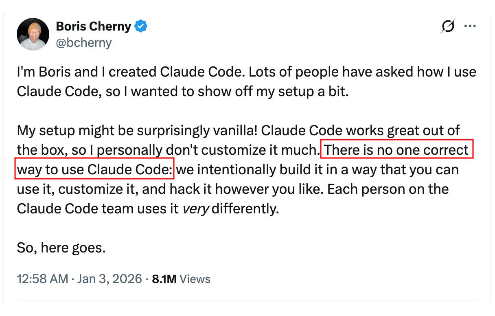
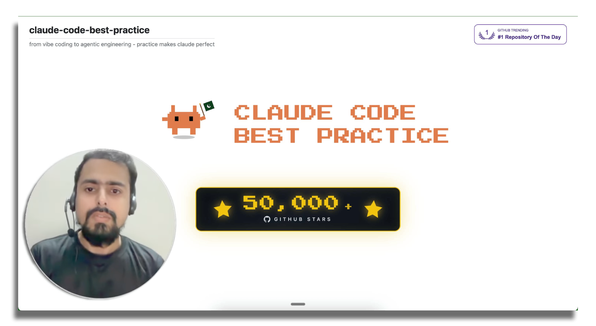
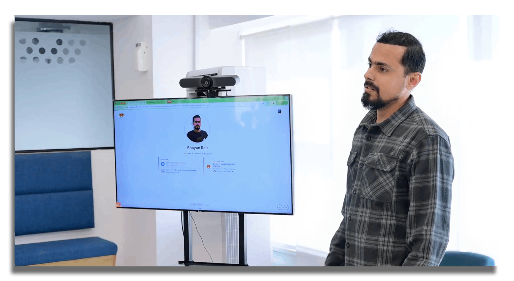

# claude-code-best-practice
从氛围编程到智能体工程——实践让 Claude 更完美

-white?style=flat&labelColor=555) <a href="https://github.com/shanraisshan/claude-code-best-practice/stargazers"></a><br>

[](best-practice/) [](implementation/) [](orchestration-workflow/orchestration-workflow.md) [](https://code.claude.com/docs) [](#-技巧与贴士) [](#-订阅) <br>
 = 智能体（Agents） ·  = 命令（Commands） ·  = 技能（Skills）

<p align="center">
  <br>
  <a href="https://github.com/trending"></a>
</p>

<p align="center">
  <br>
  Boris Cherny 在 X 上的分享（<a href="https://x.com/bcherny/status/2007179832300581177">推文 1</a> · <a href="https://x.com/bcherny/status/2017742741636321619">推文 2</a> · <a href="https://x.com/bcherny/status/2021699851499798911">推文 3</a>）
</p>

> [!TIP]
> 请访问 [**如何使用**](#如何使用) 章节以充分利用本仓库。

## 🧠 核心概念

| 功能 | 位置 | 描述 |
|---------|----------|-------------|
|  [**子智能体**](https://code.claude.com/docs/en/sub-agents) | `.claude/agents/<name>.md` | [](best-practice/claude-subagents.md) [](implementation/claude-subagents-implementation.md) |
|  [**命令**](https://code.claude.com/docs/en/slash-commands) | `.claude/commands/<name>.md` | [](best-practice/claude-commands.md) [](implementation/claude-commands-implementation.md) |
|  [**技能**](https://code.claude.com/docs/en/skills) | `.claude/skills/<name>/SKILL.md` | [](best-practice/claude-skills.md) [](implementation/claude-skills-implementation.md) [官方技能](https://github.com/anthropics/skills/tree/main/skills) · [单体仓库技能](reports/claude-skills-for-larger-mono-repos.md) |
| [**工作流**](https://code.claude.com/docs/en/common-workflows) | [`.claude/commands/weather-orchestrator.md`](.claude/commands/weather-orchestrator.md) | [](orchestration-workflow/orchestration-workflow.md) |
| [**钩子（Hooks）**](https://code.claude.com/docs/en/hooks) | `.claude/hooks/` | [](https://github.com/shanraisshan/claude-code-hooks) [](https://github.com/shanraisshan/claude-code-hooks) [指南](https://code.claude.com/docs/en/hooks-guide) |
| [**MCP 服务器**](https://code.claude.com/docs/en/mcp) | `.claude/settings.json`, `.mcp.json` | [](best-practice/claude-mcp.md) [](.mcp.json) |
| [**插件**](https://code.claude.com/docs/en/plugins) | 可分发包 | [市场](https://code.claude.com/docs/en/discover-plugins) · [创建市场](https://code.claude.com/docs/en/plugin-marketplaces) |
| [**设置**](https://code.claude.com/docs/en/settings) | `.claude/settings.json` | [](best-practice/claude-settings.md) [](.claude/settings.json) [权限](https://code.claude.com/docs/en/permissions) · [模型配置](https://code.claude.com/docs/en/model-config) · [输出风格](https://code.claude.com/docs/en/output-styles) · [沙盒](https://code.claude.com/docs/en/sandboxing) · [快捷键](https://code.claude.com/docs/en/keybindings) · [自动模式配置](https://code.claude.com/docs/en/auto-mode-config) |
| [**状态行**](https://code.claude.com/docs/en/statusline) | `.claude/settings.json` | [](https://github.com/shanraisshan/claude-code-status-line) [](.claude/settings.json) |
| [**记忆（Memory）**](https://code.claude.com/docs/en/memory) | `CLAUDE.md`, `.claude/rules/`, `~/.claude/rules/`, `~/.claude/projects/<project>/memory/` | [](best-practice/claude-memory.md) [](CLAUDE.md) [自动记忆](https://code.claude.com/docs/en/memory) · [自动记忆深度解析](reports/claude-agent-memory.md) · [规则](https://code.claude.com/docs/en/memory#organize-rules-with-clauderules) |
| [**检查点**](https://code.claude.com/docs/en/checkpointing) | 自动（文件编辑追踪） |  |
| [**CLI 启动参数**](https://code.claude.com/docs/en/cli-reference) | `claude [flags]` | [](best-practice/claude-cli-startup-flags.md) [交互模式](https://code.claude.com/docs/en/interactive-mode) · [环境变量](https://code.claude.com/docs/en/env-vars) |
| **AI 术语** | | [](https://github.com/shanraisshan/claude-code-codex-cursor-gemini/blob/main/reports/ai-terms.md) |
| [**最佳实践**](https://code.claude.com/docs/en/best-practices) | | [提示工程](https://github.com/anthropics/prompt-eng-interactive-tutorial) · [扩展 Claude Code](https://code.claude.com/docs/en/features-overview) |

### 🔥 热门功能

| 功能 | 位置 | 描述 |
|---------|----------|-------------|
| [**Ultrareview**](https://code.claude.com/docs/en/ultrareview)  | `/ultrareview`, `claude ultrareview [target]` | [任务追踪](https://code.claude.com/docs/en/ultrareview#track-a-running-review) |
| [**Devcontainers**](https://code.claude.com/docs/en/devcontainer) | `.devcontainer/` |  |
| [**Channels**](https://code.claude.com/docs/en/channels)  | `--channels`, 基于插件 | [参考](https://code.claude.com/docs/en/channels-reference) |
| [**Ultraplan**](https://code.claude.com/docs/en/ultraplan)  | `/ultraplan` |  |
| [**无闪烁模式**](https://code.claude.com/docs/en/fullscreen)  | `/tui fullscreen`, `CLAUDE_CODE_NO_FLICKER=1` | [](https://x.com/bcherny/status/2039421575422980329) |
| [**自动模式**](https://code.claude.com/docs/en/permission-modes#eliminate-prompts-with-auto-mode)  | `--permission-mode auto`, `Shift+Tab` | [](https://x.com/claudeai/status/2036503582166393240) [博客](https://claude.com/blog/auto-mode) |
| [**强化能力（Power-ups）**](best-practice/claude-power-ups.md) | `/powerup` | [](best-practice/claude-power-ups.md) |
| [**极速模式**](https://code.claude.com/docs/en/fast-mode)  | `/fast`, `"fastMode": true` |  |
| [**电脑操控**](https://code.claude.com/docs/en/computer-use)  | `computer-use` MCP 服务器 | [桌面](https://code.claude.com/docs/en/desktop#let-claude-use-your-computer) |
| [**Agent SDK**](https://code.claude.com/docs/en/agent-sdk/overview) | `npm` / `pip` 包 | [快速入门](https://code.claude.com/docs/en/agent-sdk/quickstart) · [示例](https://github.com/anthropics/claude-agent-sdk-demos) |
| [**Ralph Wiggum 循环**](https://github.com/anthropics/claude-code/tree/main/plugins/ralph-wiggum) | 插件 | [](https://github.com/ghuntley/how-to-ralph-wiggum) [](https://github.com/shanraisshan/ralph-wiggum-self-evolving-loop) |
| [**Chrome**](https://code.claude.com/docs/en/chrome)  | `--chrome`, 扩展 | [](reports/claude-in-chrome-v-chrome-devtools-mcp.md) |
| [**Claude Code Web**](https://code.claude.com/docs/en/claude-code-on-the-web)  | `claude.ai/code` | [例行任务](https://code.claude.com/docs/en/routines) |
| [**Slack**](https://code.claude.com/docs/en/slack) | Slack 中 `@Claude` |  |
| [**代码审查**](https://code.claude.com/docs/en/code-review)  | GitHub App（托管） | [](https://x.com/claudeai/status/2031088171262554195) [博客](https://claude.com/blog/code-review) |
| [**GitHub Actions**](https://code.claude.com/docs/en/github-actions) | `.github/workflows/` | [GitLab CI/CD](https://code.claude.com/docs/en/gitlab-ci-cd) |
| [**远程控制**](https://code.claude.com/docs/en/remote-control) | `/remote-control`, `/rc` | [](https://x.com/noahzweben/status/2032533699116355819) [无头模式](https://code.claude.com/docs/en/headless) |
| [**深度链接**](https://code.claude.com/docs/en/deep-links) | `claude-cli://open?repo=…&q=…` |  |
| [**智能体团队**](https://code.claude.com/docs/en/agent-teams)  | 内置（环境变量） | [](https://x.com/bcherny/status/2019472394696683904) [](implementation/claude-agent-teams-implementation.md) |
| [**智能体视图**](https://code.claude.com/docs/en/agent-view)  | `claude agents`, `--bg`, `/bg` |  |
| [**定时任务**](https://code.claude.com/docs/en/scheduled-tasks) | `/loop`, `/schedule`, cron 工具 | [](https://x.com/bcherny/status/2030193932404150413) [](implementation/claude-scheduled-tasks-implementation.md) [桌面定时任务](https://code.claude.com/docs/en/desktop-scheduled-tasks) · [公告](https://x.com/noahzweben/status/2036129220959805859) |
| [**例行任务（Routines）**](https://code.claude.com/docs/en/routines)  | `claude.ai/code/routines`, `/schedule` | [桌面任务](https://code.claude.com/docs/en/desktop-scheduled-tasks) |
| [**任务**](reports/claude-global-vs-project-settings.md#tasks-system) | `/tasks`, `~/.claude/tasks/` | [](reports/claude-global-vs-project-settings.md) [Ultrareview 追踪](https://code.claude.com/docs/en/ultrareview#track-a-running-review) |
| [**目标**](https://code.claude.com/docs/en/goal) | `/goal <condition>`, `/goal clear` | [](implementation/claude-goal-implementation.md) |
| [**语音输入**](https://code.claude.com/docs/en/voice-dictation)  | `/voice` | [](https://x.com/trq212/status/2028628570692890800) |
| [**简化与批处理**](https://code.claude.com/docs/en/skills#bundled-skills) | `/simplify`, `/batch` | [](https://x.com/bcherny/status/2027534984534544489) |
| [**Git 工作树**](https://code.claude.com/docs/en/worktrees) | `--worktree`/`-w`, `.worktreeinclude`, `EnterWorktree`/`ExitWorktree`, `isolation: "worktree"`, `WorktreeCreate`/`WorktreeRemove` 钩子 | [](https://x.com/bcherny/status/2025007393290272904) |

<p align="center">
  
</p>

<a id="orchestration-workflow"></a>

## <a href="orchestration-workflow/orchestration-workflow.md"></a>

详见 [orchestration-workflow](orchestration-workflow/orchestration-workflow.md) 了解  **命令** →  **智能体** →  **技能** 模式的实现细节。


<p align="center">
  
</p>

<p align="center">
  
</p>


```bash
claude
/weather-orchestrator
```

<p align="center">
  
</p>

## ⚙️ 开发工作流

所有主要工作流都汇聚于同一架构模式：**研究 → 规划 → 执行 → 审查 → 交付**

| 名称 | ★ | 工作流 |  |  |  |
|------|---|----------|---|---|---|
| [Superpowers](https://github.com/obra/superpowers) | 200k |  →  →  →  →  →  →  →  | 0 | 0 | 14 |
| [Everything Claude Code](https://github.com/affaan-m/everything-claude-code) | 188k |  →  →  →  →  →  | 48 | 143 | 230 |
| [Spec Kit](https://github.com/github/spec-kit) | 104k |  →  →  →  →  →  | 0 | 9 | 0 |
| [gstack](https://github.com/garrytan/gstack) | 100k |  →  →  →  →  →  →  →  →  →  →  →  | 0 | 0 | 48 |
| [Matt Pocock 技能集](https://github.com/mattpocock/skills) | 97k |  →  →  →  →  →  →  →  | 0 | 0 | 28 |
| [Get Shit Done](https://github.com/gsd-build/get-shit-done) | 63k |  →  →  →  →  →  →  | 33 | 67 | 0 |
| [OpenSpec](https://github.com/Fission-AI/OpenSpec) | 50k |  →  →  | 0 | 11 | 0 |
| [BMAD-METHOD](https://github.com/bmad-code-org/BMAD-METHOD) | 48k |  →  →  →  →  →  →  →  →  | 0 | 0 | 42 |
| [oh-my-claudecode](https://github.com/Yeachan-Heo/oh-my-claudecode) | 34k |  →  →  →  →  →  →  →  →  | 19 | 0 | 39 |
| [agent-skills](https://github.com/addyosmani/agent-skills) | 27k |  →  →  →  →  →  | 3 | 7 | 21 |
| [Compound Engineering](https://github.com/EveryInc/compound-engineering-plugin) | 17k |  →  →  →  →  →  →  →  →  | 49 | 4 | 38 |
| [HumanLayer](https://github.com/humanlayer/humanlayer) | 11k |  →  →  →  →  →  | 6 | 27 | 0 |

> *注：黄色标签表示子循环——在父步骤中重复执行的步骤（例如按任务、按用户故事，或直到验证条件通过）。*

### 其他工作流
- [RPI](development-workflows/rpi/rpi-workflow.md) [](development-workflows/rpi/rpi-workflow.md)
- [Ralph Wiggum 循环](https://www.youtube.com/watch?v=eAtvoGlpeRU) [](https://github.com/shanraisshan/ralph-wiggum-self-evolving-loop)
- [Andrej Karpathy（OpenAI 创始成员）工作流](https://x.com/karpathy/status/2015883857489522876)
- [Peter Steinberger（OpenClaw 创建者）工作流](https://youtu.be/8lF7HmQ_RgY?t=2582)
- Boris Cherny（Claude Code 创建者）工作流 — [13 条贴士](tips/claude-boris-13-tips-03-jan-26.md) · [10 条贴士](tips/claude-boris-10-tips-01-feb-26.md) · [12 条贴士](tips/claude-boris-12-tips-12-feb-26.md) · [2 条贴士](tips/claude-boris-2-tips-25-mar-26.md) · [15 条贴士](tips/claude-boris-15-tips-30-mar-26.md) · [6 条贴士](tips/claude-boris-6-tips-16-apr-26.md) [](https://x.com/bcherny)
- Thariq（Anthropic）工作流 — [技能](tips/claude-thariq-tips-17-mar-26.md) · [会话管理](tips/claude-thariq-tips-16-apr-26.md) [](https://x.com/trq212)

<p align="center">
  
</p>

## 🔀 跨模型工作流

通过三种机制将 Claude Code 与其他模型（Codex、Gemini、GPT、Kimi、DeepSeek、本地模型）结合使用：

- **插件** — 其他模型的 CLI 在 Claude Code 内部运行（如 `/codex:review` 斜杠命令）
- **MCP** — Claude Code 通过模型上下文协议将其他模型作为工具调用
- **路由器（Router）** — 将 Claude Code 的 API 端点切换到其他提供方

方法论：[跨模型（Claude Code + Codex）工作流](development-workflows/cross-model-workflow/cross-model-workflow.md) [](development-workflows/cross-model-workflow/cross-model-workflow.md) — 手动双终端流程：Claude 中规划，Codex 中 QA 审查。

| 名称 | ★ | 类型 | 桥接到 | 功能描述 |
|------|---|------|------------|--------------|
| [musistudio/claude-code-router](https://github.com/musistudio/claude-code-router) | 34k | 路由器 | OpenRouter、DeepSeek、Ollama、Gemini、Kimi、Qwen、Groq 等 | 将 Claude Code 的 API 路由到任何兼容的提供方，支持按任务选择模型 |
| [router-for-me/CLIProxyAPI](https://github.com/router-for-me/CLIProxyAPI) | 32k | 路由器 | Gemini CLI、Codex、Claude Code、Antigravity | 将每个 CLI 包装为兼容 OpenAI/Gemini/Claude/Codex 的 API 服务 |
| [openai/codex-plugin-cc](https://github.com/openai/codex-plugin-cc) | 18k | 插件 | Codex / GPT-5 | OpenAI 官方插件：在 Claude Code 中使用 `/codex:review`、`/codex:adversarial-review`、`/codex:rescue` |
| [BeehiveInnovations/pal-mcp-server](https://github.com/BeehiveInnovations/pal-mcp-server) | 12k | MCP | Gemini、OpenAI、Azure、Grok、Ollama、OpenRouter（50+ 模型） | 多模型 MCP 服务器（原 `zen-mcp-server`）——将其他模型作为 Claude 工具调用 |

<p align="center">
  
</p>

## 🧰 技能合集

主要被认作是精心整理的 `SKILL.md` 文件库的仓库（区别于上述完整工作流方法论）。按 star 数降序排列。

| 名称 | ★ |  |
|------|---|---|
| [anthropics/skills](https://github.com/anthropics/skills) | 138k | 17 |
| [mattpocock/skills](https://github.com/mattpocock/skills) | 97k | 24 |
| [wshobson/agents](https://github.com/wshobson/agents) | 36k | 155 |
| [impeccable](https://github.com/pbakaus/impeccable) | 27k | 1（含 7 个设计领域参考） |
| [agent-skills](https://github.com/addyosmani/agent-skills) | 27k | 21 |
| [scientific-agent-skills](https://github.com/K-Dense-AI/scientific-agent-skills) | 25k | 138 |
| [awesome-agent-skills](https://github.com/VoltAgent/awesome-agent-skills) | 22k | 1,100+（精选列表） |
| [claude-skills](https://github.com/alirezarezvani/claude-skills) | 15k | 246（涵盖 9 个领域） |

<p align="center">
  
</p>

## 🤖 智能体合集

主要被认作是精心整理的子智能体定义库（`.claude/agents/*.md`）的仓库。按 star 数降序排列。

| 名称 | ★ |  |
|------|---|---|
| [msitarzewski/agency-agents](https://github.com/msitarzewski/agency-agents) | 105k | 144 |
| [VoltAgent/awesome-claude-code-subagents](https://github.com/VoltAgent/awesome-claude-code-subagents) | 20k | 151 |

<p align="center">
  
</p>

## 💡 技巧与贴士（83 条）

🚫👶 = 不要"手把手喂奶"

[提示词](#贴士-提示词) · [规划](#贴士-规划) · [上下文](#贴士-上下文) · [会话](#贴士-会话管理) · [CLAUDE.md + .claude/rules](#贴士-claudemd) · [智能体](#贴士-智能体) · [命令](#贴士-命令) · [技能](#贴士-技能) · [钩子](#贴士-钩子) · [工作流](#贴士-工作流) · [进阶工作流](#贴士-进阶工作流) · [Git / PR](#贴士-git--pr) · [调试](#贴士-调试) · [工具](#贴士-工具) · [日常](#贴士-日常)


<a id="tips-prompting"></a>■ **提示词（3）**

| 贴士 | 来源 |
|-----|--------|
| 挑战 Claude——"对我这些改动严格拷问，不通过你的测试就不要提 PR。" 或 "向我证明这能正常工作"，让 Claude 在 main 和你的分支之间做 diff 🚫👶 | [](https://x.com/bcherny/status/2017742752566632544) |
| 修复方案不够好后——"综合你现在的所有认知，废弃这个方案，重新实现一个优雅的解决方案" 🚫👶 | [](https://x.com/bcherny/status/2017742752566632544) |
| Claude 能自己修复大部分 bug——贴上 bug 描述，说"修复"，不要微观管理它怎么做 🚫👶 | [](https://x.com/bcherny/status/2017742750473720121) |

<a id="tips-planning"></a>■ **规划/规格（7）**

| 贴士 | 来源 |
|-----|--------|
| 始终以[规划模式](https://code.claude.com/docs/en/common-workflows)开始 | [](https://x.com/bcherny/status/2007179845336527000) |
| 从一个最小规格或提示词开始，让 Claude 使用 [AskUserQuestion](https://code.claude.com/docs/en/cli-reference) 工具访谈你，然后开新会话来执行规格 | [](https://x.com/trq212/status/2005315275026260309) |
| 始终制定分阶段的关卡式计划，每个阶段包含多个测试（单元测试、自动化测试、集成测试） | [](videos/claude-dex-mlops-community-24-mar-26.md) [](https://youtu.be/YwZR6tc7qYg?t=1032) |
| 将 PRD 拆分为贯穿所有层（数据库 + 服务 + UI）的纵向切片（曳光弹）——AI 会默认采用横向分阶段（先数据库阶段，再 API 阶段，再前端阶段），这会延迟端到端反馈直到最后阶段。来自《程序员修炼之道》🚫👶 | [](videos/claude-matt-pocock-24-apr-26.md) [](https://youtu.be/-QFHIoCo-Ko) |
| 启动第二个 Claude 以高级工程师身份审查你的计划，或使用[跨模型](development-workflows/cross-model-workflow/cross-model-workflow.md)进行审查 | [](https://x.com/bcherny/status/2017742745365057733) |
| 在交付工作前编写详细规格并减少歧义——你越具体，输出质量越高 | [](https://x.com/bcherny/status/2017742752566632544) |
| 原型 > PRD——构建 20-30 个版本而非编写规格，构建成本很低，多试几次 | [](https://youtu.be/julbw1JuAz0?t=3630) [](https://youtu.be/julbw1JuAz0?t=3630) |

<a id="tips-context"></a>■ **上下文（5）**

| 贴士 | 来源 |
|-----|--------|
| 在 100 万 token 上下文模型上，上下文衰减大约在 ~300-400k token 时开始——对于智能敏感型工作，不要让会话超出这个范围 | [](tips/claude-thariq-tips-16-apr-26.md) |
| 大约在 40% 上下文时进入"弱智区"——"你达到这个点后结果质量会下降"。新手："尽量保持在 40% 以下，到 60% 就考虑收尾"。有经验者："严格保持在 30% 以下"——只有简单任务才推到 60%。切换任务时手动 [/compact](https://code.claude.com/docs/en/interactive-mode) 或 [/clear](https://code.claude.com/docs/en/cli-reference) 来重置 | [](videos/claude-dex-mlops-community-24-mar-26.md) [](https://youtu.be/YwZR6tc7qYg?t=1541) |
| 回退 > 纠正——双击 Esc 或 [/rewind](https://code.claude.com/docs/en/checkpointing) 回到失败尝试之前，用你学到的东西重新提示，而不是让失败的尝试和纠正留在上下文中污染会话 🚫👶 | [](tips/claude-thariq-tips-16-apr-26.md) |
| 带提示的 [/compact](https://code.claude.com/docs/en/interactive-mode)（如 `/compact 聚焦认证重构，放弃测试调试`）比让自动压缩触发更好——自动压缩时模型处于智能最低点，因为上下文已经衰减 | [](tips/claude-thariq-tips-16-apr-26.md) |
| 使用子智能体管理上下文——问自己"我是需要再次用到这个工具输出，还是只需要结论？"——20 次文件读取 + 12 次 grep + 3 条死胡同留在子上下文中，只有最终报告返回 🚫👶 | [](tips/claude-thariq-tips-16-apr-26.md) |

<a id="tips-session"></a>■ **会话管理（6）**

| 贴士 | 来源 |
|-----|--------|
| 每个回合都是分支点——Claude 完成一轮后，根据你需要向前携带多少现有上下文，在继续、/rewind、/clear、/compact 或子智能体之间选择 | [](tips/claude-thariq-tips-16-apr-26.md) |
| 新任务 = 新会话——相关任务（如为你刚构建的东西编写文档）可以复用上下文以提高效率，但真正全新的任务应该用全新会话 | [](tips/claude-thariq-tips-16-apr-26.md) |
| 回退前使用"从这里开始总结"让 Claude 写一个交接信息——就像未来版本的 Claude 给上一个迭代留的便条 | [](tips/claude-thariq-tips-16-apr-26.md) |
| /compact vs /clear——compact 有损但适合保持工作节奏（任务中途，细节模糊也没问题）；/clear + 简要说明工作量更大，但你完全控制向前传递什么（关键下一步） | [](tips/claude-thariq-tips-16-apr-26.md) |
| 对长时间运行的会话使用摘要回顾——Claude 已完成内容和下一步的简短总结，几分钟或几小时后返回时很有用。在 /config 中使用 recaps 关闭 | [](tips/claude-boris-6-tips-16-apr-26.md) |
| [/rename](https://code.claude.com/docs/en/cli-reference) 命名重要会话（如 [TODO - 重构任务]），之后 [/resume](https://code.claude.com/docs/en/cli-reference) 恢复——同时运行多个 Claude 时为每个实例打标签 | [](https://every.to/podcast/how-to-use-claude-code-like-the-people-who-built-it) |

<a id="tips-claudemd"></a>■ **CLAUDE.md + .claude/rules（8）**

| 贴士 | 来源 |
|-----|--------|
| [CLAUDE.md](https://code.claude.com/docs/en/memory) 应控制在每文件 [200 行以内](https://code.claude.com/docs/en/memory#write-effective-instructions)。[HumanLayer 中仅 60 行](https://www.humanlayer.dev/blog/writing-a-good-claude-md)（[仍不能 100% 保证](https://www.reddit.com/r/ClaudeCode/comments/1qn9pb9/claudemd_says_must_use_agent_claude_ignores_it_80/)） | [](https://x.com/bcherny/status/2007179840848597422) [](https://www.humanlayer.dev/blog/writing-a-good-claude-md) |
| .claude/rules/*.md 像 CLAUDE.md 一样自动加载到每个会话——添加 paths: YAML 前置元数据实现懒加载，仅当 Claude 触及匹配 glob 的文件时才加载 | [](https://code.claude.com/docs/en/memory#organize-rules-with-clauderules) |
| 将特定领域的 CLAUDE.md 规则包裹在 [\<important if="..."\> 标签](https://www.hlyr.dev/blog/stop-claude-from-ignoring-your-claude-md) 中，防止文件变长后 Claude 忽略它们 | [](https://www.hlyr.dev/blog/stop-claude-from-ignoring-your-claude-md) |
| 为单体仓库使用[多个 CLAUDE.md](best-practice/claude-memory.md)——祖先 + 后代加载 | [](https://x.com/bcherny/status/2016339448863355206) |
| 使用 [.claude/rules/](https://code.claude.com/docs/en/memory#organize-rules-with-clauderules) 拆分大型指令 | [](https://code.claude.com/docs/en/memory#organize-rules-with-clauderules) |
| 任何开发者都应该能够启动 Claude，说"运行测试"并且首次就能成功——如果不行，说明你的 CLAUDE.md 缺少必要的设置/构建/测试命令 | [](https://x.com/dexhorthy/status/2034713765401551053) |
| 保持代码库清洁并完成迁移——部分迁移的框架会混淆模型，可能选错模式 | [](https://youtu.be/julbw1JuAz0?t=1112) [](https://youtu.be/julbw1JuAz0?t=1112) |
| 使用 [settings.json](best-practice/claude-settings.md) 实现框架级强制行为（署名、权限、模型）——不要在 CLAUDE.md 中写"绝不添加 Co-Authored-By"，当 `attribution.commit: ""` 是确定性的时候 | [](https://x.com/dani_avila7/status/2036182734310195550) |

<a id="tips-agents"></a> **智能体（4）**

| 贴士 | 来源 |
|-----|--------|
| 使用特定功能的[子智能体](https://code.claude.com/docs/en/sub-agents)（附带额外上下文）搭配[技能](https://code.claude.com/docs/en/skills)（渐进式展开），而非通用的 QA、后端工程师 | [](https://x.com/bcherny/status/2007179850139000872) |
| 说"使用子智能体"来投入更多算力——将任务卸载以保持主上下文清晰和专注 🚫👶 | [](https://x.com/bcherny/status/2017742755737555434) |
| [使用 tmux 的智能体团队](https://code.claude.com/docs/en/agent-teams)和 [git 工作树](https://x.com/bcherny/status/2025007393290272904)进行并行开发 | [](https://x.com/bcherny/status/2025007393290272904) |
| 使用[测试时计算](https://code.claude.com/docs/en/sub-agents)——独立的上下文窗口使结果更好；一个智能体引入 bug，另一个（同模型）可以发现它们 | [](https://x.com/bcherny/status/2031151689219321886) |

<a id="tips-commands"></a> **命令（3）**

| 贴士 | 来源 |
|-----|--------|
| 使用[命令](https://code.claude.com/docs/en/slash-commands)来执行工作流，而非[子智能体](https://code.claude.com/docs/en/sub-agents) | [](https://x.com/bcherny/status/2007179847949500714) |
| 为每天多次执行的每个"内循环"工作流使用[斜杠命令](https://code.claude.com/docs/en/slash-commands)——省去重复提示，命令存放在 .claude/commands/ 中并可检入 git | [](https://x.com/bcherny/status/2007179847949500714) |
| 如果你每天做某件事超过一次，把它变成[技能](https://code.claude.com/docs/en/skills)或[命令](https://code.claude.com/docs/en/slash-commands)——构建 /techdebt、上下文转储或分析类命令 | [](https://x.com/bcherny/status/2017742748984742078) |

<a id="tips-skills"></a> **技能（9）**

| 贴士 | 来源 |
|-----|--------|
| 使用 [context: fork](https://code.claude.com/docs/en/skills) 在独立子智能体中运行技能——主上下文只看到最终结果，而非中间的 工具调用。agent 字段可以设置子智能体类型 | [](https://x.com/lydiahallie/status/2033603164398883042) |
| 为单体仓库使用[子文件夹中的技能](reports/claude-skills-for-larger-mono-repos.md) | [](https://code.claude.com/docs/en/skills) |
| 技能是文件夹而非文件——使用 references/、scripts/、examples/ 子目录实现[渐进式展开](https://code.claude.com/docs/en/skills) | [](https://x.com/trq212/status/2033949937936085378) |
| 在每个技能中建立"常见陷阱（Gotchas）"章节——最高价值的内容，随时添加 Claude 的失败点 | [](https://x.com/trq212/status/2033949937936085378) |
| 技能的 description 字段是触发器，不是摘要——为模型而写（"我应该在什么情况下触发？"） | [](https://x.com/trq212/status/2033949937936085378) |
| 不要在技能中陈述显而易见的东西——聚焦于推动 Claude 走出默认行为的内容 🚫👶 | [](https://x.com/trq212/status/2033949937936085378) |
| 不要在技能中强制限定 Claude——给出目标和约束，而非规定性的逐步指令 🚫👶 | [](https://x.com/trq212/status/2033949937936085378) |
| 在技能中包含脚本和库，让 Claude 组合而非重建样板代码 | [](https://x.com/trq212/status/2033949937936085378) |
| 在 SKILL.md 中嵌入 !command 将动态 shell 输出注入提示词——Claude 在调用时运行，模型只看到结果 | [](https://x.com/lydiahallie/status/2034337963820327017) |

<a id="tips-hooks"></a>■ **钩子（5）**

| 贴士 | 来源 |
|-----|--------|
| 在技能中使用[按需钩子](https://code.claude.com/docs/en/skills)——/careful 阻止破坏性命令，/freeze 阻止编辑目录外的内容 | [](https://x.com/trq212/status/2033949937936085378) |
| 使用 PreToolUse 钩子[测量技能使用情况](https://code.claude.com/docs/en/skills)，找到热门或触发不足的技能 | [](https://x.com/trq212/status/2033949937936085378) |
| 使用 [PostToolUse 钩子](https://code.claude.com/docs/en/hooks)自动格式化代码——Claude 生成良好格式的代码，钩子处理最后 10% 以避免 CI 失败 | [](https://x.com/bcherny/status/2007179852047335529) |
| 通过钩子将[权限请求](https://code.claude.com/docs/en/hooks)路由到 Opus——让它扫描攻击并自动批准安全的请求 🚫👶 | [](https://x.com/bcherny/status/2017742755737555434) |
| 使用 [Stop 钩子](https://code.claude.com/docs/en/hooks)推动 Claude 继续执行或在每轮结束时验证其工作 | [](https://x.com/bcherny/status/2021701059253874861) |

<a id="tips-workflows"></a>■ **工作流（5）**

| 贴士 | 来源 |
|-----|--------|
| 使用 [/model](https://code.claude.com/docs/en/model-config) 选择模型和推理模式，[/context](https://code.claude.com/docs/en/interactive-mode) 查看上下文使用情况，[/usage](https://code.claude.com/docs/en/costs) 检查计划限额，[/extra-usage](https://code.claude.com/docs/en/interactive-mode) 配置超额计费，[/config](https://code.claude.com/docs/en/settings) 配置设置——规划模式用 Opus，编码用 Sonnet，两者优势兼得 | [](https://x.com/_catwu/status/1955694117264261609) |
| 始终在 [/config](https://code.claude.com/docs/en/settings) 中开启[思考模式](https://code.claude.com/docs/en/model-config)（查看推理过程）和[输出风格](https://code.claude.com/docs/en/output-styles)为 Explanatory（查看带 ★ Insight 框的详细输出），以更好理解 Claude 的决策 | [](https://x.com/bcherny/status/2007179838864666847) |
| 在提示词中使用 ultrathink 关键词触发[高投入推理](https://docs.anthropic.com/en/docs/build-with-claude/extended-thinking#tips-and-best-practices) | [](https://docs.anthropic.com/en/docs/build-with-claude/extended-thinking#tips-and-best-practices) |
| /focus 模式隐藏所有中间工作，只展示最终结果——信任模型运行正确的命令，只看结果（用 /focus 切换） | [](tips/claude-boris-6-tips-16-apr-26.md) |
| 使用 Opus 4.7 的自适应思考调整投入水平——低投入追求速度和较少 token，最大投入追求最高智能（滑块：低 · 中 · 高 · 极高 · 最大） | [](tips/claude-boris-6-tips-16-apr-26.md) |

<a id="tips-workflows-advanced"></a>■ **进阶工作流（9）**

| 贴士 | 来源 |
|-----|--------|
| 大量使用 ASCII 图表来理解你的架构 | [](https://x.com/bcherny/status/2017742759218794768) |
| 使用 [/loop](https://code.claude.com/docs/en/scheduled-tasks) 进行本地定期监控（最多 7 天）· 使用 [/schedule](https://code.claude.com/docs/en/routines) 进行云端定期任务（即使你的机器关机也运行） | [](https://x.com/bcherny/status/2038454341884154269) |
| 使用 [Ralph Wiggum 插件](https://github.com/shanraisshan/ralph-wiggum-self-evolving-loop)进行长时间运行的自主任务 | [](https://x.com/bcherny/status/2007179858435281082) |
| [/permissions](https://code.claude.com/docs/en/permissions) 配合通配符语法（Bash(npm run *)、Edit(/docs/**)），而非 dangerously-skip-permissions | [](https://x.com/bcherny/status/2007179854077407667) |
| [/sandbox](https://code.claude.com/docs/en/sandboxing) 通过文件和网络隔离减少权限提示——内部测试降低 84% | [](https://x.com/bcherny/status/2021700506465579443) [](https://creatoreconomy.so/p/inside-claude-code-how-an-ai-native-actually-works-cat-wu) |
| 投入时间打磨[产品验证](https://code.claude.com/docs/en/skills)技能（注册流程驱动、结账验证器）——值得花一周时间完善 | [](https://x.com/trq212/status/2033949937936085378) |
| 使用[自动模式](https://code.claude.com/docs/en/permission-modes#eliminate-prompts-with-auto-mode)而非 dangerously-skip-permissions——基于模型的分类器决定每个命令是否安全并自动批准，有风险时暂停询问。Shift+Tab 循环切换 Ask → Plan → Auto 模式 🚫👶 | [](tips/claude-boris-6-tips-16-apr-26.md) |
| 使用 /less-permission-prompts 技能扫描会话历史中反复提示的安全 bash/MCP 命令，然后获取推荐的允许列表粘贴到[设置](best-practice/claude-settings.md)中 | [](tips/claude-boris-6-tips-16-apr-26.md) |
| 构建一个 /go 技能，它 (1) 通过 bash/浏览器/电脑操控进行端到端测试 (2) 运行 /simplify (3) 提交 PR——这样当你回来时，你知道代码能工作 🚫👶 | [](tips/claude-boris-6-tips-16-apr-26.md) |

<a id="tips-git-pr"></a>■ **Git / PR（5）**

| 贴士 | 来源 |
|-----|--------|
| 保持 PR 小而聚焦——[中位数 118 行](tips/claude-boris-2-tips-25-mar-26.md)（141 个 PR，一天内改动 45K 行），每个 PR 一个功能，更易审查和回退 | [](https://x.com/bcherny/status/2038552880018538749) |
| 始终 [squash merge](tips/claude-boris-2-tips-25-mar-26.md) PR——清晰的线性历史，每个功能一个提交，方便 git revert 和 git bisect | [](https://x.com/bcherny/status/2038552880018538749) |
| 频繁提交——尽量至少每小时提交一次，任务完成后立即提交 |  |
| 在同事的 PR 上 @[claude](https://github.com/apps/claude) 以自动生成针对重复性审查反馈的 lint 规则——把自己从代码审查中解放出来 🚫👶 | [](https://youtu.be/julbw1JuAz0?t=2715) [](https://youtu.be/julbw1JuAz0?t=2715) |
| 使用 [/code-review](https://code.claude.com/docs/en/code-review) 进行多智能体 PR 分析——在合并前捕获 bug、安全漏洞和回归 | [](https://x.com/bcherny/status/2031089411820228645) |

<a id="tips-debugging"></a>■ **调试（6）**

| 贴士 | 来源 |
|-----|--------|
| 养成习惯，遇到任何问题都截图分享给 Claude |  |
| 使用 MCP（[Chrome 中的 Claude](https://code.claude.com/docs/en/chrome)、[Playwright](https://github.com/microsoft/playwright-mcp)、[Chrome DevTools](https://developer.chrome.com/blog/chrome-devtools-mcp)）让 Claude 自行查看 Chrome 控制台日志 | [](https://code.claude.com/docs/en/chrome) |
| 始终让 Claude 在后台运行你希望记录日志的终端，以获得更好的调试体验 |  |
| [/doctor](https://code.claude.com/docs/en/cli-reference) 诊断安装、认证和配置问题 |  |
| 使用[跨模型](development-workflows/cross-model-workflow/cross-model-workflow.md)做 QA——例如用 [Codex](https://github.com/shanraisshan/codex-cli-best-practice) 审查计划和实现 |  |
| 智能体搜索（glob + grep）比 RAG 更好——Claude Code 尝试后放弃向量数据库，因为代码会不同步且权限复杂 | [](https://youtu.be/julbw1JuAz0?t=3095) [](https://youtu.be/julbw1JuAz0?t=3095) |

<a id="tips-utilities"></a>■ **工具（5）**

| 贴士 | 来源 |
|-----|--------|
| 使用 [iTerm](https://iterm2.com/)/[Ghostty](https://ghostty.org/)/[tmux](https://github.com/tmux/tmux) 终端，而非 IDE（[VS Code](https://code.visualstudio.com/)/[Cursor](https://www.cursor.com/)） | [](https://x.com/bcherny/status/2017742753971769626) |
| [/voice](https://code.claude.com/docs/en/voice-dictation) 或 [Wispr Flow](https://wisprflow.ai) 进行语音提示（10 倍生产力） | [](https://x.com/bcherny/status/2038454362226467112) |
| [claude-code-hooks](https://github.com/shanraisshan/claude-code-hooks) 用于 Claude 反馈 |  |
| [状态行](https://github.com/shanraisshan/claude-code-status-line) 用于上下文感知和快速压缩 | [](https://x.com/bcherny/status/2021700784019452195)  |
| 探索 [settings.json](best-practice/claude-settings.md) 的各种功能，如 [Plans Directory](best-practice/claude-settings.md#plans-directory)、[Spinner Verbs](best-practice/claude-settings.md#display--ux) 以获得个性化体验 | [](https://x.com/bcherny/status/2021701145023197516) |

<a id="tips-daily"></a>■ **日常（2）**

| 贴士 | 来源 |
|-----|--------|
| 每天[更新](https://code.claude.com/docs/en/setup) Claude Code |  |
| 每天从阅读[更新日志](https://github.com/anthropics/claude-code/blob/main/CHANGELOG.md)开始 |  |


| 文章 / 推文 | 来源 |
|-----------------|--------|
| [充分发挥 Opus 4.7 的 6 个技巧 (Boris) \| 2026年4月16日](tips/claude-boris-6-tips-16-apr-26.md) | [推文](https://x.com/bcherny) |
| [会话管理与百万 token 上下文 (Thariq) \| 2026年4月16日](tips/claude-thariq-tips-16-apr-26.md) | [推文](https://x.com/trq212) |
| [Claude Code 中 15 个隐藏且未被充分利用的功能 (Boris) \| 2026年3月30日](tips/claude-boris-15-tips-30-mar-26.md) | [推文](https://x.com/bcherny/status/2038454336355999749) |
| [Squash 合并与 PR 大小分布 (Boris) \| 2026年3月25日](tips/claude-boris-2-tips-25-mar-26.md) | [推文](https://x.com/bcherny/status/2038552880018538749) |
| [构建 Claude Code 的经验教训：我们如何使用技能 (Thariq) \| 2026年3月17日](tips/claude-thariq-tips-17-mar-26.md) | [文章](https://x.com/trq212/status/2033949937936085378) |
| [代码审查与测试时计算 (Boris) \| 2026年3月10日](tips/claude-boris-2-tips-10-mar-26.md) | [推文](https://x.com/bcherny/status/2031089411820228645) |
| /loop — 定期调度最多 3 天的任务 (Boris) \| 2026年3月7日 | [推文](https://x.com/bcherny/status/2030193932404150413) |
| AskUserQuestion + ASCII Markdown (Thariq) \| 2026年2月28日 | [推文](https://x.com/trq212/status/2027543858289250472) |
| 像智能体一样看世界 - 构建 Claude Code 的经验教训 (Thariq) \| 2026年2月28日 | [文章](https://x.com/trq212/status/2027463795355095314) |
| Git 工作树 - Boris 使用的 5 种方式 \| 2026年2月21日 | [推文](https://x.com/bcherny/status/2025007393290272904) |
| 构建 Claude Code 的经验教训：提示缓存就是一切 (Thariq) \| 2026年2月20日 | [文章](https://x.com/trq212/status/2024574133011673516) |
| [人们自定义 Claude 的 12 种方式 (Boris) \| 2026年2月12日](tips/claude-boris-12-tips-12-feb-26.md) | [推文](https://x.com/bcherny/status/2021699851499798911) |
| [Claude Code 团队分享的 10 个使用技巧 (Boris) \| 2026年2月1日](tips/claude-boris-10-tips-01-feb-26.md) | [推文](https://x.com/bcherny/status/2017742741636321619) |
| [我如何使用 Claude Code——来自我意外简约设置的 13 个贴士 (Boris) \| 2026年1月3日](tips/claude-boris-13-tips-03-jan-26.md) | [推文](https://x.com/bcherny/status/2007179832300581177) |
| 让 Claude 使用 AskUserQuestion 工具访谈你 (Thariq) \| 2025年12月28日 | [推文](https://x.com/trq212/status/2005315275026260309) |
| 始终使用规划模式，给 Claude 验证方式，使用 /code-review (Boris) \| 2025年12月27日 | [推文](https://x.com/bcherny/status/2004711722926616680) |

#### 来自 Claude Code CLI 二进制文件的贴士

[Spinner 动词与贴士（从 CLI 二进制文件 v2.1.121 中提取）](reports/claude-spinner-verbs-and-tips.md)

<p align="center">
  
</p>

## 🎬 视频 / 播客

| 视频 / 播客 | 来源 | YouTube |
|-----------------|--------|--------|
| 从氛围编程到智能体工程 (Andrej) \| 2026年5月2日 \| AI Engineer | [](https://x.com/karpathy) | [YouTube](https://www.youtube.com/watch?v=96jN2OCOfLs) |
| 完整演练：AI 编码工作流 (Matt) \| 2026年4月24日 \| Matt Pocock | [](https://x.com/mattpocockuk) | [YouTube](https://youtu.be/-QFHIoCo-Ko) |
| 我们在研究-规划-实现上犯的所有错误 (Dex) \| 2026年3月24日 \| MLOps 社区 | [](https://x.com/daborhyde) | [YouTube](https://youtu.be/YwZR6tc7qYg) |
| 与 Boris Cherny 一起构建 Claude Code (Boris) \| 2026年3月4日 \| The Pragmatic Engineer | [](https://x.com/bcherny) | [YouTube](https://youtu.be/julbw1JuAz0) |
| Claude Code 负责人：编码问题解决之后会发生什么 (Boris) \| 2026年2月19日 \| Lenny's Podcast | [](https://x.com/bcherny) | [YouTube](https://youtu.be/We7BZVKbCVw) |
| Claude Code 内幕——与其创建者 Boris Cherny 对话 (Boris) \| 2026年2月17日 \| Y Combinator | [](https://x.com/bcherny) | [YouTube](https://youtu.be/PQU9o_5rHC4) |
| Boris Cherny（Claude Code 创建者）谈什么促进了他的职业成长 (Boris) \| 2025年12月15日 \| Ryan Peterman | [](https://x.com/bcherny) | [YouTube](https://youtu.be/AmdLVWMdjOk) |
| Claude Code 的秘密——来自构建它的工程师 (Cat) \| 2025年10月29日 \| Every | [](https://x.com/bcherny) | [YouTube](https://youtu.be/IDSAMqip6ms) |

<p align="center">
  
</p>

## 🔔 订阅

| 来源 | 名称 | 徽章 |
|--------|------|-------|
|  | [r/ClaudeAI](https://www.reddit.com/r/ClaudeAI/)、[r/ClaudeCode](https://www.reddit.com/r/ClaudeCode/)、[r/Anthropic](https://www.reddit.com/r/Anthropic/) |  |
|  | [Claude](https://x.com/claudeai)、[Claude 开发者](https://x.com/ClaudeDevs)、[Anthropic](https://x.com/AnthropicAI)、[Boris](https://x.com/bcherny)、[Thariq](https://x.com/trq212)、[Cat](https://x.com/_catwu)、[Lydia](https://x.com/lydiahallie)、[Noah](https://x.com/noahzweben)、[Anthony](https://x.com/amorriscode)、[Alex](https://x.com/alexalbert__)、[Kenneth](https://x.com/neilhtennek) |  |
|  | [Jesse Kriss](https://x.com/obra) ([Superpowers](https://github.com/obra/superpowers))、[Affaan Mustafa](https://x.com/affaanmustafa) ([ECC](https://github.com/affaan-m/everything-claude-code))、[Garry Tan](https://x.com/garrytan) ([gstack](https://github.com/garrytan/gstack))、[Dex Horthy](https://x.com/dexhorthy) ([HumanLayer](https://github.com/humanlayer/humanlayer))、[Kieran Klaassen](https://x.com/kieranklaassen) ([Compound Eng](https://github.com/EveryInc/compound-engineering-plugin))、[Tabish Gilani](https://x.com/0xTab) ([OpenSpec](https://github.com/Fission-AI/OpenSpec))、[Brian McAdams](https://x.com/BMadCode) ([BMAD](https://github.com/bmad-code-org/BMAD-METHOD))、[Lex Christopherson](https://x.com/official_taches) ([GSD](https://github.com/gsd-build/get-shit-done))、[Matt Pocock](https://x.com/mattpocockuk) ([Skills](https://github.com/mattpocock/skills))、[Dani Avila](https://x.com/dani_avila7) ([CC 模板](https://github.com/davila7/claude-code-templates))、[Dan Shipper](https://x.com/danshipper) ([Every](https://every.to/))、[Andrej Karpathy](https://x.com/karpathy) ([AutoResearch](https://x.com/karpathy/status/2015883857489522876))、[Peter Steinberger](https://x.com/steipete) ([OpenClaw](https://x.com/openclaw))、[Sigrid Jin](https://x.com/realsigridjin) ([claw-code](https://github.com/ultraworkers/claw-code))、[Yeachan Heo](https://x.com/bellman_ych) ([oh-my-claudecode](https://github.com/Yeachan-Heo/oh-my-claudecode)) |  |
|  | [Anthropic](https://www.youtube.com/@anthropic-ai) |  |
|  | [Lenny's Podcast](https://www.youtube.com/@LennysPodcast)、[Y Combinator](https://www.youtube.com/@ycombinator)、[The Pragmatic Engineer](https://www.youtube.com/@pragmaticengineer)、[Ryan Peterman](https://www.youtube.com/@ryanlpeterman)、[Every](https://www.youtube.com/@every_media)、[MLOps 社区](https://www.youtube.com/@MLOps) |  |

<p align="center">
  
</p>

## ☠️ 初创公司 / 业务（被 Claude 取代的工具）

| Claude | 已被取代 |
|--------|--------|
| [**代码审查**](https://code.claude.com/docs/en/code-review) | [Greptile](https://greptile.com)、[CodeRabbit](https://coderabbit.ai)、[Devin Review](https://devin.ai)、[OpenDiff](https://opendiff.com)、[Cursor BugBot](https://bugbot.dev) |
| [**语音输入**](https://code.claude.com/docs/en/voice-dictation) | [Wispr Flow](https://wisprflow.ai)、[SuperWhisper](https://superwhisper.com/) |
| [**远程控制**](https://code.claude.com/docs/en/remote-control) | [OpenClaw](https://openclaw.ai/) |
| [**Chrome 中的 Claude**](https://code.claude.com/docs/en/chrome) | [Playwright MCP](https://github.com/microsoft/playwright-mcp)、[Chrome DevTools MCP](https://developer.chrome.com/blog/chrome-devtools-mcp) |
| [**电脑操控**](https://docs.anthropic.com/en/docs/agents-and-tools/computer-use) | [OpenAI CUA](https://openai.com/index/computer-using-agent/) |
| [**Cowork**](https://claude.com/blog/cowork-research-preview) | [ChatGPT Agent](https://openai.com/chatgpt/agent/)、[Perplexity Computer](https://www.perplexity.ai/computer/)、[Manus](https://manus.im) |
| [**任务**](https://x.com/trq212/status/2014480496013803643) | [Beads](https://github.com/steveyegge/beads) |
| [**规划模式**](https://code.claude.com/docs/en/common-workflows) | [Agent OS](https://github.com/buildermethods/agent-os) |
| [**设计**](https://claude.com/design) | [Figma](https://figma.com)、[Framer](https://framer.com)、[Sketch](https://sketch.com)、[v0](https://v0.dev) |
| [**Agent SDK**](https://code.claude.com/docs/en/agent-sdk/overview) | [LangChain](https://langchain.com)、[LangGraph](https://www.langchain.com/langgraph)、[CrewAI](https://www.crewai.com)、[AutoGen](https://github.com/microsoft/autogen)、[OpenAI Assistants API](https://platform.openai.com/docs/assistants/overview) |
| [**技能 / 插件**](https://code.claude.com/docs/en/plugins) | YC AI 包装类初创公司（[reddit](https://reddit.com/r/ClaudeAI/comments/1r6bh4d/claude_code_skills_are_basically_yc_ai_startup/)） |

<p align="center">
  
</p>

<a id="billion-dollar-questions"></a>


*如果你有答案，请告诉我：shanraisshan@gmail.com*

**记忆与指令（4）**

1. 你的 CLAUDE.md 中究竟应该放什么——又应该留出什么？
2. 如果你已经有 CLAUDE.md 了，是否还需要一个独立的 constitution.md 或 rules.md？
3. 你应该多久更新一次 CLAUDE.md？怎么知道它已经过时了？
4. 为什么 Claude 仍然忽略 CLAUDE.md 指令——即使写着全大写的 MUST 也无济于事？（[reddit](https://reddit.com/r/ClaudeCode/comments/1qn9pb9/claudemd_says_must_use_agent_claude_ignores_it_80/)）

**智能体、技能与工作流（6）**

1. 什么时候用命令 vs 智能体 vs 技能——什么时候直接用原生 Claude Code 更好？
2. 随着模型进步，你应该多久更新一次智能体、命令和工作流？
3. 应该有通用型子智能体还是特定功能/角色的智能体？给子智能体详细的人物设定能提高质量吗？研究/视觉方向的"完美角色提示词"是什么样的？
4. 应该依赖 Claude Code 内置的规划模式——还是构建自己团队工作流的专属规划命令/智能体？
5. 如果你有个人技能（如 /implement 带你的编码风格），如何整合社区技能（如 /simplify）而不产生冲突——发生分歧时谁优先？
6. 我们到了吗？能将现有代码库转换为规格，删除代码，然后仅凭那些规格让 AI 重新生成完全相同的代码吗？

**规格与文档（3）**

1. 仓库中的每个功能都应该有一个 Markdown 格式的规格文件吗？
2. 你需要多久更新一次规格，以免新功能实现后规格变得过时？
3. 实现新功能时，如何处理对其他功能规格的连锁影响？

### 🤔 [代码还重要吗？](https://github.com/shanraisshan/agentic-engineering)

<p align="center">
  
</p>

## 报告

<p align="center">
  <a href="reports/claude-agent-sdk-vs-cli-system-prompts.md"></a>
  <a href="reports/claude-in-chrome-v-chrome-devtools-mcp.md"></a>
  <a href="reports/claude-global-vs-project-settings.md"></a>
  <a href="reports/claude-skills-for-larger-mono-repos.md"></a>
  <br>
  <a href="reports/claude-agent-memory.md"></a>
  <a href="reports/claude-advanced-tool-use.md"></a>
  <a href="reports/claude-usage-and-rate-limits.md"></a>
  <a href="reports/claude-agent-command-skill.md"></a>
  <br>
  <a href="reports/llm-day-to-day-degradation.md"></a>
  <a href="reports/why-harness-is-important.md"></a>
  <a href="reports/claude-spinner-verbs-and-tips.md"></a>
</p>

<p align="center">
  
</p>

<a id="how-to-use"></a>

## 

按照以下步骤充分利用本仓库：

1. **把本仓库当作课程来阅读，而非工作流或技能。** 它首先是参考资料；你之后才会运行其中的内容。
2. **不要把 Claude 当作聊天机器人。** 学习基本原语——智能体、命令、技能、钩子——并将它们组装成自己的工作流。
3. **运行 [`/weather-orchestrator`](orchestration-workflow/orchestration-workflow.md)** 来查看完整的命令 → 智能体 → 技能流程。将其作为任何开发工作流（从规划到交付）的模板。
4. **工作时注意听自定义钩子音效。** 它们的实现位于专门的 [Claude Code Hooks 仓库](https://github.com/shanraisshan/claude-code-hooks)；其他模式如[智能体团队](implementation/claude-agent-teams-implementation.md)则在本仓库的 `implementation/` 目录中。
5. **从 [🔥 热门功能](#-热门功能) 子表中学习进阶主题及其实现**——例如 [Ralph Wiggum 自进化循环](https://github.com/shanraisshan/ralph-wiggum-self-evolving-loop) 是一个完整的可运行仓库，你可以克隆以端到端地查看这些模式。
6. **在自己的项目中将 Claude 指向[技巧与贴士](#-技巧与贴士83-条)章节**，让它建议编辑——特别是如何重构你的 `CLAUDE.md`。每条贴士都来源于 Claude 团队或社区。
7. **订阅[订阅章节](#-订阅)中的 Reddit 和 YouTube 频道**以跟上社区动态。

**🎬 视频**

<a href="https://www.youtube.com/watch?v=AkAhkalkRY4"></a>
<a href="https://youtu.be/lPjhM6BBK0Q"></a>

**📊 演示文稿**

<a href="https://github.com/shanraisshan/claude-code-best-practice/tree/main/presentation/2026-04-25-gdg-kolachi-cli-claude-code-gemini"></a>

<p align="center">
  
</p>

<p align="center">
  <a href="https://github.com/trending?since=monthly"></a><br>
  ✨2026年3月 GitHub 趋势榜✨
</p>

## Star 历史

[](https://star-history.com/#shanraisshan/claude-code-best-practice&Date)

<a href="https://github.com/shanraisshan/claude-code-best-practice/stargazers"></a> 星标持续增长中

## 其他仓库

<table>
<tr>
<td align="center" width="140">
  <a href="https://github.com/shanraisshan/claude-code-hooks"></a><br>
  <a href="https://github.com/shanraisshan/claude-code-hooks"><strong>Claude Code<br>Hooks</strong></a>
</td>
<td align="center" width="140">
  <a href="https://github.com/shanraisshan/codex-cli-best-practice"></a><br>
  <a href="https://github.com/shanraisshan/codex-cli-best-practice"><strong>Codex CLI<br>最佳实践</strong></a>
</td>
<td align="center" width="140">
  <a href="https://github.com/shanraisshan/codex-cli-hooks"></a><br>
  <a href="https://github.com/shanraisshan/codex-cli-hooks"><strong>Codex CLI<br>Hooks</strong></a>
</td>
<td align="center" width="140">
  <a href="https://github.com/shanraisshan/gemini-cli-best-practice"></a><br>
  <a href="https://github.com/shanraisshan/gemini-cli-best-practice"><strong>Gemini CLI<br>最佳实践</strong></a>
</td>
<td align="center" width="140">
  <a href="https://github.com/shanraisshan/gemini-cli-hooks"></a><br>
  <a href="https://github.com/shanraisshan/gemini-cli-hooks"><strong>Gemini CLI<br>Hooks</strong></a>
</td>
</tr>
</table>

## 开发方式


> | # | 工作流 | 描述 |
> |---|----------|-------------|
> | 1 | /workflows:development-workflows | 通过并行研究所有 10 个工作流仓库来更新开发工作流表格和跨工作流分析报告 |
> | 2 | /workflows:skill-collections | 通过并行研究所有 5 个技能合集仓库来更新技能合集表格 |
> | 3 | /workflows:agent-collections | 通过并行研究所有智能体合集仓库来更新智能体合集表格 |
> | 4 | /workflows:best-practice:workflow-concepts | 使用最新的 Claude Code 功能和概念更新 README 核心概念章节 |
> | 5 | /workflows:best-practice:workflow-claude-settings | 跟踪 Claude Code 设置报告变化，找出需要更新的内容 |
> | 6 | /workflows:best-practice:workflow-claude-subagents | 跟踪 Claude Code 子智能体报告变化，找出需要更新的内容 |
> | 7 | /workflows:best-practice:workflow-claude-commands | 跟踪 Claude Code 命令报告变化，找出需要更新的内容 |
> | 8 | /workflows:best-practice:workflow-claude-skills | 跟踪 Claude Code 技能报告变化，找出需要更新的内容 |

## 附加内容

[](https://claude.com/contact-sales/claude-for-oss)
[](https://claude.com/community/ambassadors)
[](https://anthropic.skilljar.com/claude-certified-architect-foundations-access-request)
[](https://anthropic.skilljar.com/)
[](https://chat.whatsapp.com/BDUV2stIS0c7X5uY7RY6nS)

<p align="center">
  
</p>

##  赞助我的工作

如果你喜欢我的工作，请我喝一杯 doodh patti 🍵 通过

<a href="https://buy.polar.sh/polar_cl_R6wjUESl8RiJD0iVaTyStBUV6WNuYvDmLJ0si1XXj4C"></a> <a href="https://buy.polar.sh/polar_cl_R6wjUESl8RiJD0iVaTyStBUV6WNuYvDmLJ0si1XXj4C"><strong>Polar</strong></a>
