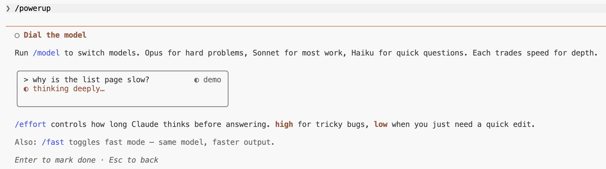

# 增强功能最佳实践


交互式课程，通过动画演示教授 Claude Code 功能。每项增强功能教会你一个 Claude Code 能做但多数人忽略的技能。于 v2.1.90 版本引入。

<table width="100%">
<tr>
<td><a href="../">← 返回 Claude Code 最佳实践</a></td>
<td align="right"></td>
</tr>
</table>

---

## 用法

```bash
claude
/powerup
```

---

## 增强功能（共 10 项）

<p align="center">
  
</p>

| # | 增强功能 | 主题 |
|---|----------|--------|
| 1 | 与你的代码库对话 | `@` 文件、行引用 |
| 2 | 用模式掌控 | `shift+tab`、plan、auto |
| 3 | 撤销一切 | `/rewind`、`Esc-Esc` |
| 4 | 后台运行 | 任务、`/tasks` |
| 5 | 教会 Claude 你的规则 | `CLAUDE.md`、`/memory` |
| 6 | 用工具扩展 | MCP、`/mcp` |
| 7 | 自动化你的工作流 | 技能、钩子 |
| 8 | 复制你自己 | 子代理、`/agents` |
| 9 | 从任何地方编码 | `/remote-control`、`/teleport` |
| 10 | 切换模型 | `/model`、`/effort` |

---

## 示例：切换模型

最后一项增强功能通过动画演示教授模型切换和精力控制。

<p align="center">
  
</p>

<p align="center">
  
</p>

<p align="center">
  
</p>

---

## 来源

- [更新日志 — v2.1.90](https://code.claude.com/docs/en/changelog)
