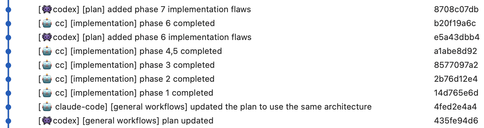

# 跨模型（Claude Code + Codex）工作流

基于 [claude-code-best-practice](https://github.com/shanraisshan/claude-code-best-practice) 和 [codex-cli-best-practice](https://github.com/shanraisshan/codex-cli-best-practice)

## 工作流

```
┌─────────────────────────────────────────────────────────────────────────┐
│              跨模型 CLAUDE CODE + CODEX 工作流                           │
├─────────────────────────────────────────────────────────────────────────┤
│                                                                         │
│  第1步：规划                                           Claude Code       │
│  ────────────                                          Opus 4.6         │
│  在规划模式下打开 Claude Code（终端1）。                  规划模式          │
│  Claude 通过 AskUserQuestion 与你交互。                                  │
│  生成包含测试关卡的分阶段计划。                                          │
│                                                                         │
│  输出：plans/{feature-name}.md                                          │
│                                                                         │
│                              ▼                                          │
│                                                                         │
│  第2步：QA 审核                                        Codex CLI        │
│  ──────────────                                        GPT-5.4          │
│  在另一个终端（终端2）中打开 Codex CLI。                                 │
│  Codex 根据实际代码库审核计划。                                          │
│  插入中间阶段（"阶段 2.5"），                                             │
│  标注为 "Codex 发现" 标题。                                              │
│  追加到计划中——从不重写原始阶段。                                        │
│                                                                         │
│  输出：plans/{feature-name}.md（已更新）                                  │
│                                                                         │
│                              ▼                                          │
│                                                                         │
│  第3步：实现                                            Claude Code       │
│  ────────────                                          Opus 4.6         │
│  启动新的 Claude Code 会话（终端1）。                                     │
│  你按阶段逐步实现，                                                       │
│  每个阶段设有测试关卡。                                                   │
│                                                                         │
│                              ▼                                          │
│                                                                         │
│  第4步：验证                                            Codex CLI        │
│  ────────────                                          GPT-5.4          │
│  启动新的 Codex CLI 会话（终端2）。                                       │
│  Codex 根据计划验证实现。                                                │
│                                                                         │
└─────────────────────────────────────────────────────────────────────────┘
```

## 跨模型工作流在生产环境中的实际效果



*最后更新：2026-03-06*
