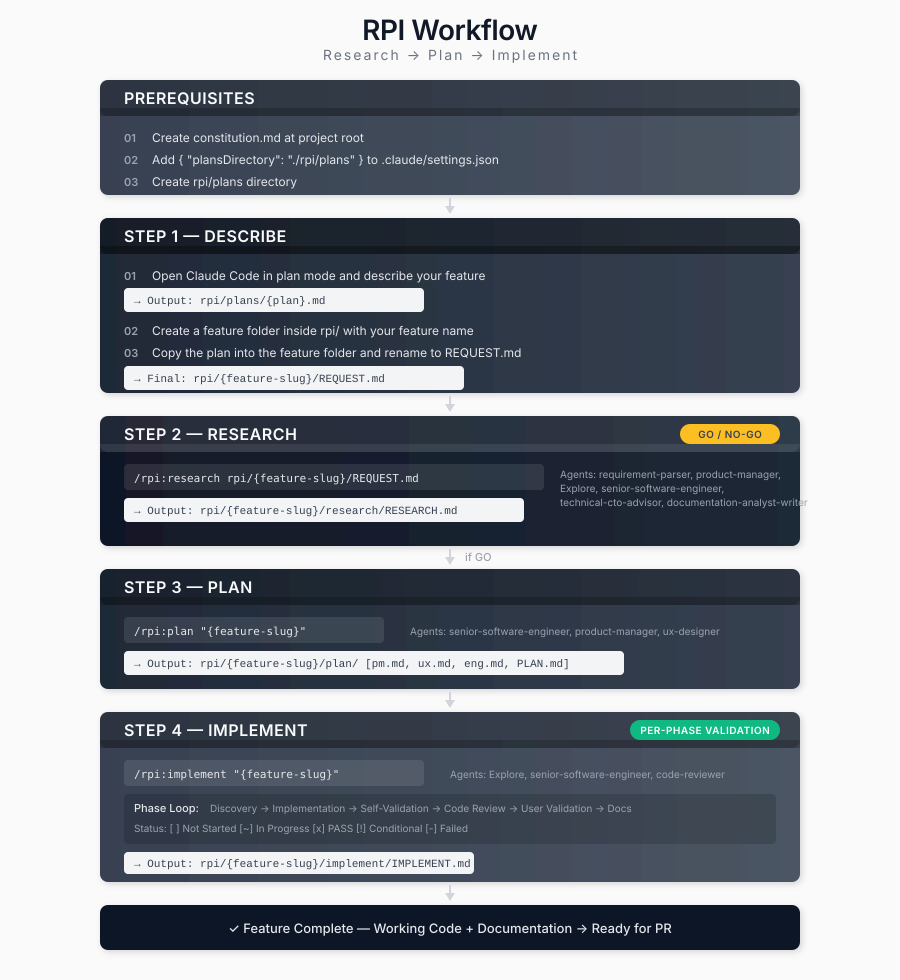

# RPI 工作流

**RPI** = **R**esearch（研究）→ **P**lan（规划）→ **I**mplement（实现）

一种系统化的开发工作流，每个阶段均设有验证关卡。避免在不可行功能上浪费精力，并确保全面的文档记录。

<table width="100%">
<tr>
<td><a href="../../">← 返回 Claude Code 最佳实践</a></td>
<td align="right"></td>
</tr>
</table>

---

## 概述



---

## 安装

将 `.claude` 文件夹（包含 `agents/` 和 `commands/rpi/`）复制到你的仓库根目录，然后创建 `rpi/plans` 目录。

---

## 示例工作流

### 功能：用户认证

**第1步：描述**
```
用户："添加支持 Google 和 GitHub 提供商的 OAuth2 认证"

1. Claude 生成计划
   → 输出：rpi/plans/oauth2-authentication.md
2. 创建功能文件夹：rpi/oauth2-authentication/
3. 将计划复制到功能文件夹中
4. 将计划重命名为 REQUEST.md
   → 最终：rpi/oauth2-authentication/REQUEST.md
```

**第2步：研究**
```bash
/rpi:research rpi/oauth2-authentication/REQUEST.md
```
输出：
- `research/RESEARCH.md` 包含分析
- 裁决：**GO**（可行，符合战略方向）

**第3步：规划**
```bash
/rpi:plan oauth2-authentication
```
输出：
- `plan/pm.md` - 用户故事与验收标准
- `plan/ux.md` - 登录 UI 流程
- `plan/eng.md` - 技术架构
- `plan/PLAN.md` - 3 个阶段，15 项任务

**第4步：实现**
```bash
/rpi:implement oauth2-authentication
```
进度：
- 阶段 1：后端基础 → 通过
- 阶段 2：前端集成 → 通过
- 阶段 3：测试与优化 → 通过

结果：功能完成，可提交 PR。

---

## 功能文件夹结构

所有功能工作均位于 `rpi/{feature-slug}/` 目录下：

```
rpi/{feature-slug}/
├── REQUEST.md              # 第1步：初始功能描述
├── research/
│   └── RESEARCH.md         # 第2步：GO/NO-GO 分析
├── plan/
│   ├── PLAN.md             # 第3步：实现路线图
│   ├── pm.md               # 产品需求
│   ├── ux.md               # UX 设计
│   └── eng.md              # 技术规范
└── implement/
    └── IMPLEMENT.md        # 第4步：实现记录
```

---

## 代理与命令

| 命令 | 使用的代理 |
|---------|-------------|
| `/rpi:research` | requirement-parser, product-manager, Explore, senior-software-engineer, technical-cto-advisor, documentation-analyst-writer |
| `/rpi:plan` | senior-software-engineer, product-manager, ux-designer, documentation-analyst-writer |
| `/rpi:implement` | Explore, senior-software-engineer, code-reviewer |
