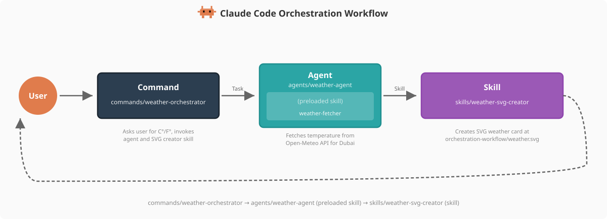

# 命令实现


<table width="100%">
<tr>
<td><a href="../">← 返回 Claude Code 最佳实践</a></td>
<td align="right"></td>
</tr>
</table>

---

<a href="#weather-orchestrator"></a>

天气编排器命令在此仓库中实现，作为**命令 → 代理 → 技能**架构模式的入口点，演示了命令如何编排多步骤工作流。

---

## 天气编排器

**文件**：[`.claude/commands/weather-orchestrator.md`](../.claude/commands/weather-orchestrator.md)

```yaml
---
description: 获取迪拜天气数据并创建 SVG 天气卡片
model: haiku
---

# 天气编排器命令

获取阿联酋迪拜的当前温度并创建可视化 SVG 天气卡片。

## 工作流

### 步骤 1：询问用户偏好
使用 AskUserQuestion 工具询问用户希望温度使用
摄氏度还是华氏度。

### 步骤 2：获取天气数据
使用 Agent 工具调用天气代理：
- subagent_type: weather-agent
- prompt: 获取阿联酋迪拜的当前温度，单位为 [unit]...

### 步骤 3：创建 SVG 天气卡片
使用 Skill 工具调用 weather-svg-creator 技能：
- skill: weather-svg-creator

...
```

该命令编排整个工作流：询问用户温度单位偏好，通过 Agent 工具调用 `weather-agent`，然后通过 Skill 工具调用 `weather-svg-creator` 技能。

---

## 

```bash
$ claude
> /weather-orchestrator
```

---

## 

让 Claude 为你创建一个——它将生成带有 YAML 前置元数据和正文的 markdown 文件，位于 `.claude/commands/<name>.md`

---

<a href="https://github.com/shanraisshan/claude-code-best-practice#orchestration-workflow"></a>

天气编排器是命令 → 代理 → 技能编排模式中的**命令**。它作为入口点——处理用户交互（温度单位偏好），将数据获取委托给 `weather-agent`，并调用 `weather-svg-creator` 技能生成可视化输出。

<p align="center">
  
</p>

| 组件 | 角色 | 本仓库 |
|-----------|------|-----------|
| **命令** | 入口点，用户交互 | [`/weather-orchestrator`](../.claude/commands/weather-orchestrator.md) |
| **代理** | 使用预加载技能（代理技能）获取数据 | [`weather-agent`](../.claude/agents/weather-agent.md) 携带 [`weather-fetcher`](../.claude/skills/weather-fetcher/SKILL.md) |
| **技能** | 独立创建输出（技能） | [`weather-svg-creator`](../.claude/skills/weather-svg-creator/SKILL.md) |
