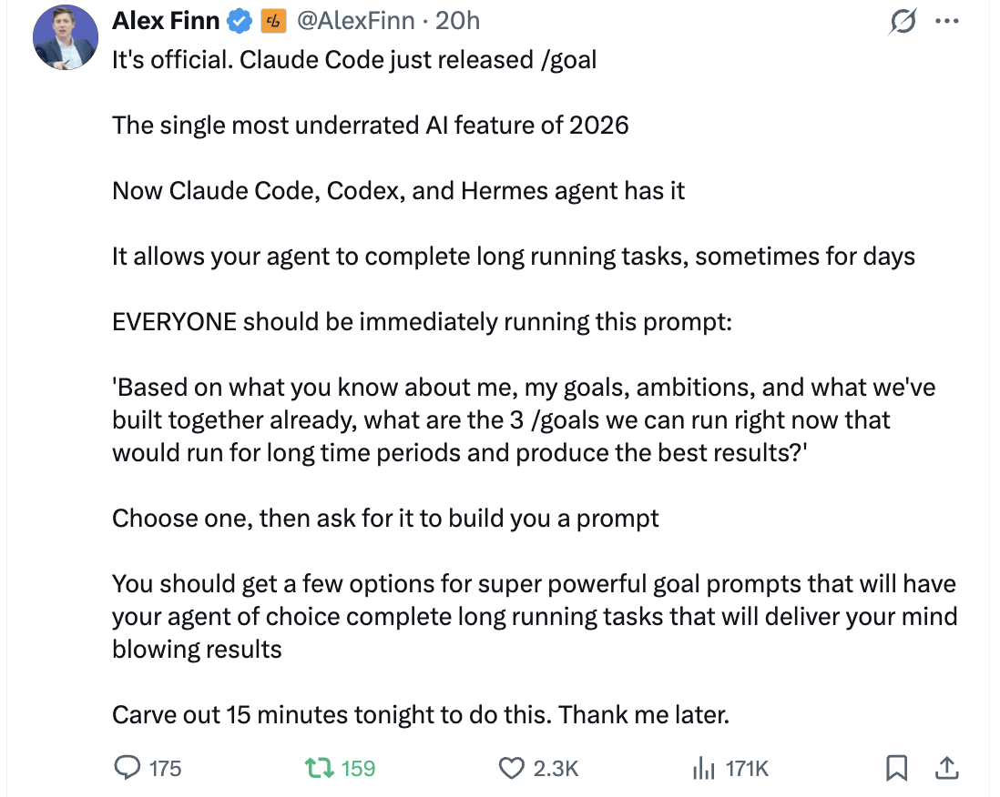

# 目标实现


<table width="100%">
<tr>
<td><a href="../">← 返回 Claude Code 最佳实践</a></td>
<td align="right"></td>
</tr>
</table>

---

<a href="#goal-tips-from-the-community"></a>

`/goal` 让你的代理持续工作，跨多轮交互直到条件满足——Claude Code、Codex 和 Hermes Agent 都支持此功能。社区正在形成几个高杠杆提示技巧，与 `/goal` 配合使用效果极佳。

---

## 社区目标技巧

### 1. 让代理提出自己的目标

<p align="center">
  
</p>

> 官方消息。Claude Code 刚刚发布了 /goal
>
> 2026 年最被低估的 AI 功能
>
> 现在 Claude Code、Codex 和 Hermes agent 都拥有了它
>
> 它能让你的代理完成长期运行的任务，有时持续数天
>
> 每个人都应该立即运行这个提示词：
>
> '根据你对我的了解、我的目标、抱负以及我们已共同构建的成果，我们现在可以运行哪 3 个 /goal，使其长期运行并产生最佳结果？'
>
> 选择一个，然后让它为你构建一个提示词
>
> 你应该会得到几个超级强大的目标提示词选项，让你选择的代理完成长期运行的任务，带来令人惊叹的成果。
>
> 今晚抽出 15 分钟来做这件事。以后再来感谢我。

**来源：**[Alex Finn (@AlexFinn) 在 X](https://x.com/AlexFinn/status/2053976411296452887)

---

### 2. 让代理为你草拟 /goal 提示词

<p align="center">
  
</p>

> 想知道 Codex 最好的 /goal 技巧吗？
>
> 只需告诉你的 Codex：
>
> "阅读此次会话和仓库，深入分析我们想要达成的确切意图和目标，然后为我编写 /goal 提示词。
>
> 务必深入挖掘历史记录和文档，确保 100% 清晰"
>
> 你还可以添加：
>
> "如果你对某些部分不确定，或者想问我几个问题以进一步明确目标，请尽管问"
>
> 然后只需复制粘贴 Codex 给你的内容，将开头部分改为 /goal
>
> 它就会完全按照你希望在该会话/仓库中做的事情去执行，不停歇直到完成。

**来源：**[Meta Alchemist (@meta_alchemist) 在 X](https://x.com/meta_alchemist/status/2054214497443995694)

---

## 

```bash
$ claude
> /goal <条件>
> /goal clear
```

`/goal <条件>` 让 Claude 跨多轮持续工作，直到 Haiku 评估的条件成立。它与 `/loop`（时间驱动）和自动模式（每工具）互补。需要 Claude Code v2.1.139+。

查看[官方文档](https://code.claude.com/docs/en/goal)了解完整行为。
