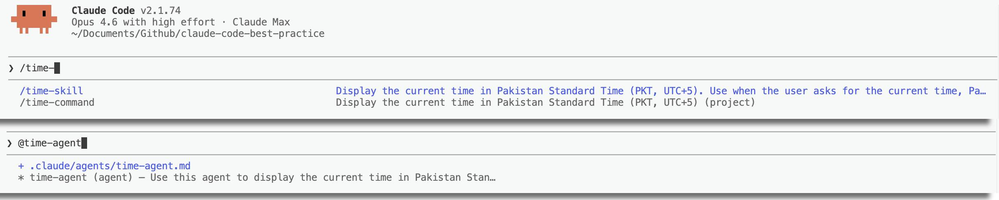
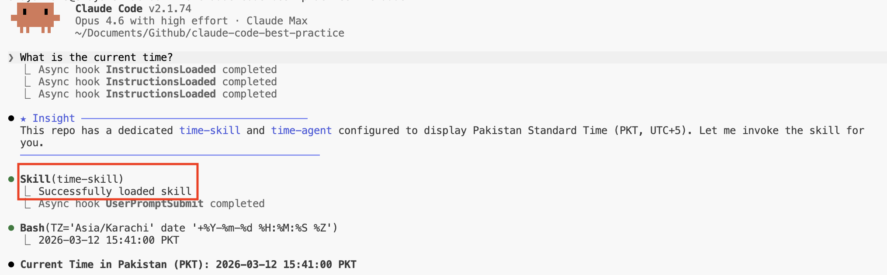

# 代理 vs 命令 vs 技能 — 何时使用何种机制

Claude Code 三种扩展机制的对比：子代理、命令和技能。

<table width="100%">
<tr>
<td><a href="../">← 返回 Claude Code 最佳实践</a></td>
<td align="right"></td>
</tr>
</table>



---

## 概览

| | 代理 | 命令 | 技能 |
|---|---|---|---|
| **位置** | `.claude/agents/<name>.md` | `.claude/commands/<name>.md` | `.claude/skills/<name>/SKILL.md` |
| **上下文** | 独立的子代理进程 | 内联（主对话） | 内联（主对话） |
| **用户可调用** | 无 `/` 菜单 — 由 Claude 调用或通过 Agent 工具调用 | 是 — `/command-name` | 是 — `/skill-name`（除非设置 `user-invocable: false`） |
| **Claude 自动调用** | 是 — 通过 `description` 字段 | 否 | 是 — 通过 `description` 字段（除非设置 `disable-model-invocation: true`） |
| **接受参数** | 通过 `prompt` 参数 | `$ARGUMENTS`、`$0`、`$1` | `$ARGUMENTS`、`$0`、`$1` |
| **动态上下文注入** | 否 | 是 — `` !`command` `` | 是 — `` !`command` `` |
| **独立上下文窗口** | 是 — 隔离 | 否 — 共享主窗口 | 否 — 共享主窗口（除非设置 `context: fork`） |
| **模型覆盖** | `model:` 前置元数据 | `model:` 前置元数据 | `model:` 前置元数据 |
| **工具限制** | `tools:` / `disallowedTools:` | `allowed-tools:` | `allowed-tools:` |
| **钩子** | `hooks:` 前置元数据 | — | `hooks:` 前置元数据 |
| **记忆** | `memory:` 前置元数据（用户/项目/本地） | — | — |
| **可预加载技能** | 是 — `skills:` 前置元数据 | — | — |
| **MCP 服务器** | `mcpServers:` 前置元数据 | — | — |

---

## 何时使用

### 使用代理当：

- 任务是**自主且多步骤的** — 代理需要探索、决策和执行，无需持续指导
- 需要**上下文隔离** — 工作不应污染主对话窗口
- 代理需要跨会话的**持久化记忆**（例如，一个能学习模式代码审查员）
- 希望通过**预加载领域知识**（技能）而不挤占主上下文
- 任务适合**在后台运行**或在 **git 工作树**中运行
- 需要**工具限制**或**不同的权限模式**（例如 `acceptEdits`、`plan`）

**示例**：`weather-agent` — 使用预加载的 `weather-fetcher` 技能自主获取天气数据，在独立的上下文环境中运行，并带有受限的工具。

### 使用命令当：

- 需要**用户触发的入口点** — 一个由用户明确启动的工作流
- 工作流涉及**编排**其他代理或技能
- 希望**保持上下文精简** — 命令内容在用户触发之前不会注入到会话上下文中

**示例**：`weather-orchestrator` — 用户触发它，询问摄氏/华氏偏好，调用代理，然后调用 SVG 技能。

### 使用技能当：

- 希望**Claude 根据用户意图自动调用** — 技能描述会被注入到会话上下文中进行语义匹配
- 任务是**可重用的流程**，可以从多个地方调用（命令、代理或 Claude 本身）
- 需要**代理预加载** — 在启动时将领域知识注入到特定代理中

**示例**：`weather-svg-creator` — 当用户请求天气卡片时，Claude 自动调用它；也可以从命令中调用。

---

## 命令 → 代理 → 技能的架构

本仓库展示了一种分层编排模式：

```
用户触发 /command
    ↓
命令编排工作流
    ↓
命令调用代理（独立上下文，自主运行）
    ↓
代理使用预加载的技能（领域知识）
    ↓
命令调用技能（内联，用于生成输出）
```

**具体示例** — 天气系统：

```
/weather-orchestrator（命令 — 入口点，询问摄氏/华氏）
    ↓
weather-agent（代理 — 自主获取温度）
    ├── weather-fetcher（代理技能 — 预加载的 API 指令）
    ↓
weather-svg-creator（技能 — 内联创建 SVG）
```

---

## 前置元数据对比

### 代理前置元数据

```yaml
---
name: my-agent
description: Use this agent PROACTIVELY when...
tools: Read, Write, Edit, Bash
model: sonnet
maxTurns: 10
permissionMode: acceptEdits
memory: user
skills:
  - my-skill
---
```

### 命令前置元数据

```yaml
---
description: Do something useful
argument-hint: [issue-number]
allowed-tools: Read, Edit, Bash(gh *)
model: sonnet
---
```

### 技能前置元数据

```yaml
---
name: my-skill
description: Do something when the user asks for...
argument-hint: [file-path]
disable-model-invocation: false
user-invocable: true
allowed-tools: Read, Grep, Glob
model: sonnet
context: fork
agent: general-purpose
---
```

---

## 关键区别

### 自动调用

| 机制 | Claude 可自动调用？ | 如何阻止 |
|-----------|------------------------|----------------|
| 代理 | 是 — 通过 `description`（使用 "PROACTIVELY" 以鼓励调用） | 移除或弱化描述 |
| 命令 | 否 — 始终由用户通过 `/` 触发 | 不适用 |
| 技能 | 是 — 通过 `description` | 设置 `disable-model-invocation: true` |

### 在 `/` 菜单中的可见性

| 机制 | 是否出现在 `/` 菜单中？ | 如何隐藏 |
|-----------|---------------------|-------------|
| 代理 | 否 | 不适用 |
| 命令 | 是 — 始终 | 无法隐藏 |
| 技能 | 是 — 默认 | 设置 `user-invocable: false` |

### 上下文隔离

| 机制 | 是否在独立上下文中运行？ | 如何配置 |
|-----------|---------------------|-----------------|
| 代理 | 始终 | 内置行为 |
| 命令 | 从不 | 不适用 |
| 技能 | 可选 | 设置 `context: fork` |

---

## 实际示例："当前时间是多少？"

本仓库为同一任务定义了全部三种机制 — 显示 PKT（巴基斯坦标准时间）的当前时间。以下是当用户输入 **"当前时间是多少？"** 而未明确调用任何 `/` 命令时发生的事情：

| 机制 | 是否会触发？ | 原因 |
|-----------|--------------|---------------|
| `time-command` | 否 | 命令**永远不会自动调用**。用户需要明确输入 `/time-command` 才能运行。命令没有自动发现路径 — 它们严格由用户触发。 |
| `time-agent` | **是**（可能） | 该代理的 `description` 写着 *"Use this agent to display the current time in Pakistan Standard Time"*。Claude 将其与用户意图匹配，并可能通过 Agent 工具生成它。但是，代理运行在**独立的上下文窗口**中，对于这个简单任务来说过于沉重。 |
| `time-skill` | **是**（最可能） | 该技能的 `description` 写着 *"Display the current time in Pakistan Standard Time (PKT, UTC+5). Use when the user asks for the current time, Pakistan time, or PKT."*。Claude 匹配到它并通过 Skill 工具调用它。由于它**内联**运行且无上下文开销，是最有效的匹配。 |

### 解析顺序

当多种机制匹配同一意图时，Claude 优先选择满足请求的**最轻量选项**：

```
1. 技能（内联，无上下文开销）     ← 首选
2. 代理（独立上下文，自主运行）    ← 当技能不可用或任务复杂时使用
3. 命令（从不 — 需要显式 /）   ← 仅当用户输入 /time-command 时
```

### 如果技能设置了 `disable-model-invocation: true` 会怎样？

那么 Claude **无法**自动调用该技能。代理成为唯一可自动调用的选项，因此 Claude 会生成 `time-agent` — 代价是为一行的 bash 命令单独开启一个上下文窗口。

### 如果技能和代理都禁用了自动调用会怎样？

那么**什么都不会自动触发**。Claude 会退回到自身的通用知识，很可能直接运行 `TZ='Asia/Karachi' date` — 不涉及任何扩展机制。用户需要明确输入 `/time-command` 或 `/time-skill` 来使用它们。



---

## 来源

- [Claude Code 技能 — 文档](https://code.claude.com/docs/en/skills)
- [Claude Code 子代理 — 文档](https://code.claude.com/docs/en/sub-agents)
- [Claude Code 斜杠命令 — 文档](https://code.claude.com/docs/en/slash-commands)
- [技能最佳实践](../best-practice/claude-skills.md)
- [命令最佳实践](../best-practice/claude-commands.md)
- [子代理最佳实践](../best-practice/claude-subagents.md)
