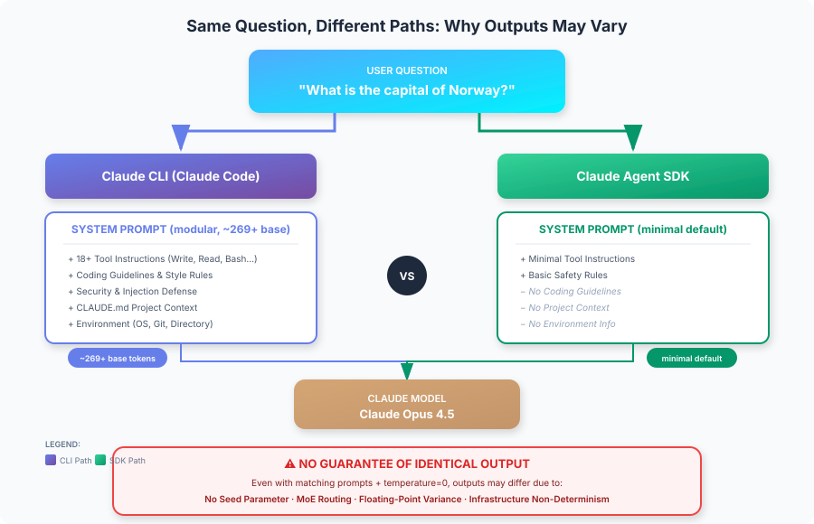

# Claude Agent SDK 对比 Claude CLI：系统提示词与输出一致性

<table width="100%">
<tr>
<td><a href="../">← 返回 Claude Code 最佳实践</a></td>
<td align="right"></td>
</tr>
</table>



---

## 执行摘要

当通过 **Claude Agent SDK** 与 **Claude CLI（Claude Code）** 发送相同的消息（例如"挪威的首都是什么？"）时，这些消息所附带的系统提示词存在根本性差异。CLI 使用**模块化系统提示词架构**（约 269 基础令牌，根据功能特性条件加载额外上下文），而 SDK 默认使用极简提示词。由于缺少种子参数以及 Claude 架构固有的非确定性，即使在配置一致的情况下，**两者之间也无法保证输出完全相同**。

---

## 1. 系统提示词对比

### Claude CLI（Claude Code）

Claude CLI 使用**模块化系统提示词架构**，基础提示词约 269 令牌，并根据条件加载额外上下文：

| 组件 | 描述 | 加载方式 |
|-----------|-------------|---------|
| **基础系统提示词** | 核心指令和行为 | 始终加载（约 269 令牌） |
| **工具指令** | 18 个以上内置工具（Write、Read、Edit、Bash、TodoWrite 等） | 始终加载 |
| **编码规范** | 代码风格、格式化规则、安全实践 | 始终加载 |
| **安全规则** | 拒绝规则、注入防御、危害防护 | 始终加载 |
| **回复风格** | 语气、详细程度、解释深度、表情符号使用 | 始终加载 |
| **环境上下文** | 工作目录、git 状态、平台信息 | 始终加载 |
| **项目上下文** | CLAUDE.md 内容、设置、钩子配置 | 条件加载 |
| **子代理提示词** | 计划模式、探索代理、任务代理 | 条件加载 |
| **安全审查** | 扩展安全指令（约 2,610 令牌） | 条件加载 |

**关键特性：**
- **模块化架构**，拥有 110 多个条件加载的系统提示词字符串
- 基础提示词适中（约 269 令牌），总量取决于激活的功能
- 包含广泛的安全和注入防御层
- 自动加载工作目录中的 CLAUDE.md 文件
- 交互模式下保持会话持久上下文

### Claude Agent SDK

Agent SDK 默认使用**极简系统提示词**，包含：

| 组件 | 描述 | 令牌影响 |
|-----------|-------------|--------------|
| **必要工具指令** | 仅显式提供的工具 | 极小 |
| **基本安全** | 最简安全指令 | 极小 |

**关键特性：**
- 默认不包含编码规范或风格偏好
- 除非显式配置，否则不包含项目上下文
- 无扩展工具描述
- 需要显式配置才能匹配 CLI 行为

---

## 2. 各接口发送的内容

### 示例："挪威的首都是什么？"

#### 通过 Claude CLI

```
系统提示词：[模块化，约 269+ 基础令牌]
├── 基础系统提示词（约 269 令牌）
├── 工具指令（Write、Read、Edit、Bash、Grep、Glob 等）
├── Git 安全协议
├── 代码引用规范
├── 专业客观性指令
├── 安全与注入防御规则
├── 环境上下文（操作系统、目录、日期）
├── CLAUDE.md 内容（如存在）[条件加载]
├── MCP 工具描述（如已配置）[条件加载]
├── 计划/探索模式提示词 [条件加载]
└── 会话/对话上下文

用户消息："挪威的首都是什么？"
```

#### 通过 Claude Agent SDK（默认）

```
系统提示词：[极简]
├── 必要的工具指令（如提供了任何工具）
└── 基本操作上下文

用户消息："挪威的首都是什么？"
```

#### 通过 Agent SDK（使用 `claude_code` 预设）

```typescript
const response = await query({
  prompt: "What is the capital of Norway?",
  options: {
    systemPrompt: {
      type: "preset",
      preset: "claude_code"
    }
  }
});
```

```
系统提示词：[模块化，与 CLI 一致]
├── 完整的 Claude Code 系统提示词
├── 工具指令
├── 编码规范
└── 安全规则

// 注意：除非配置了 settingSources，否则仍不会加载 CLAUDE.md
```

---

## 3. 自定义方法

### Claude CLI 自定义

| 方法 | 命令 | 效果 |
|--------|---------|--------|
| **追加提示词** | `claude -p "..." --append-system-prompt "..."` | 保留默认设置的同时添加指令 |
| **替换提示词** | `claude -p "..." --system-prompt "..."` | 完全替换系统提示词 |
| **项目上下文** | CLAUDE.md 文件 | 自动加载，持久生效 |
| **输出风格** | `/output-style [名称]` | 应用预定义的回复风格 |

### Agent SDK 自定义

| 方法 | 配置 | 效果 |
|--------|---------------|--------|
| **自定义提示词** | `systemPrompt: "..."` | 完全替换默认提示词（丢失工具） |
| **预设 + 追加** | `systemPrompt: { type: "preset", preset: "claude_code", append: "..." }` | 保留 CLI 功能 + 自定义指令 |
| **加载 CLAUDE.md** | `settingSources: ["project"]` | 加载项目级指令 |
| **输出风格** | `settingSources: ["user"]` 或 `settingSources: ["project"]` | 加载已保存的输出风格 |

### 配置对比表

| 功能 | CLI 默认 | SDK 默认 | SDK 使用预设 |
|---------|-------------|-------------|-----------------|
| 工具指令 | ✅ 完整 | ❌ 极简 | ✅ 完整 |
| 编码规范 | ✅ 有 | ❌ 无 | ✅ 有 |
| 安全规则 | ✅ 有 | ❌ 基础 | ✅ 有 |
| CLAUDE.md 自动加载 | ✅ 是 | ❌ 否 | ❌ 否* |
| 项目上下文 | ✅ 自动 | ❌ 否 | ❌ 否* |

*需要显式配置 `settingSources: ["project"]`

---

## 4. 输出一致性保证

### 关键发现：不保证确定性

**Claude Messages API 未提供用于复现结果的种子参数。** 这是一个根本性的架构限制。

### 阻碍输出一致性的因素

| 因素 | 描述 | 可控？ |
|--------|-------------|---------------|
| **不同的系统提示词** | CLI 与 SDK 默认设置不同 | ✅ 是（通过配置） |
| **浮点运算** | 并行硬件特性 | ❌ 否 |
| **MoE 路由** | 混合专家架构的差异 | ❌ 否 |
| **批处理/调度** | 云基础设施差异 | ❌ 否 |
| **数值精度** | 推理引擎差异 | ❌ 否 |
| **模型快照** | 版本更新/变更 | ❌ 否 |

### 温度与采样

即使使用 `temperature=0.0`（贪婪解码）：
- **不保证**完全的确定性
- 由于基础设施因素，仍可能出现微小差异
- 已知问题：[Claude CLI 对相同输入产生非确定性输出](https://github.com/anthropics/claude-code/issues/3370)

---

## 5. 实现最大一致性

要使 SDK 与 CLI 之间获得**尽可能接近**的相同输出：

### Agent SDK 配置

```typescript
import Anthropic from "@anthropic-ai/sdk";

const client = new Anthropic();

// 选项 1：使用 claude_code 预设
const response = await client.messages.create({
  model: "claude-sonnet-4-20250514",
  max_tokens: 1024,
  // 尽可能匹配 CLI 系统提示词
  system: "Your exact system prompt matching CLI",
  messages: [
    { role: "user", content: "What is the capital of Norway?" }
  ],
  // 使用贪婪解码以获得最大一致性
  temperature: 0
});

// 选项 2：使用 Agent SDK 查询函数
import { query } from "@anthropic-ai/agent-sdk";

for await (const message of query({
  prompt: "What is the capital of Norway?",
  options: {
    systemPrompt: {
      type: "preset",
      preset: "claude_code"
    },
    temperature: 0,
    model: "claude-sonnet-4-20250514",
    // 像 CLI 一样加载项目上下文
    settingSources: ["project"]
  }
})) {
  // 处理回复
}
```

### CLI 配置

```bash
# 尽可能匹配 SDK 配置
claude -p "What is the capital of Norway?" \
  --model claude-sonnet-4-20250514 \
  --temperature 0
```

### 仍无法保证

即使配置完全一致：
- 不同运行之间的输出可能不同
- SDK 与 CLI 之间的输出可能不同
- 不存在用于强制复现结果的种子参数

---

## 6. 实际应用意义

### 何时使用各接口

| 使用场景 | 推荐接口 | 原因 |
|----------|----------------------|--------|
| 交互式开发 | Claude CLI | 完整工具套件、项目上下文 |
| 程序化集成 | Agent SDK | 细粒度控制、嵌入集成 |
| 一致性 API 响应 | Agent SDK + 自定义提示词 | 对系统提示词有更多控制 |
| 批量处理 | Agent SDK | 更适合自动化流水线 |
| 一次性任务 | Claude CLI | 快速启动、即时上下文 |

### 设计建议

1. **不要依赖比特级可复现性**
   - 构建对微小输出差异具有鲁棒性的应用程序
   - 使用结构化输出和验证

2. **对于需要一致性的生产流水线：**
   - 尽可能缓存结果
   - 使用 JSON 模式验证的结构化输出
   - 结合确定性逻辑和验证
   - 考虑多轮生成并取共识

3. **在 SDK 中匹配 CLI 行为：**
   ```typescript
   systemPrompt: {
     type: "preset",
     preset: "claude_code",
     append: "Your additional instructions"
   },
   settingSources: ["project", "user"]
   ```

---

## 7. 系统提示词令牌影响

| 配置 | 架构 | 说明 |
|---------------|-------------|-------|
| SDK（极简） | 极简默认 | 仅必要的工具指令 |
| SDK（claude_code 预设） | 模块化（约 269+ 基础） | 与 CLI 一致，因功能而异 |
| CLI（默认） | 模块化（约 269+ 基础） | 条件加载额外上下文 |
| CLI（带 MCP 工具） | 模块化 + MCP | MCP 工具描述会显著增加令牌 |

**注意：** Claude Code 使用模块化架构，拥有 110 多个系统提示词字符串。基础提示词约 269 令牌，各组件根据激活功能在 18 到 2,610 令牌之间变化。

**影响：** SDK 的极简默认设置为实际任务提供了更多上下文，但代价是失去了 Claude Code 的完整能力。

---

## 8. 汇总表

| 方面 | Claude CLI | Agent SDK（默认） | Agent SDK（预设） |
|--------|------------|--------------------|--------------------|
| **系统提示词** | 模块化（约 269+ 基础） | 极简 | 模块化（与 CLI 一致） |
| **包含的工具** | 18 个以上内置 | 仅当提供时 | 18 个以上内置 |
| **CLAUDE.md 自动加载** | 是 | 否 | 否（需配置） |
| **编码规范** | 是 | 否 | 是 |
| **安全规则** | 完整 | 基础 | 完整 |
| **温度控制** | 是 | 是 | 是 |
| **确定性保证** | 否 | 否 | 否 |
| **输出相同？** | 不适用 | 否（与 CLI 对比） | 更接近，但否 |

---

## 9. 结论

**问：SDK 与 CLI 中相同消息所附带的系统提示词有何不同？**

CLI 使用**模块化系统提示词架构**，包含约 269 令牌的基础提示词和 110 多个条件加载组件（工具指令、编码规范、安全规则、项目上下文）。SDK 使用**极简默认设置**，仅包含必要的工具指令，但可以通过 `claude_code` 预设配置为匹配 CLI 行为。

**问：能否保证输出相同？**

**不能。** 即使使用匹配的系统提示词、相同的输入和 `temperature=0`，也无法保证输出相同，原因包括：
- Claude API 中缺少种子参数
- 浮点运算差异
- 基础设施层面的非确定性
- 模型架构（混合专家）路由差异

**建议：** 设计系统时应使其对输出差异具有鲁棒性，而非依赖确定性行为。对于对一致性要求较高的应用，应使用结构化输出、缓存和验证层。

---

## 参考来源

- [修改系统提示词 - Agent SDK](https://docs.anthropic.com/en/docs/agents-and-tools/claude-code/sdk#modifying-system-prompts)
- [Claude Code CLI 参考](https://docs.anthropic.com/en/docs/agents-and-tools/claude-code/cli)
- [Claude Code 无头模式](https://docs.anthropic.com/en/docs/agents-and-tools/claude-code/headless)
- [Claude Code 最佳实践 - Anthropic Engineering](https://www.anthropic.com/engineering/claude-code-best-practices)
- [Claude Messages API 参考](https://docs.anthropic.com/en/api/messages)
- [GitHub Issue #3370：非确定性输出](https://github.com/anthropics/claude-code/issues/3370)
- [Claude Code 系统提示词仓库](https://github.com/Piebald-AI/claude-code-system-prompts) - 模块化提示词架构分析
- [为什么大语言模型的确定性输出几乎不可能实现](https://unstract.com/blog/understanding-why-deterministic-output-from-llms-is-nearly-impossible/)

---

*本报告由 Claude Code 使用 Opus 4.5 模型于 2026 年 2 月 3 日生成。*
