# 使用 Claude Code 的 10 个技巧 — 来自 Claude Code 团队

Claude Code 创建者 Boris Cherny（[@bcherny](https://x.com/bcherny)）于 2026 年 2 月 1 日分享的团队技巧总结。

<table width="100%">
<tr>
<td><a href="../">← 返回 Claude Code 最佳实践</a></td>
<td align="right"></td>
</tr>
</table>

---

## 背景

Boris 分享了直接来自 Claude Code 团队的使用技巧。团队使用 Claude 的方式与 Boris 个人的使用方式不同。请记住：使用 Claude Code 没有唯一正确的方法——每个人的设置都不同。你应该尝试找出适合你的方法！

<a href="https://x.com/bcherny/status/2017742741636321619">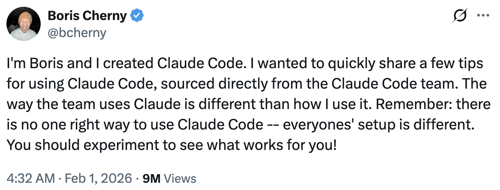</a>

---

## 1/ 更充分地并行执行

同时启动 3–5 个 git 工作树，每个运行独立的 Claude 会话。这是最大的生产力提升点，也是团队的首推技巧。Boris 个人使用多个 git 检出，但 Claude Code 团队大多偏好工作树——这也是 `@amorisscode` 为 Claude Desktop 应用构建原生支持的原因！

有些人还会命名他们的工作树并设置 shell 别名（`2a`、`2b`、`2c`），以便一键切换。另一些人则设有专门的"分析"工作树，仅用于读取日志和运行 BigQuery。

参见：[工作树文档](https://code.claude.com/docs/en/common...)

<a href="https://x.com/bcherny/status/2017742743125299476">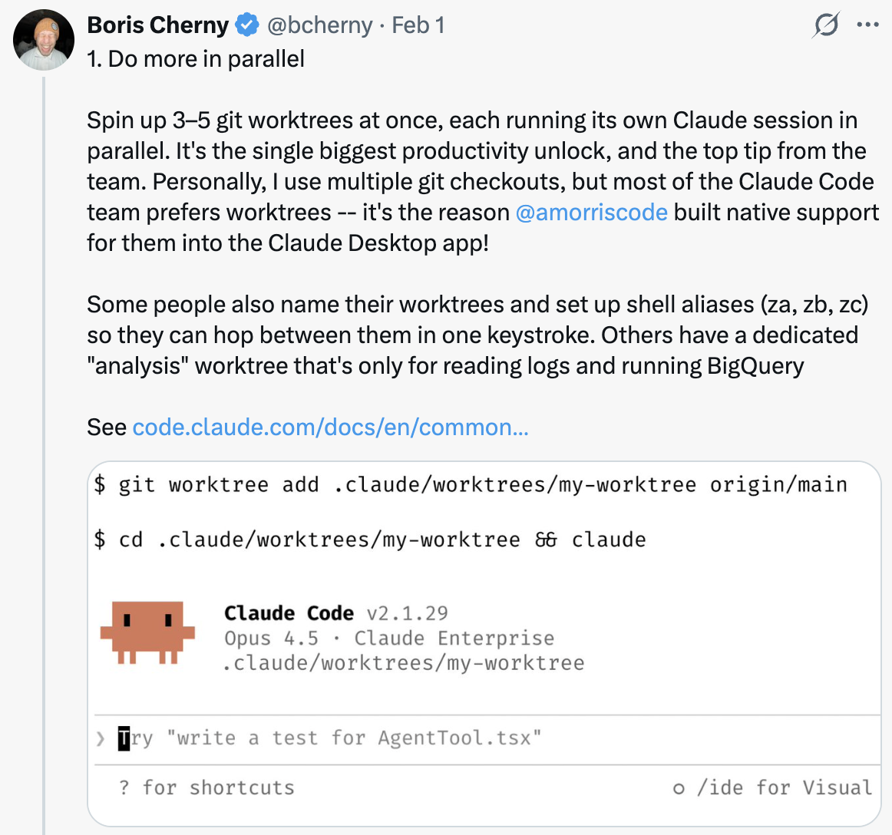</a>

---

## 2/ 每个复杂任务都从计划模式开始

把精力投入计划中，这样 Claude 就能一次性完成实现。

有人会让一个 Claude 编写计划，然后启动第二个 Claude 作为高级工程师来评审它。

另一个人说，一旦事情偏离正轨，就切换回计划模式重新规划，不要硬着头皮继续。他们还明确告诉 Claude 在验证步骤时进入计划模式，而不仅仅是在构建阶段。

<a href="https://x.com/bcherny/status/2017742745365057733">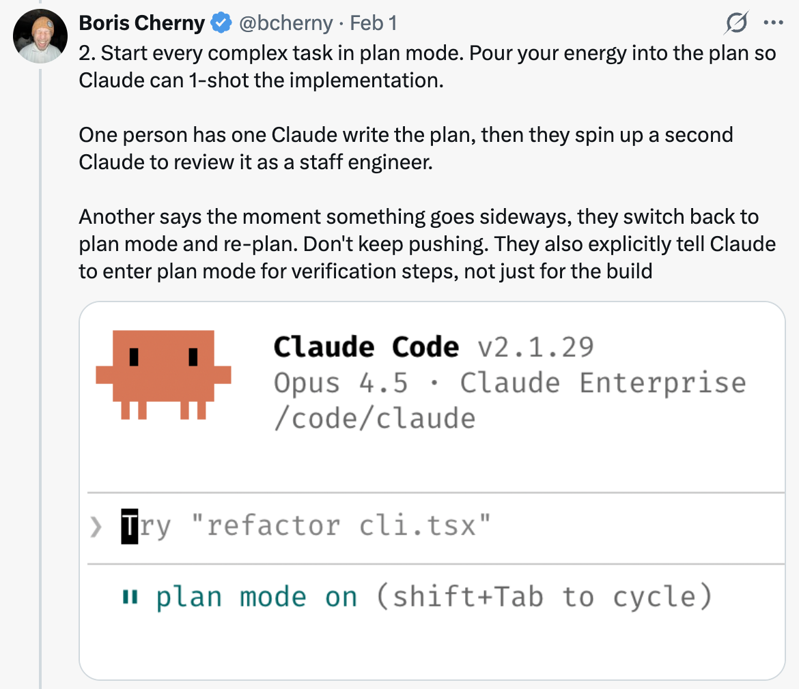</a>

---

## 3/ 投入精力到你的 CLAUDE.md 中

每次纠正后，加上一句："更新你的 CLAUDE.md，这样你就不会再犯同样的错误。" Claude 在为自己编写规则方面出奇地擅长。

随着时间的推移，无情地编辑你的 `CLAUDE.md`。持续迭代，直到 Claude 的错误率明显下降。

一位工程师告诉 Claude 为每个任务/项目维护一个笔记目录，每次 PR 后更新。然后他们将 `CLAUDE.md` 指向它。

<a href="https://x.com/bcherny/status/2017742747067945390">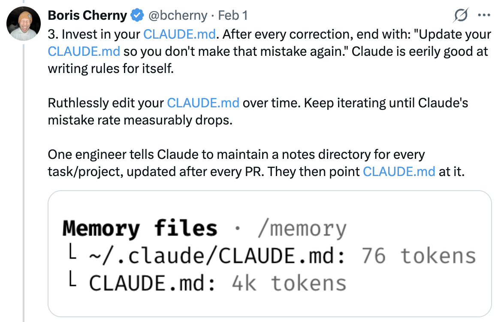</a>

---

## 4/ 创建你自己的技能并将其提交到 Git

在所有项目中复用。团队的建议：

- 如果某件事你一天做超过一次，就把它变成技能或命令
- 创建一个 `/techdebt` 斜杠命令，在每个会话结束时运行，查找并删除重复代码
- 设置一个斜杠命令，将 7 天的 Slack、GDrive、Asana 和 GitHub 同步到一个上下文转储中
- 构建数据分析工程师风格的代理，用于编写 dbt 模型、审查代码以及在开发环境中测试变更

参见：[用技能扩展 Claude — Claude Code 文档](https://code.claude.com/docs/en/skills)

<a href="https://x.com/bcherny/status/2017742748984742078">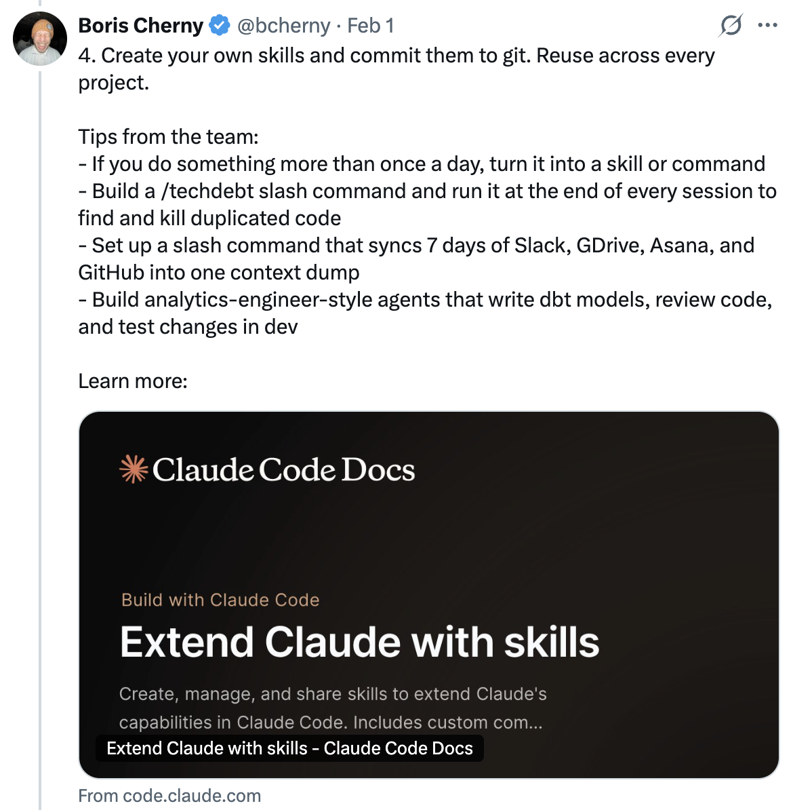</a>

---

## 5/ Claude 能自行修复大多数错误

团队的做法如下：

启用 Slack MCP，然后将 Slack 中的错误讨论线程粘贴到 Claude 中，只需说"修复"。无需上下文切换。

或者，直接说"去修复失败的 CI 测试。"不要微观管理具体怎么修。

将 Claude 指向 docker 日志来排查分布式系统问题——它在这方面出奇地能干。

<a href="https://x.com/bcherny/status/2017742750473720121">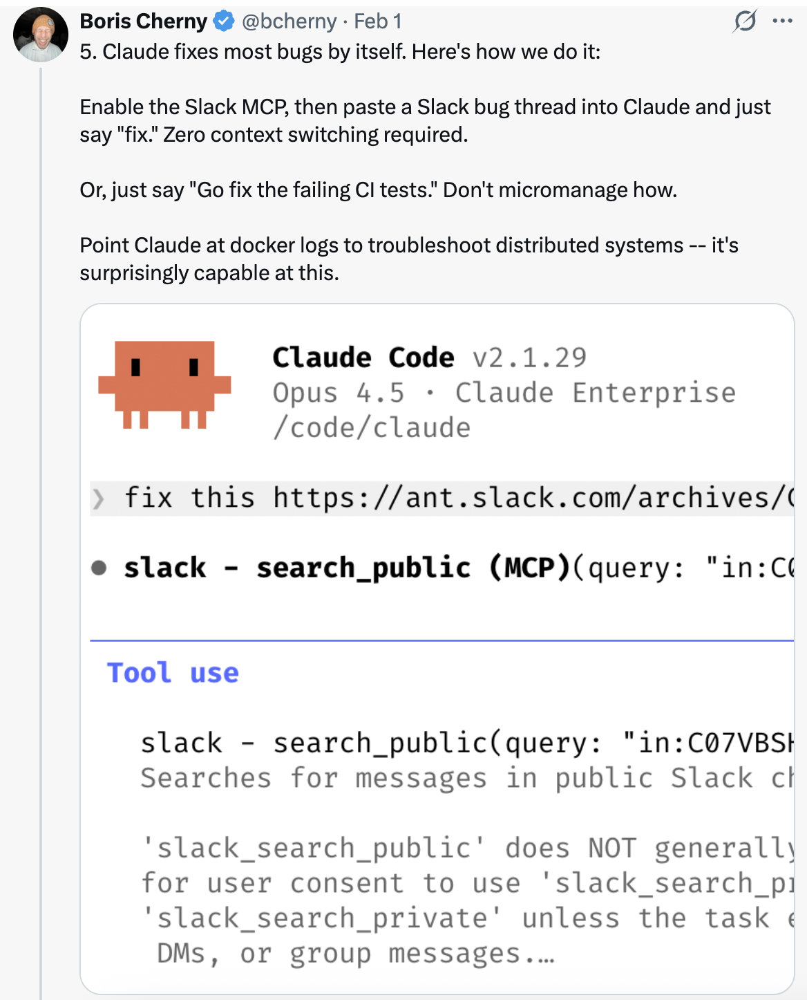</a>

---

## 6/ 提升你的提示技巧

a. **挑战 Claude。** 说"在这些变更上拷问我，直到我通过你的测试才创建 PR。"让 Claude 做你的审查者。或者说"向我证明这有效"，让 Claude 比较 main 分支和你的功能分支之间的差异。

b. **在一个平庸的修复之后，** 说："基于你现在所知的一切，扔掉这个，实现优雅的解决方案。"

c. **编写详细的规格说明**，在交接工作前减少歧义。你越具体，输出就越好。

<a href="https://x.com/bcherny/status/2017742752566632544">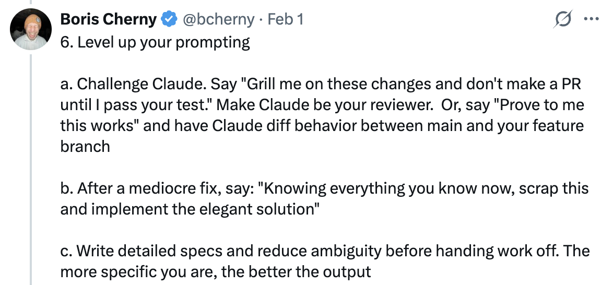</a>

---

## 7/ 终端与环境设置

团队钟爱 Ghostty！多人喜欢它的同步渲染、24 位色彩和良好的 unicode 支持。

为了更方便地管理多个 Claude，使用 `/statusline` 自定义你的状态栏，始终显示上下文使用情况和当前 git 分支。许多人还会为终端标签设置颜色和名称，有时使用 tmux——每个标签对应一个任务/工作树。

使用语音输入。你说话的速度是打字速度的 3 倍，因此你的提示词也会更加详细。（在 macOS 上按两次 fn 键）

参见：[终端设置文档](https://code.claude.com/docs/en/termin...)

<a href="https://x.com/bcherny/status/2017742753971769626">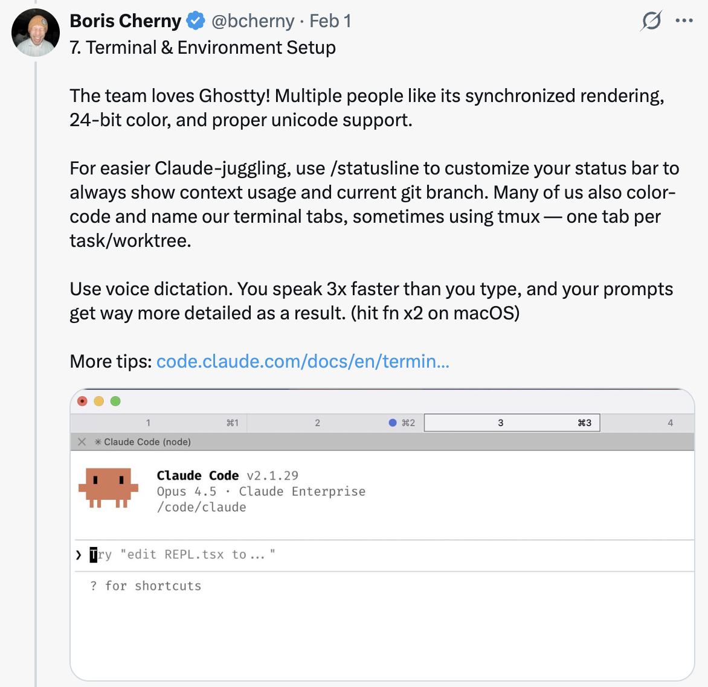</a>

---

## 8/ 使用子代理

a. 在任何希望 Claude 投入更多算力来解决的问题后追加"使用子代理"。

b. 将单个任务卸载给子代理，保持主代理的上下文窗口干净且专注。

c. 通过钩子将权限请求路由到 Opus 4.5——让它扫描攻击并自动批准安全的请求。参见：[钩子文档](https://code.claude.com/docs/en/hooks#...)

<a href="https://x.com/bcherny/status/2017742755737555434">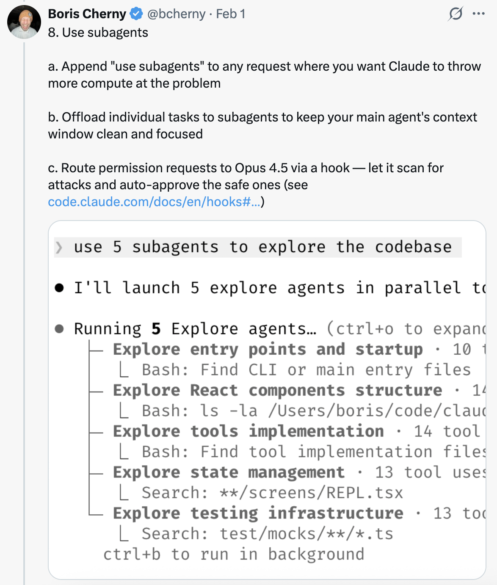</a>

---

## 9/ 使用 Claude 处理数据与分析

让 Claude Code 使用"bq" CLI 即时拉取和分析指标。团队在代码库中检查了一个 BigQuery 技能，每个人都在 Claude Code 中直接使用它进行分析查询。Boris 个人已经 6 个多月没写过一行 SQL 了。

这对任何有 CLI、MCP 或 API 的数据库都适用。

<a href="https://x.com/bcherny/status/2017742757666902374">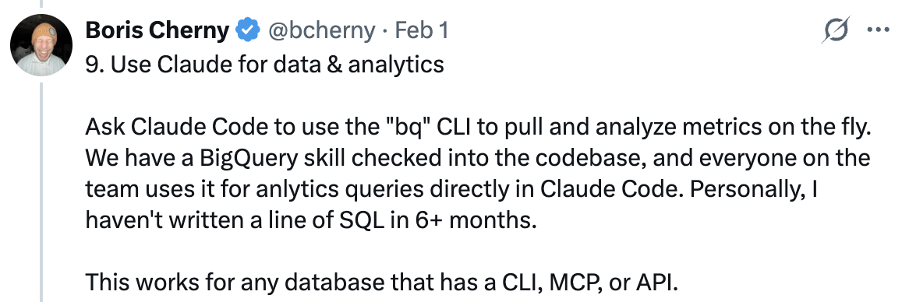</a>

---

## 10/ 用 Claude 学习

团队提供的几个使用 Claude Code 学习的技巧：

a. 在 `/config` 中启用"解释型"或"学习型"输出风格，让 Claude 解释其变更背后的"原因"。

b. 让 Claude 生成一个可视化的 HTML 演示文稿来解释不熟悉的代码。它做出的幻灯片出奇地好！

c. 让 Claude 绘制新协议和代码库的 ASCII 图表，帮助你理解它们。

d. 构建一个间隔重复学习技能：你解释你的理解，Claude 提出后续问题来填补空白，并存储结果。

<a href="https://x.com/bcherny/status/2017742759218794768">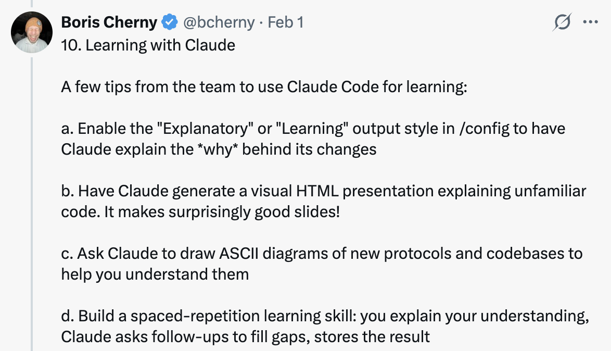</a>

---

## 来源

- [Boris Cherny (@bcherny) 在 X — 2026 年 2 月 1 日](https://x.com/bcherny/status/2017742741636321619)
