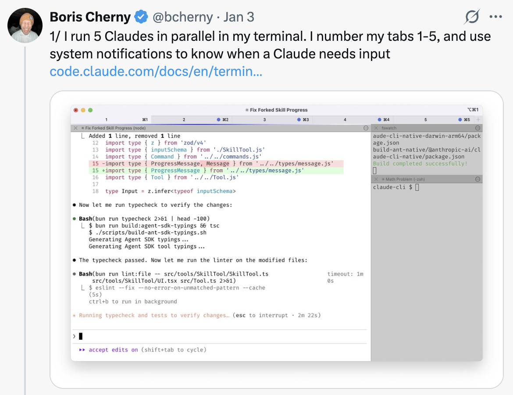
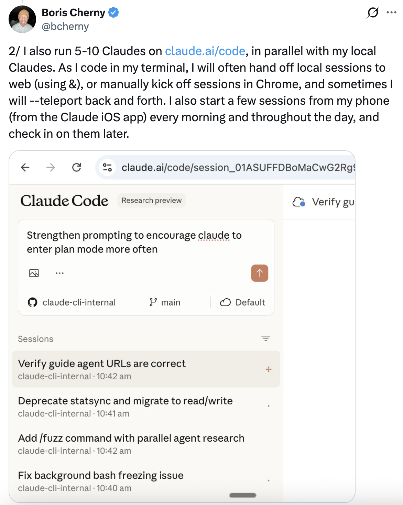
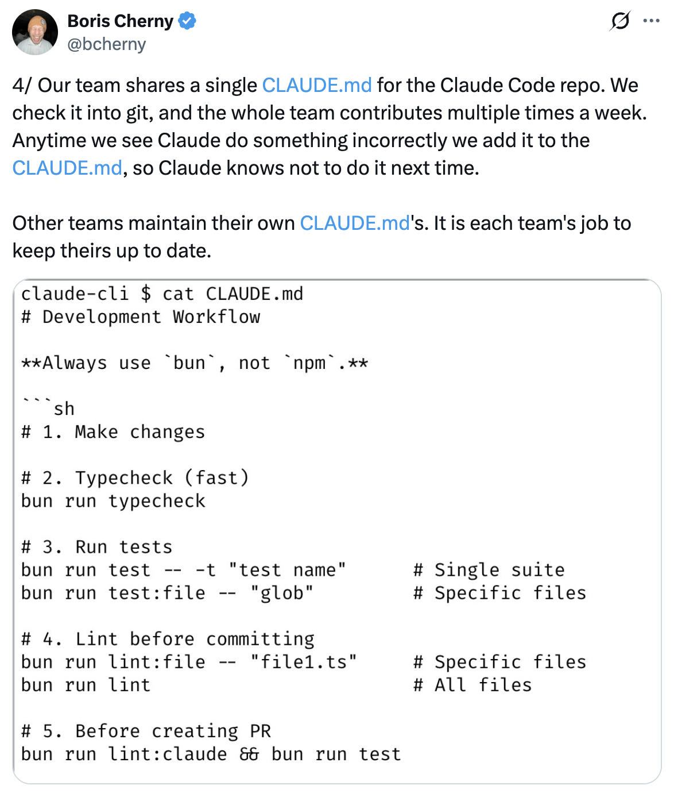
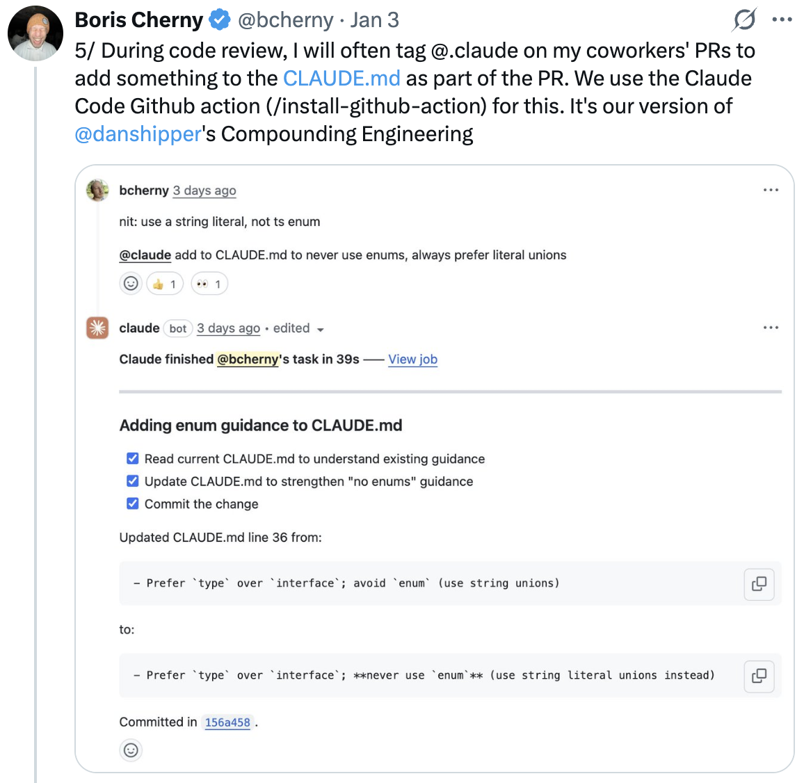
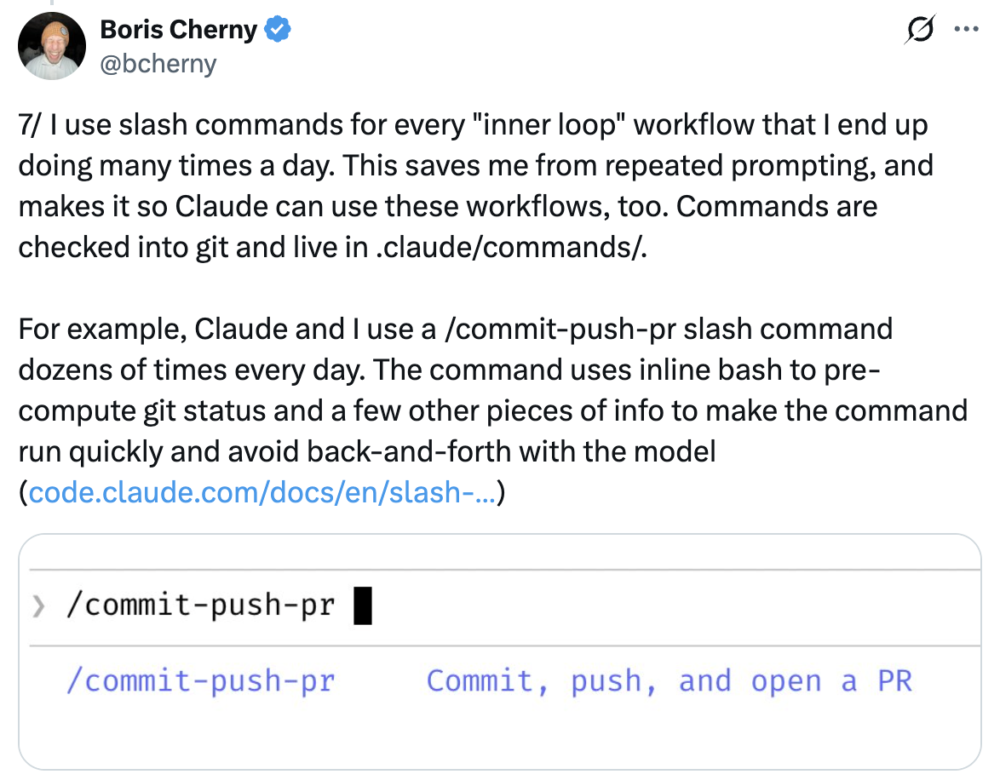
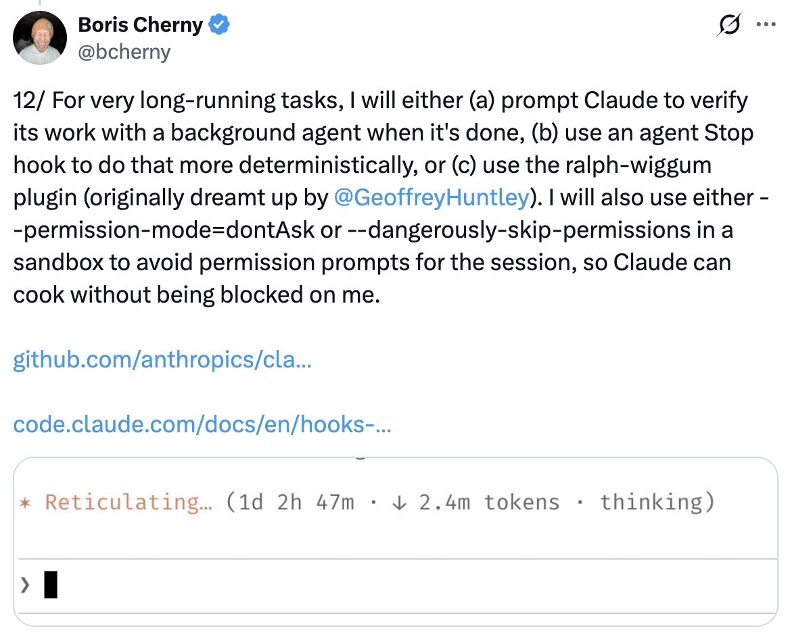

# 我如何使用 Claude Code — Boris Cherny 的 13 个技巧

Claude Code 创建者 Boris Cherny（[@bcherny](https://x.com/bcherny)）于 2026 年 1 月 3 日分享的设置技巧总结。

<table width="100%">
<tr>
<td><a href="../">← 返回 Claude Code 最佳实践</a></td>
<td align="right"></td>
</tr>
</table>

---

## 背景

Boris 分享了他个人的 Claude Code 设置，并指出它"出奇地普通"——Claude Code 开箱即用效果很好，所以他不会做太多自定义。没有唯一正确的使用方法：团队有意将其构建为你可以按自己的喜好使用、自定义和改造。Claude Code 团队中的每个人使用方式都大不相同。

<a href="https://x.com/bcherny/status/2007179832300581177"></a>

---

## 1/ 并行运行 5 个 Claude

在你的终端中并行运行 5 个 Claude。将标签编号 1–5，并使用系统通知来了解哪个 Claude 需要输入。

参见：[终端设置文档](https://code.claude.com/docs/en/terminal)

<a href="https://x.com/bcherny/status/2007179833990885678"></a>

---

## 2/ 使用 claude.ai/code 实现更多并行

在 claude.ai/code 上并行运行 5–10 个 Claude，与本地 Claude 同时工作。使用 `claude.ai/code` 将会话交给网页会话，在 Chrome 中手动启动会话，并来回切换。

<a href="https://x.com/bcherny/status/2007179836704600237"></a>

---

## 3/ 所有任务都使用带思考的 Opus

所有任务都使用带思考的 Opus 4.5。这是 Boris 使用过的最好的编码模型——尽管它比 Sonnet 更大更慢，但由于你需要引导的更少且工具使用能力更强，最终几乎总是比使用更小的模型更快。

<a href="https://x.com/bcherny/status/2007179838864666847"></a>

---

## 4/ 与你的团队共享一个 CLAUDE.md

为仓库共享一个 `CLAUDE.md`。将其检入 git，让整个团队每周多次贡献。每当 Claude 做错了什么，就添加到 `CLAUDE.md` 中，这样 Claude 下次就知道不要这样做。

<a href="https://x.com/bcherny/status/2007179840848597422"></a>

---

## 5/ 在 PR 上 @提及 @claude 来更新 CLAUDE.md

在代码审查期间，在你同事的 PR 上 `@claude`，以便在 PR 过程中向 `CLAUDE.md` 添加内容。使用 Claude Code GitHub 操作（[install-@hub-action](https://github.com/apps/claude)）——这是 Boris 的"复合工程"版本。

<a href="https://x.com/bcherny/status/2007179842928947333"></a>

---

## 6/ 大多数会话从计划模式开始

大多数会话从计划模式开始（按 shift+tab 两次）。如果目标是编写一个 Pull Request，使用计划模式与 Claude 来回讨论，直到你喜欢它的计划。然后切换到自动接受编辑模式，Claude 通常能一次性完成。一个好的计划非常重要。

<a href="https://x.com/bcherny/status/2007179845336527000"></a>

---

## 7/ 使用斜杠命令处理内部循环工作流

为你每天多次执行的每个"内部循环"工作流使用斜杠命令。这可以避免重复的提示工作，也让 Claude 能够使用这些工作流。命令检入 git，位于 `.claude/commands/` 中。

示例：`/commit-push-pr` — 提交、推送并打开一个 PR。

<a href="https://x.com/bcherny/status/2007179847949500714"></a>

---

## 8/ 使用子代理自动化常见工作流

定期使用几个子代理：`code-simplifier` 在 Claude 完成工作后简化代码，`verify-app` 包含测试 Claude Code 端到端的详细指令，等等。将子代理视为自动化最常见工作流的方式——类似于斜杠命令。

子代理位于 `.claude/agents/` 中。

<a href="https://x.com/bcherny/status/2007179850139000872"></a>

---

## 9/ 使用 PostToolUse 钩子自动格式化代码

使用 `PostToolUse` 钩子来格式化 Claude 的代码。Claude 通常开箱即用地生成格式良好的代码，而钩子处理最后 10% 以避免后续在 CI 中出现格式错误。

```json
"PostToolUse": [
  {
    "matcher": "Write|Edit",
    "hooks": [
      {
        "type": "command",
        "command": "bun run format || true"
      }
    ]
  }
]
```

<a href="https://x.com/bcherny/status/2007179852047335529"></a>

---

## 10/ 预允许权限而非使用 --dangerously-skip-permissions

不要使用 `--dangerously-skip-permissions`。相反，使用 `/permissions` 预允许你知道在你的环境中安全的常见 bash 命令，以避免不必要的权限提示。其中大多数检入 `.claude/settings.json` 并与团队共享。

<a href="https://x.com/bcherny/status/2007179854077407667"></a>

---

## 11/ 通过 MCP 让 Claude 使用你所有的工具

Claude Code 使用你所有的工具。它经常搜索和发布到 Slack（通过 MCP 服务器），运行 BigQuery 查询来回答分析问题（使用 `bq` CLI），从 Sentry 获取错误日志等。Slack MCP 配置检入 `.mcp.json` 并与团队共享。

<a href="https://x.com/bcherny/status/2007179856266789204"></a>

---

## 12/ 用后台代理验证长时间运行的任务

对于非常长时间运行的任务，要么（a）提示 Claude 在完成后用后台代理验证其工作，要么（b）使用代理停止钩子更确定地执行此操作，要么（c）使用 ralph-wiggum 插件（最初由 @GeoffreyHuntley 设想）。

<a href="https://x.com/bcherny/status/2007179858435281082"></a>

---

## 13/ 给 Claude 一个验证其工作的方法

这可能是从 Claude Code 获得出色结果最重要的事情——给 Claude 一个验证其工作的方法。如果 Claude 拥有那个反馈循环，最终结果的质量将提升 2–3 倍。

Claude 测试 Boris 落地的每一个变更。

<a href="https://x.com/bcherny/status/2007179861115511237"></a>

---

## 来源

- [Boris Cherny (@bcherny) 在 X — 2026 年 1 月 3 日](https://x.com/bcherny/status/2007179832300581177)
