# Claude Code 中 15 个隐藏且未被充分利用的功能 — Boris Cherny

Claude Code 创建者 Boris Cherny（[@bcherny](https://x.com/bcherny)）于 2026 年 3 月 30 日分享的技巧总结。

<table width="100%">
<tr>
<td><a href="../">← 返回 Claude Code 最佳实践</a></td>
<td align="right"></td>
</tr>
</table>

---

## 背景

Boris 分享了一系列他最喜欢的 Claude Code 中隐藏且未被充分利用的功能，重点是他最常用的那些。

<a href="https://x.com/bcherny/status/2038454336355999749">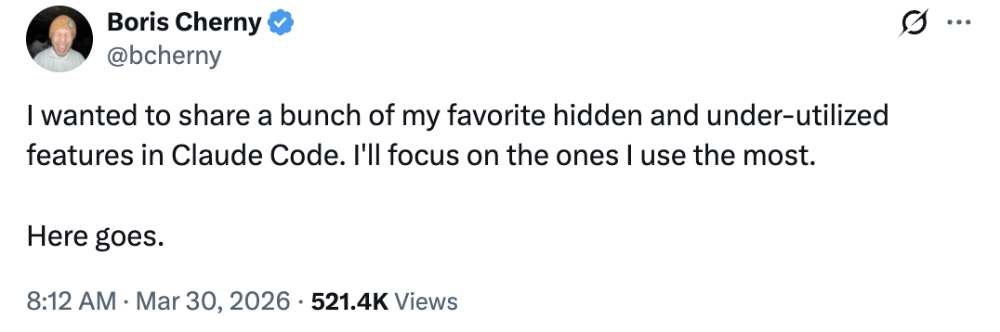</a>

---

## 1/ Claude Code 有移动应用

你知道 Claude Code 有移动应用吗？Boris 的大部分代码都是在 iOS 应用中编写的——这是一种无需打开笔记本电脑即可进行变更的便捷方式。

- 下载 iOS/Android 版 Claude 应用
- 导航到左侧的**代码**标签
- 你可以直接从手机上审查变更、批准 PR 和编写代码

<a href="https://x.com/bcherny/status/2038454337811386436">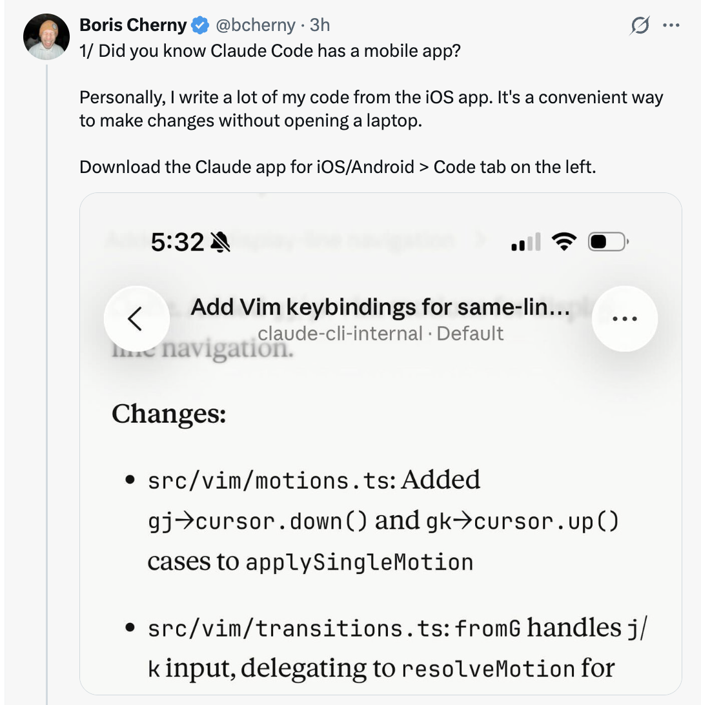</a>

---

## 2/ 在移动端/网页端/桌面端和终端之间移动会话

运行 `claude --teleport` 或 `/teleport` 在你的机器上继续云会话。或者运行 `/remote-control` 从你的手机/网页控制本地运行的会话。

- **Teleport（传送）**：将云会话拉取到你的本地终端
- **Remote Control（远程控制）**：让你从任何设备控制本地会话
- Boris 在他的 `/config` 中设置了**"为所有会话启用远程控制"**

<a href="https://x.com/bcherny/status/2038454339933548804"></a>

---

## 3/ /loop 和 /schedule — 两个最强大的功能

使用这些功能让 Claude 按设定的间隔自动运行，最长可达一周。Boris 在本地运行着多个循环：

- `/loop 5m /babysit` — 自动处理代码审查、自动变基，并将 PR 引导到生产环境
- `/loop 30m /slack-feedback` — 每 30 分钟自动为 Slack 反馈创建 PR
- `/loop /post-merge-sweeper` — 为处理他遗漏的代码审查意见创建 PR
- `/loop 1h /pr-pruner` — 关闭陈旧和不再需要的 PR
- ……还有更多！

尝试将工作流转化为技能和循环的组合。这非常强大。

<a href="https://x.com/bcherny/status/2038454341884154269">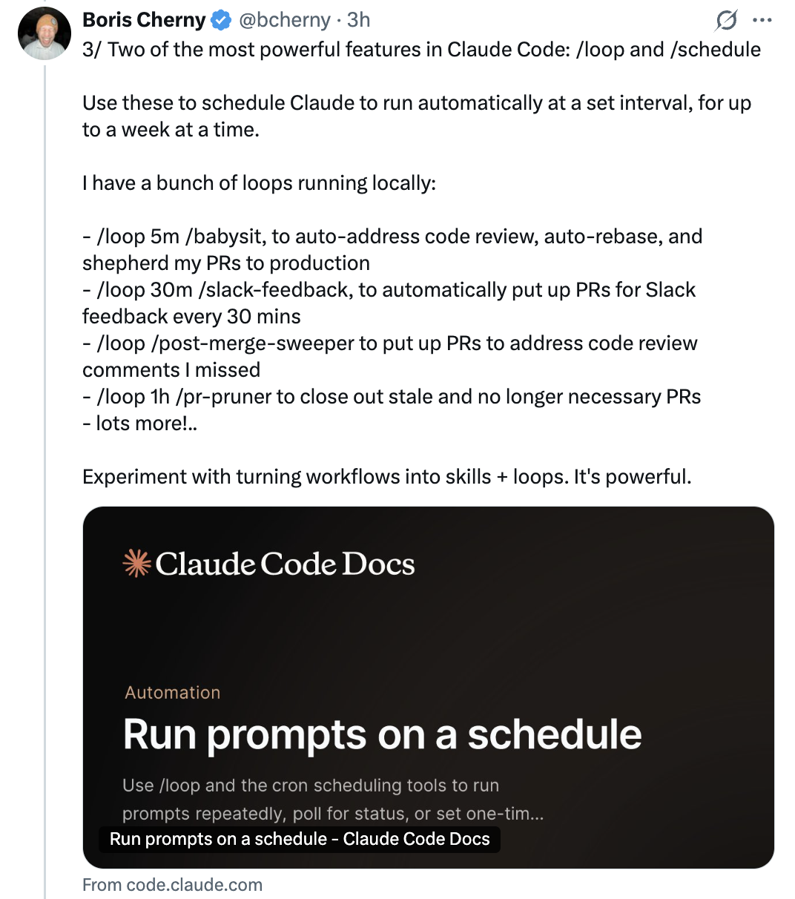</a>

---

## 4/ 使用钩子确定性地运行逻辑

使用钩子在代理生命周期中运行逻辑。例如：

- **动态加载**每次启动 Claude 时的上下文（`SessionStart`）
- **记录模型运行的每个 bash 命令**（`PreToolUse`）
- **将权限提示路由到 WhatsApp**供你批准/拒绝（`PermissionRequest`）
- **在 Claude 停止时戳它**让它继续（`Stop`）

<a href="https://x.com/bcherny/status/2038454343519932844">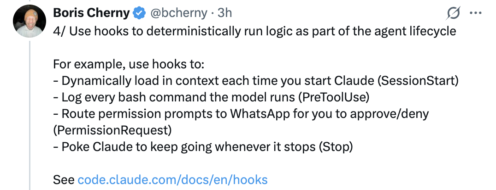</a>

---

## 5/ Cowork Dispatch

Boris 每天都在使用 Dispatch 来跟进 Slack 和邮件、管理文件，以及在不在电脑前时操作他的笔记本电脑。当他不编码时，他就在使用 Dispatch。

- Dispatch 是 Claude Desktop 应用的**安全远程控制**
- 它可以经你许可使用你的 MCP、浏览器和电脑
- 将其视为从任何地方将非编码任务委托给 Claude 的方式

<a href="https://x.com/bcherny/status/2038454345419936040">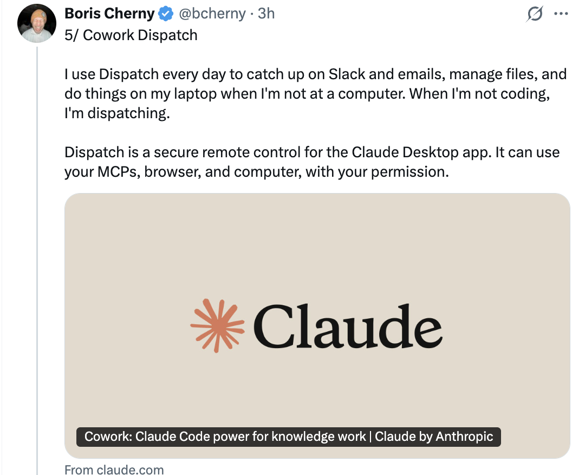</a>

---

## 6/ 使用 Chrome 扩展程序处理前端工作

使用 Claude Code 的最重要建议：**给 Claude 一个验证其输出的方法。** 一旦你这样做，Claude 就会迭代直到结果出色。

- 可以想象让某人建一个网站但不允许他们使用浏览器——结果可能不会好看
- 给 Claude 一个浏览器，它就会编写代码并迭代直到看起来不错
- Boris 每次处理网页代码时都使用 Chrome 扩展程序——它往往比其他类似的 MCP 更可靠

<a href="https://x.com/bcherny/status/2038454347156398333">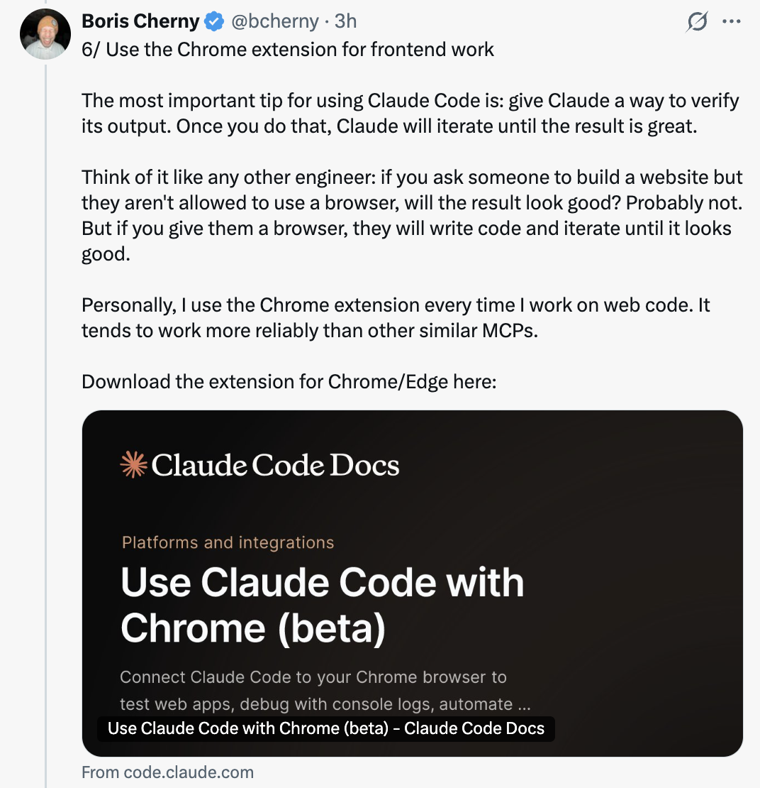</a>

---

## 7/ 使用 Claude Desktop 应用自动启动和测试 Web 服务器

同样的思路，Desktop 应用内置了让 Claude **自动运行你的 Web 服务器甚至在内置浏览器中测试它**的能力。

- 你可以使用 Chrome 扩展程序在 CLI 或 VSCode 中设置类似功能
- 或者直接使用 Desktop 应用获得一体化体验

<a href="https://x.com/bcherny/status/2038454348804714642">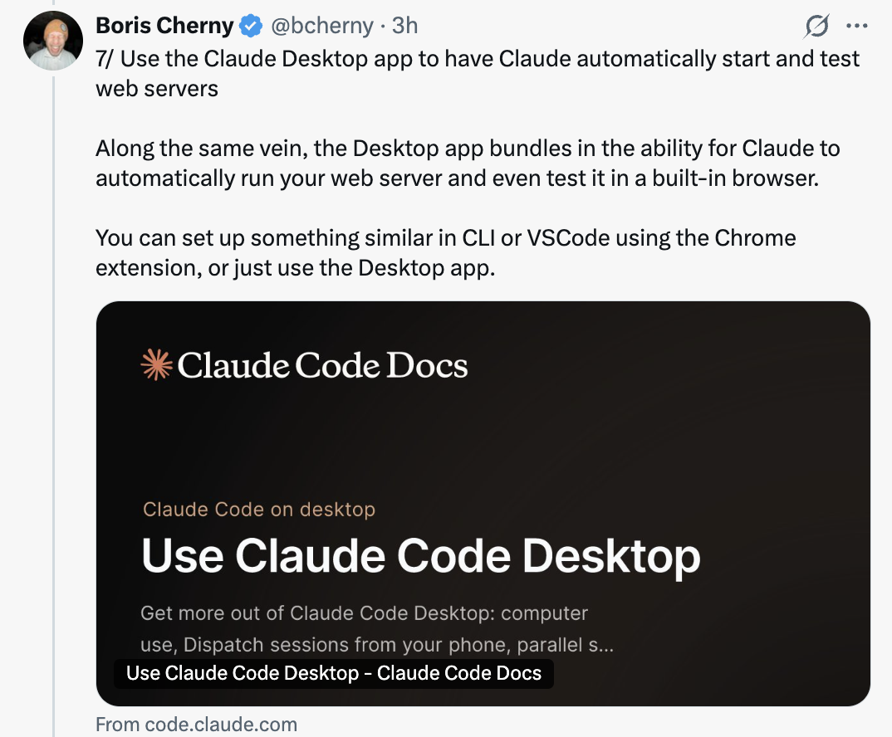</a>

---

## 8/ 分叉你的会话

人们经常问如何分叉一个现有会话。两种方法：

1. 从你的会话中运行 `/branch`
2. 在 CLI 中运行 `claude --resume <session-id> --fork-session`

`/branch` 创建一个分支会话——你现在就在这个分支中。要恢复原始会话，使用 `claude -r <original-session-id>`。

<a href="https://x.com/bcherny/status/2038454350214041740">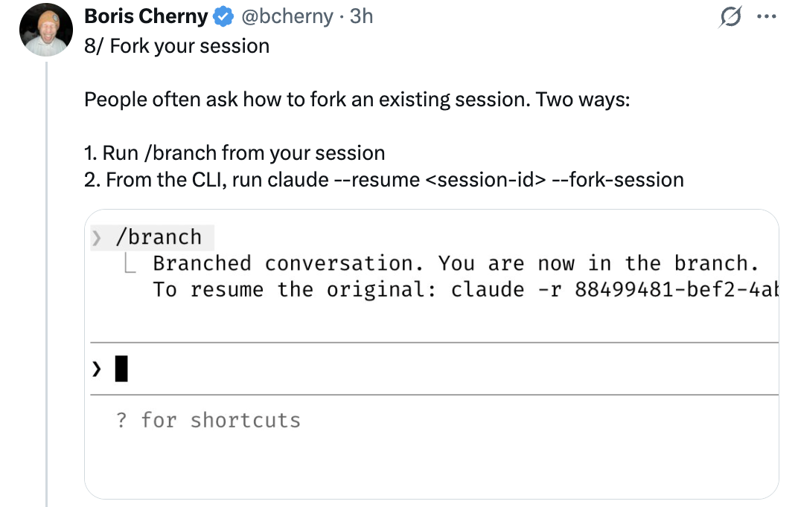</a>

---

## 9/ 使用 /btw 进行侧查询

Boris 经常在代理工作时使用这个功能来快速回答问题。`/btw` 让你在不妨碍代理当前任务的情况下提出一个侧边问题。

示例：
```
/btw 如何拼写 dachshund（腊肠犬）？
> dachshund — 德语中意为"獾犬"（dachs + 獾, hund + 狗）。
↑/↓ 滚动 · Space、Enter 或 Escape 取消
```

<a href="https://x.com/bcherny/status/2038454351849787485">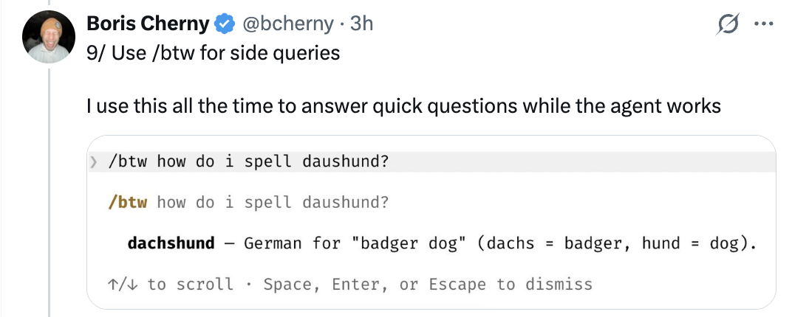</a>

---

## 10/ 使用 Git 工作树

Claude Code 深度支持 git 工作树。工作树对于在同一仓库中执行大量并行工作至关重要。Boris **始终运行着数十个 Claude**，这就是他做到的方法。

- 使用 `claude -w` 在工作树中启动新会话
- 或者在 Claude Desktop 应用中点击**"工作树"复选框**
- 对于非 git VCS 用户，使用 `WorktreeCreate` 钩子添加你自己创建工作树的逻辑

<a href="https://x.com/bcherny/status/2038454353787519164">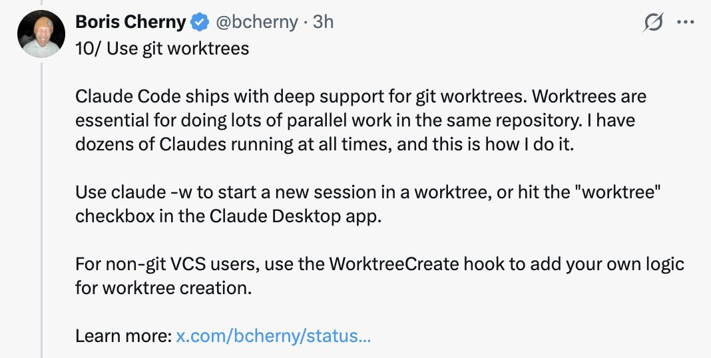</a>

---

## 11/ 使用 /batch 分发大规模变更集

`/batch` 会先与你对话，然后让 Claude 将工作分发给尽可能多的工作树代理（数十、数百甚至数千个）来完成。

- 用于大型代码迁移和其他类型的可并行化工作
- 每个工作树代理在其自己的代码库副本上独立工作

<a href="https://x.com/bcherny/status/2038454355469484142">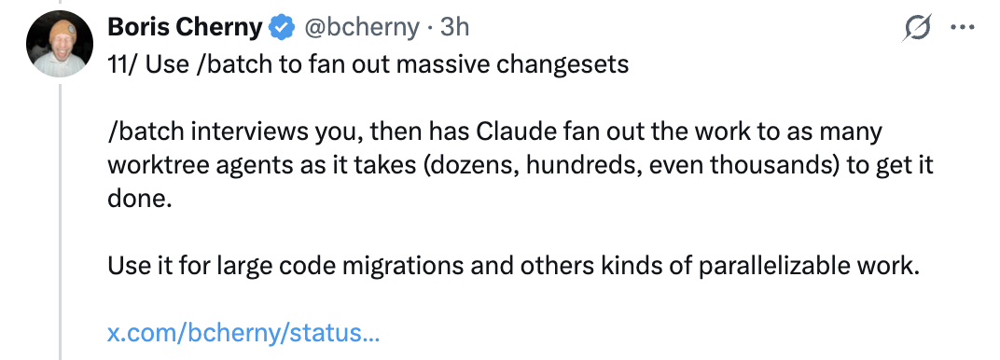</a>

---

## 12/ 使用 --bare 将 SDK 启动速度提升最多 10 倍

默认情况下，当你运行 `claude -p`（或 TypeScript 或 Python SDK）时，Claude 会搜索本地的 CLAUDE.md、设置和 MCP。但对于非交互式使用，大多数时候你希望通过 `--system-prompt`、`--mcp-config`、`--settings` 等显式指定要加载的内容。

- 这是 SDK 最初构建时的一个设计疏忽
- 在未来的版本中，他们将把默认值改为 `--bare`
- 目前，使用此标志可选择加入，获得**最多 10 倍的启动速度**

```bash
claude -p "总结这个代码库" \
    --output-format=stream-json \
    --verbose \
    --bare
```

<a href="https://x.com/bcherny/status/2038454357088457168">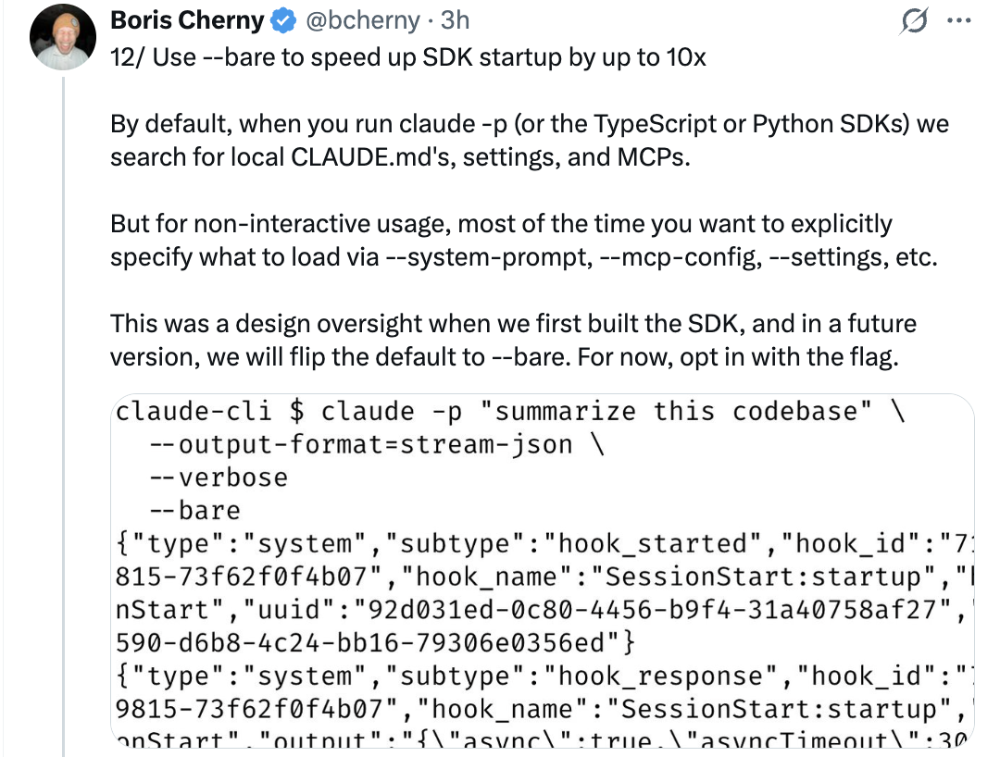</a>

---

## 13/ 使用 --add-dir 让 Claude 访问更多文件夹

当在多个仓库之间工作时，Boris 通常在一个仓库中启动 Claude，并使用 `--add-dir`（或 `/add-dir`）让 Claude 看到另一个仓库。

- 这不仅告诉 Claude 关于仓库的信息，还**授予它在仓库中工作的权限**
- 或者，将 `"additionalDirectories"` 添加到团队的 `settings.json`，以便在启动 Claude Code 时始终加载额外文件夹

<a href="https://x.com/bcherny/status/2038454359047156203">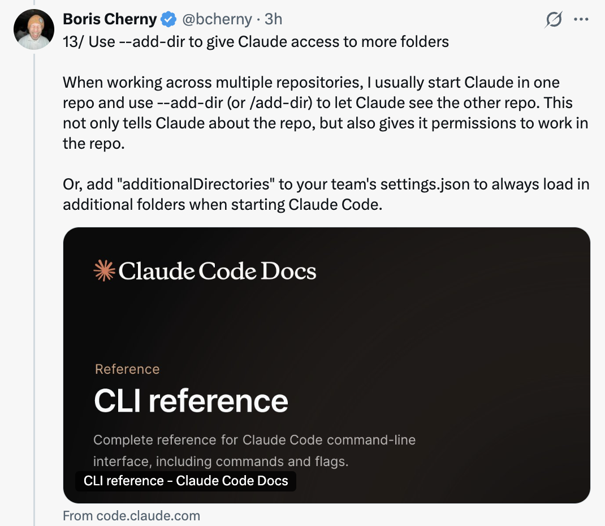</a>

---

## 14/ 使用 --agent 为 Claude Code 提供自定义系统提示词和工具

自定义代理是一个常被忽视的强大原语。使用方法是，在 `.claude/agents/` 中定义一个新代理，然后运行：

```bash
claude --agent=<你的代理名称>
```

- 代理可以拥有受限的工具、自定义描述和特定模型
- 它们非常适合创建只读代理、专业审查代理或领域特定工具

<a href="https://x.com/bcherny/status/2038454360418787764">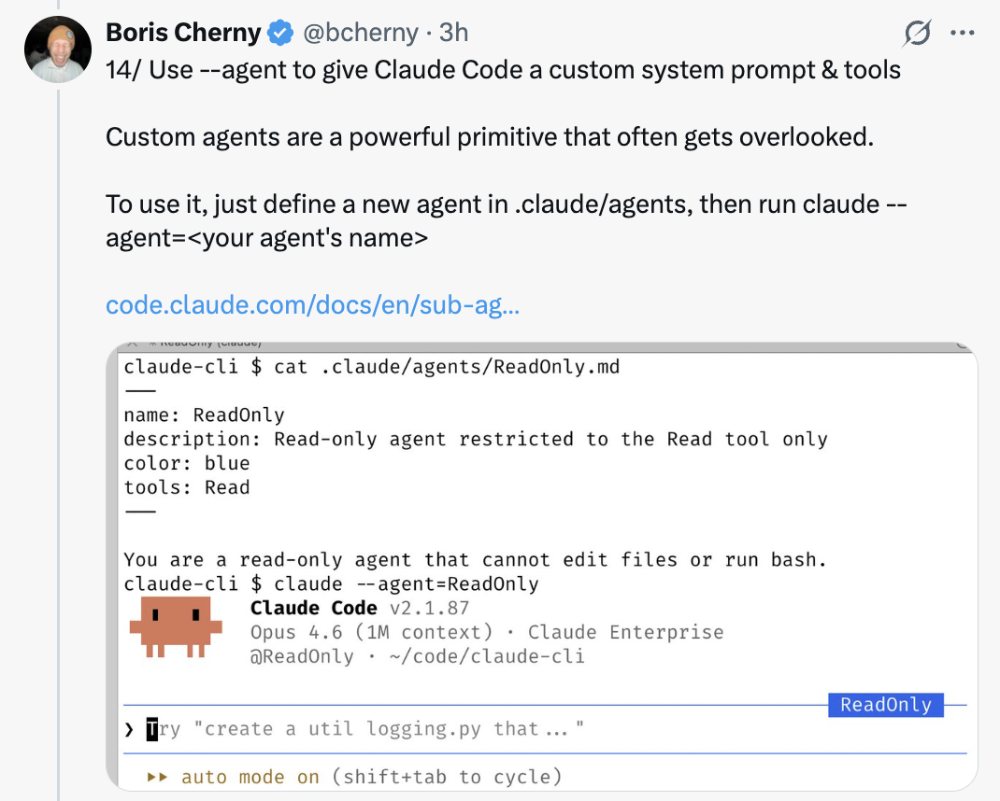</a>

---

## 15/ 使用 /voice 启用语音输入

有趣的事实：Boris 大部分编码工作是通过对 Claude 说话而不是打字完成的。

- 在 CLI 中运行 `/voice`，然后按住空格键说话
- 在 Desktop 应用中按下语音按钮
- 或在你的 iOS 设置中启用听写功能

<a href="https://x.com/bcherny/status/2038454362226467112">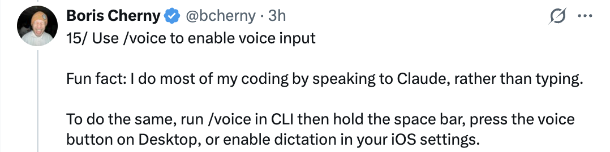</a>

---

## 来源

- [Boris Cherny (@bcherny) 在 X — 2026 年 3 月 30 日](https://x.com/bcherny/status/2038454336355999749)
