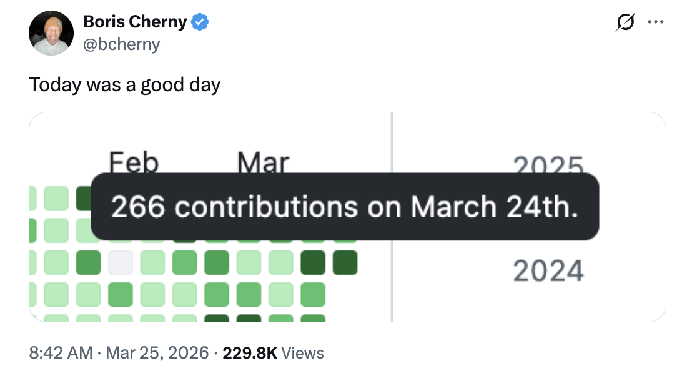

# Squash 合并与 PR 大小分布 — Boris Cherny 的技巧

Claude Code 创建者 Boris Cherny（[@bcherny](https://x.com/bcherny)）于 2026 年 3 月 25 日分享的见解总结。

<table width="100%">
<tr>
<td><a href="../">← 返回 Claude Code 最佳实践</a></td>
<td align="right"></td>
</tr>
</table>

---

## 1/ 单日 266 次贡献 — 始终 Squash

Boris 分享了他的 GitHub 贡献图，显示 **3 月 24 日有 266 次贡献**——来自 **141 个 PR，始终 squash**，每个 PR 中位数为 **118 行**。

- Squash 合并将分支上的所有提交合并为目标分支上的单个提交——保持历史记录干净和线性
- 每个 PR = 一个提交使得回滚整个功能变得容易，并简化了 `git bisect`
- 在高速 AI 辅助工作流（每天 141 个 PR）下，squash 是务实的选择——分支内单独的"修复 lint"、"试试这个"等提交只是噪音

---

## 2/ PR 大小分布 — 保持 PR 小巧

Boris 分享了这 141 个 PR 的大小分布，总计 **45,032 行变更**（增加 + 删除）：

| 指标 | 行数（增+删） | 含义 |
|--------|---------------:|---------|
| **p50** | **118** | 中位数 PR 大小——一半的 PR 在 118 行或以下 |
| p90 | 498 | 90% 的 PR 在 500 行以下 |
| **p99** | **2,978** | 只有约 1 个 PR 超过了 ~3K 行 |
| 最小值 | 2 | 最小的 PR——一个快速的 2 行修复 |
| 最大值 | 10,459 | 最大的单个 PR——可能是迁移或生成的代码 |

- **中位数 118 行**意味着大多数 PR 集中且可审查，即使在每天 141 个 PR 的情况下
- 分布明显右偏——偶尔的大 PR 是不可避免的（批量重命名、迁移），但常态是紧凑的
- 小 PR 减少了合并冲突风险，更易于审查，并且与 squash 合并完美配合，实现干净的回滚

---

## 来源

- [Boris Cherny (@bcherny) 在 X — 2026 年 3 月 25 日](https://x.com/bcherny)
