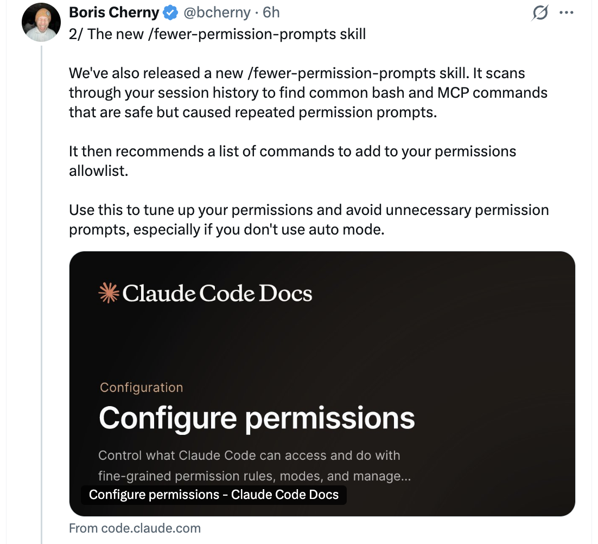
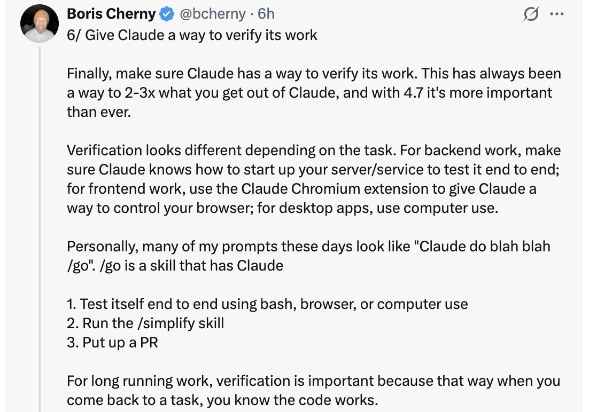

# 充分发挥 Opus 4.7 的 6 个技巧 — Boris Cherny

Claude Code 创建者 Boris Cherny（[@bcherny](https://x.com/bcherny)）于 2026 年 4 月 16 日分享的技巧系列——在内部试用 Opus 4.7 数周之后。

<table width="100%">
<tr>
<td><a href="../">← 返回 Claude Code 最佳实践</a></td>
<td align="right"></td>
</tr>
</table>

---

## 背景

在内部试用 Opus 4.7 数周后，Boris 感觉"生产力惊人"，并分享了六种充分发挥新模型能力的方法——从权限自动化到精力调整再到验证模式。

<a href="https://x.com/bcherny"></a>

---

## 1/ 自动模式 — 不再有权限提示

Opus 4.7 喜欢执行复杂、长时间运行的任务：深度研究、重构代码、构建复杂功能、迭代直到达到性能基准。过去，你要么需要在模型执行这些长时间任务时守着它，要么使用 `--dangerously-skip-permissions`。

Anthropic 最近推出了**自动模式**作为更安全的替代方案。在此模式下，权限提示被路由到一个基于模型的分类器，由它决定命令是否安全运行：

- 如果安全，自动批准
- 如果有风险，暂停并询问

这意味着不再需要在模型运行时守着它。更重要的是，这意味着你可以运行更多的 Claude 并行工作——如果是安全的，你可以将注意力切换到下一个 Claude。

自动模式现已面向 Max、Teams 和企业用户的 Opus 4.7 可用。在 CLI 中按 **Shift+Tab** 可在`询问权限` → `计划模式` → `自动模式`之间切换，或在 Desktop 或 VS Code 的下拉菜单中选择。

<a href="https://x.com/bcherny"></a>

---

## 2/ 全新的 /fewer-permission-prompts 技能

Anthropic 发布了一个新的 `/fewer-permission-prompts` 技能。它会扫描你的会话历史，找出常见且安全但反复提示权限的 bash 和 MCP 命令。然后推荐一个命令列表，添加到你权限允许列表中。

使用此功能来优化你的权限设置，避免不必要的权限提示，特别是在你不使用自动模式的情况下。

<a href="https://x.com/bcherny"></a>

---

## 3/ 回顾

Anthropic 本周早些时候推出了**回顾**功能，为 Opus 4.7 做准备。回顾是代理所做的事情和下一步计划的简短摘要。

当你在几分钟或几小时后回到一个长时间运行的会话时非常有用：

```
* 思考了 6 分 27 秒

* 回顾：修复了提交后转录移位错误。样式闪烁
  部分已作为 PR #29869 发布（自动合并已开启，已发布到 stamps）。下一步：
  我需要一个屏幕录制来展示 `cc -c` 上剩余的水平换行问题，
  以定位该独立原因。（在 /config 中禁用回顾）
```

如果你不需要回顾，可以在 `/config` 中禁用。

<a href="https://x.com/bcherny"></a>

---

## 4/ 专注模式

Boris 非常喜欢 CLI 中新增的**专注模式**，它隐藏所有中间工作，只关注最终结果。模型已经达到一个他通常信任它能运行正确命令和做出正确编辑的程度。他只看最终结果。

使用 `/focus` 切换开启/关闭。

<a href="https://x.com/bcherny"></a>

---

## 5/ 配置你的精力级别

Opus 4.7 使用**自适应思考**而非思考预算。要调整模型思考更多或更少，调整精力级别。

- **较低精力** — 更快响应和更低令牌使用量
- **较高精力** — 最高的智能和能力

滑块提供五个级别：`low`（低） · `medium`（中） · `high`（高） · `xhigh`（极高） · `max`（最高）——左侧是速度，右侧是智能。

<a href="https://x.com/bcherny"></a>

---

## 6/ 给 Claude 一个验证其工作的方法

最后，确保 Claude 有验证其工作的方法。这一直很重要——现在 4.7 能将 Claude 的输出质量提升 2-3 倍，所以比以往任何时候都更重要。

验证方式因任务而异：

- **后端工作** — 让 Claude 运行你的服务器/服务进行端到端测试
- **前端工作** — 使用 [Claude Chromium 扩展](https://code.claude.com/docs/en/chrome) 让 Claude 控制你的浏览器
- **桌面应用** — 使用 Computer Use

Boris 现在的提示词看起来像 `Claude 做 blah blah /go`，其中 `/go` 是一个技能，它：

1. 使用 bash、浏览器或 computer use 进行端到端自测
2. 运行 `/simplify`
3. 创建一个 PR

对于长时间运行的工作，验证更加重要——当你回到一个任务时，你知道代码能工作。

<a href="https://x.com/bcherny"></a>

---

## 来源

- [Boris Cherny (@bcherny) 在 X — 2026 年 4 月 16 日](https://x.com/bcherny)
