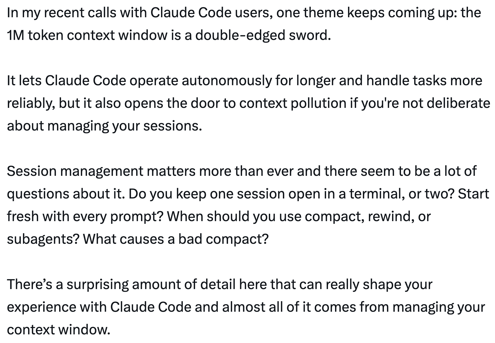
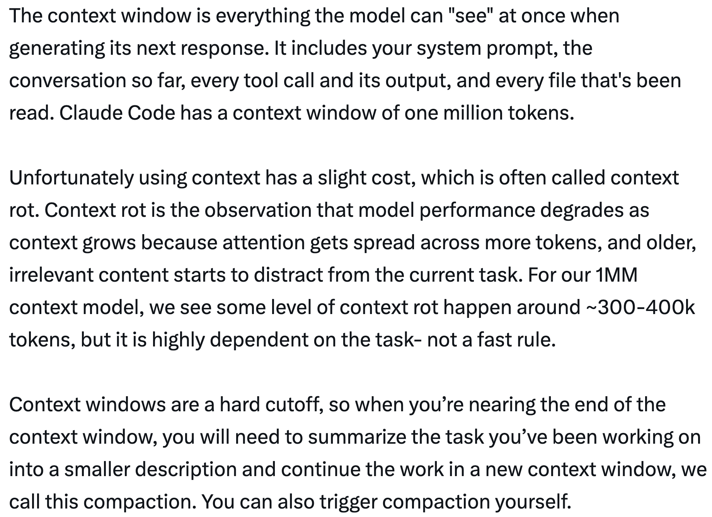
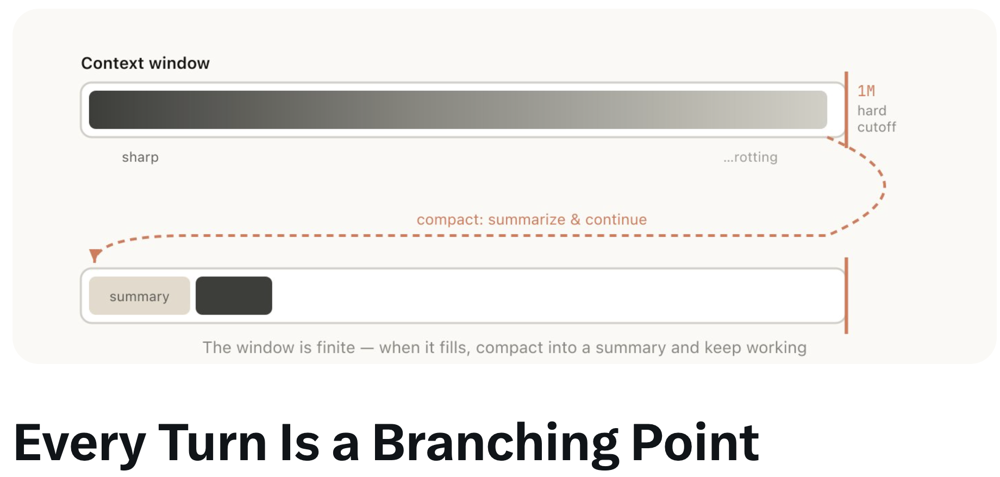
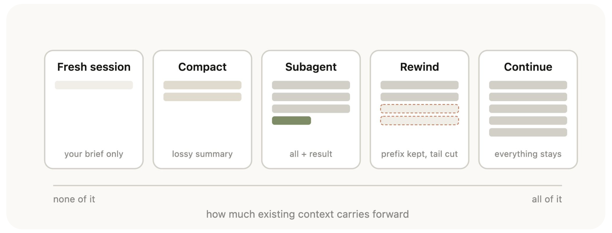
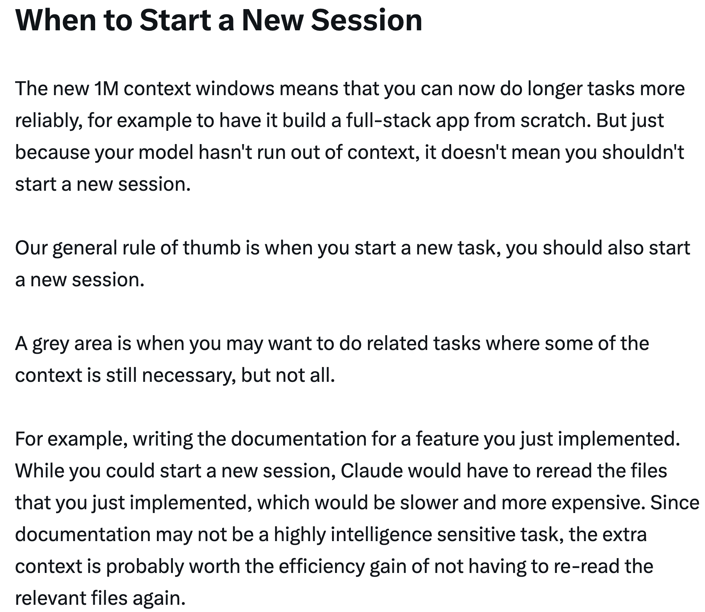
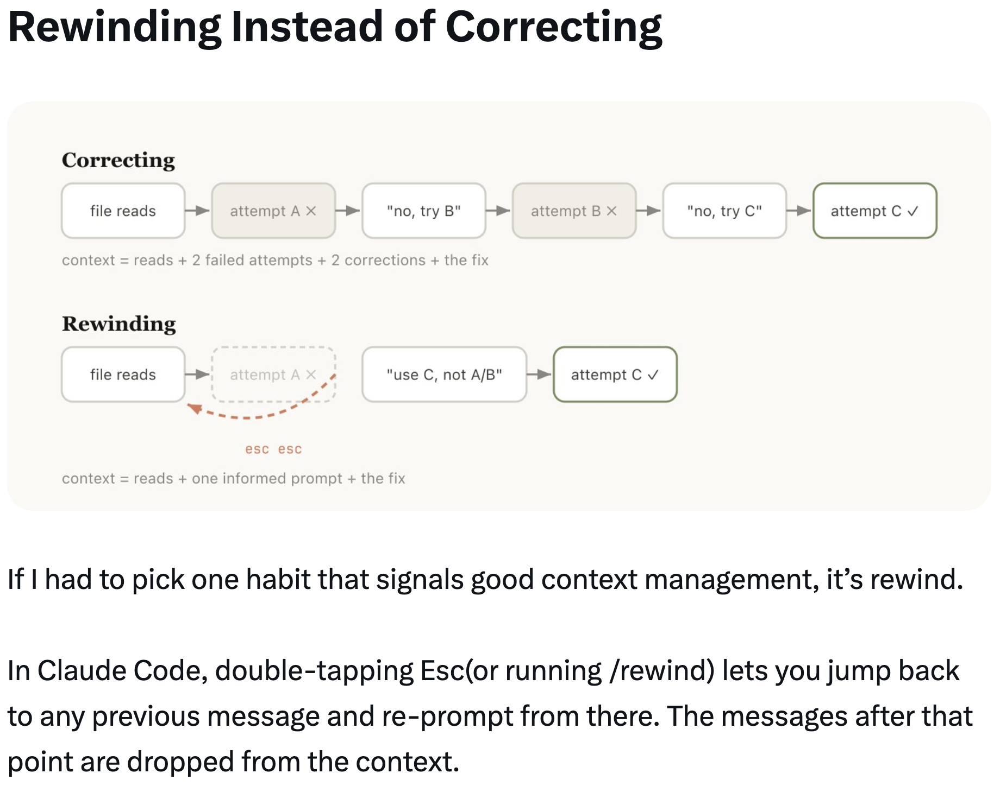
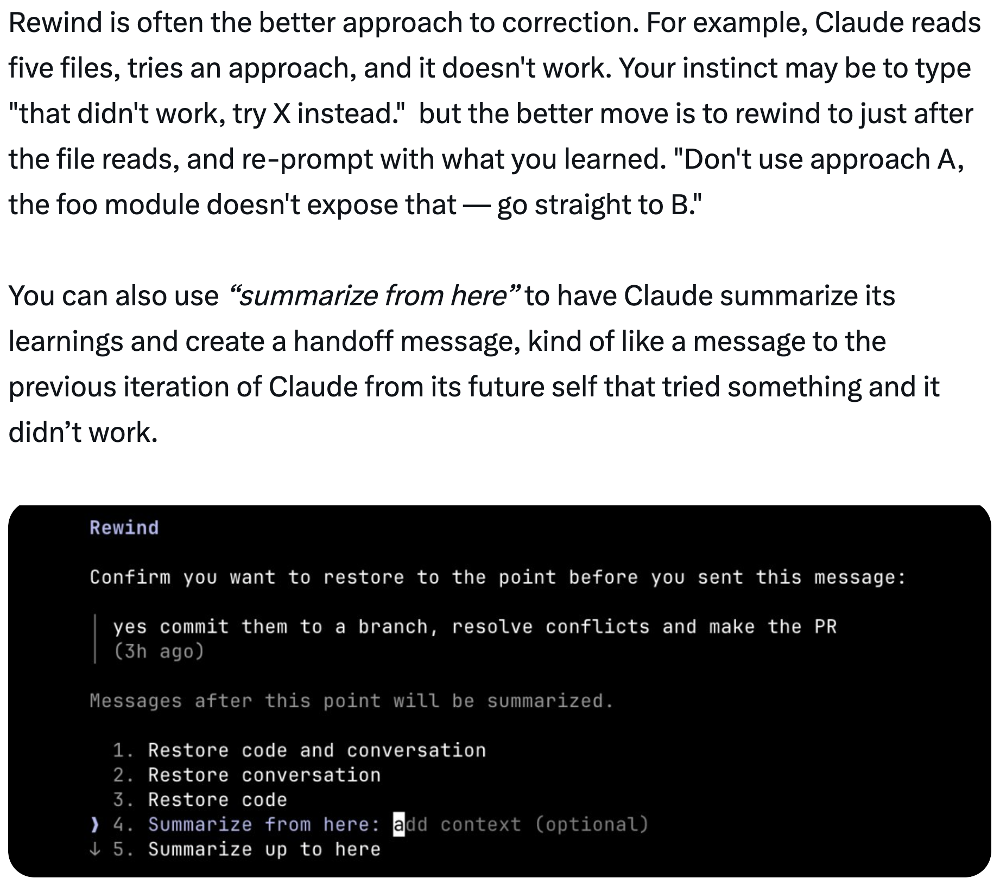
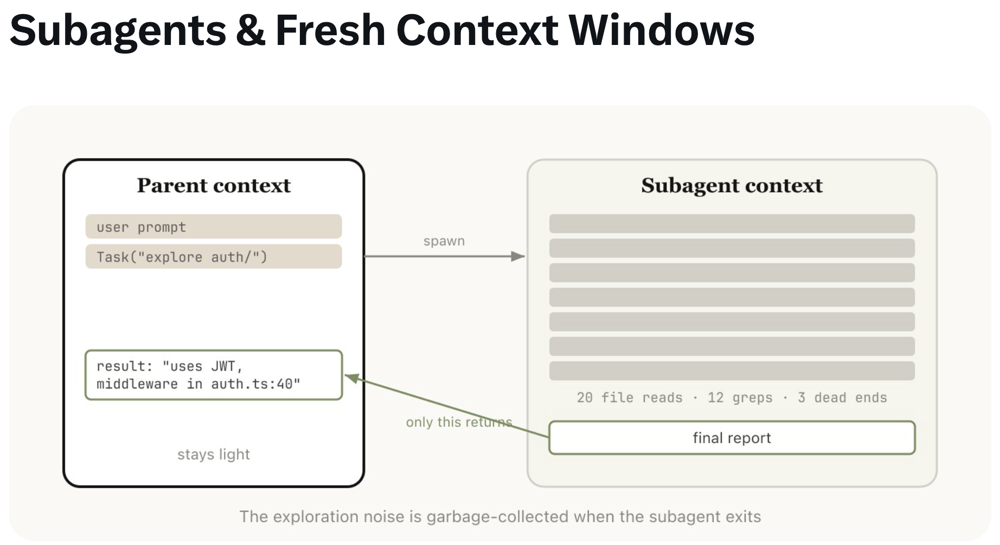
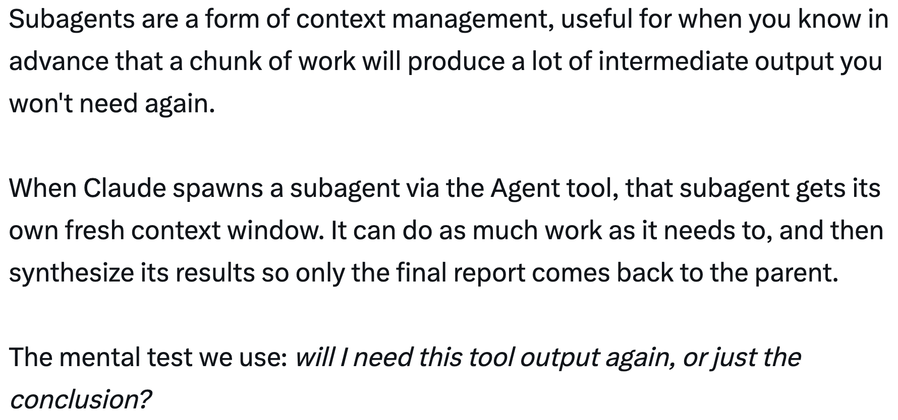

# 使用 Claude Code：会话管理和 100 万上下文 — Thariq

关于管理 Claude Code 中的会话、上下文窗口和压缩的指南，由 Thariq（[@trq212](https://x.com/trq212)）于 2026 年 4 月 16 日分享。

<table width="100%">
<tr>
<td><a href="../">← 返回 Claude Code 最佳实践</a></td>
<td align="right"></td>
</tr>
</table>

---

## 背景

有了 100 万令牌的上下文窗口，Claude Code 可以更可靠地处理更长的任务——但如果你不刻意管理会话，也会为上下文污染打开大门。会话管理比以往任何时候都更重要：何时开始新会话、何时压缩、何时回退、何时委托给子代理。

---

## 关于上下文、压缩和上下文腐化的快速入门

上下文窗口是模型在生成下一个响应时能"看到"的所有内容。它包括你的系统提示词、到目前为止的对话、每个工具调用及其输出，以及每个已读取的文件。Claude Code 拥有**一百万个令牌**的上下文窗口。

不幸的是，使用上下文有一个小代价——**上下文腐化**。随着上下文增长，模型性能会下降，因为注意力需要分散到更多令牌上，而更早的、不相关的内容会开始干扰当前任务。对于 100 万上下文的模型，某种程度的上下文腐化大约发生在 **~300-400k 令牌**时，但这高度依赖于任务——并非硬性规则。

上下文窗口是一个硬性截止点。当你接近末尾时，需要总结任务并在新的上下文窗口中继续——这就是**压缩**。你也可以自己触发压缩。

---

## 每一轮都是一个分支点

在 Claude 完成一轮后，你有多种选择来决定下一步做什么：

- **继续（Continue）** — 在同一会话中发送另一条消息
- **回退（/rewind，按 esc esc）** — 跳回到之前的消息并从那里重试
- **清除（/clear）** — 开始一个新会话，通常带有一个你从刚才所学中提炼的简报
- **压缩（Compact）** — 总结到目前为止的会话，并在总结之上继续
- **子代理（Subagents）** — 将下一部分工作委托给一个拥有自己干净上下文的代理，只将其结果拉回

虽然最自然的方式是直接继续，但其他四个选项的存在是为了帮助你管理上下文。

每个选项携带不同程度的现有上下文：

| 全新会话 | 压缩 | 子代理 | 回退 | 继续 |
|:---:|:---:|:---:|:---:|:---:|
| 只有你的简报 | 有损摘要 | 全部 + 结果 | 保留前缀，截断尾部 | 全部保留 |
| *什么都没有* | | | | *全部保留* |

---

## 何时开始新会话

新的 100 万上下文窗口意味着你现在可以更可靠地做更长的任务——例如，从头构建一个全栈应用。但即使你的模型没有用完上下文，也不意味着你不应该开始新会话。

**一般经验法则：当你开始一个新任务时，也应该开始一个新会话。**

一个灰色区域是，你可能想做相关任务，其中部分上下文仍然必要，但不是全部。例如，为你刚实现的功能编写文档。虽然你可以开始一个新会话，但 Claude 必须重新读取文件，这会更慢也更昂贵。由于文档可能不是一个对智能高度敏感的任务，额外的上下文可能值得带来的效率提升。

---

## 回退而非纠正

如果让 Thariq 选一个标志良好上下文管理的习惯，那就是**回退**。

在 Claude Code 中，双击 Esc（或运行 `/rewind`）可以让你跳回到之前的任何消息并从那里重新提示。该点之后的消息会从上下文中丢弃。

**纠正**（在失败的尝试 A 之后说"不，试试 B"）会将失败的尝试留在上下文中：
> 上下文 = 读取 + 2 次失败尝试 + 2 次纠正 + 修复

**回退**（回到失败尝试之前，用你学到的东西重新提示）更干净：
> 上下文 = 读取 + 一次有依据的提示 + 修复

回退通常是更好的方法。例如，Claude 读取了五个文件，尝试了一种方法，但没有成功。你的本能可能是输入"那样不行，试试 X。"但更好的做法是回退到文件读取之后，用你学到的东西重新提示："不要用方法 A，那个 foo 模块没有暴露那个接口——直接使用 B。"

你也可以使用**"从此处总结"**让 Claude 总结其学习成果并创建一个交接消息，就像是从未来尝试过但未成功的 Claude 自我传递给之前迭代的 Claude 的一条消息。

---

## 压缩 vs 全新会话

一旦会话变长，你有两种减轻负担的方法：`/compact` 或 `/clear`（然后从头开始）。它们感觉相似但行为截然不同。

**压缩**让模型总结到目前为止的对话，然后用该总结替换历史记录。它是有损的——你相信 Claude 能决定什么重要，但你不需要自己写任何东西。Claude 可能在包含重要学习点或文件方面更全面。你也可以通过传递指令来引导它（`/compact 关注认证重构，去掉测试调试`）。

- **任务进行中**，保持动力——细节可以模糊
- 廉价，继续前进

**全新 + 简报**（`/clear`）意味着*你*写下重要的内容（"我们在重构认证中间件，约束条件是 X，相关的文件是 A 和 B，我们已经排除了方法 Y"）并重新开始。工作量更大，但最终的上下文是*你*认为相关的内容。

- **高风险的**下一步——在 10 万令牌的探索中找到了一条关键信息
- 工作量更大，更精确

---

## 什么导致了糟糕的压缩？

如果你运行过很多长时间运行的会话，你可能注意到有时压缩效果特别差。当模型无法预测你的工作方向时，就可能发生糟糕的压缩。

例如，自动压缩在长时间的调试会话后触发，并总结了调查过程。你的下一条消息是"现在修复我们在 bar.ts 中看到的那个其他警告。"但由于会话一直专注于调试，那个其他警告可能已经从摘要中丢失了。

这特别困难，因为由于上下文腐化，模型在压缩时处于其最不智能的状态。有了 100 万上下文，你有更多时间用描述你想要做什么来主动 `/compact`。

---

## 子代理和全新的上下文窗口

子代理是上下文管理的一种形式，适用于当你预先知道某部分工作会产生大量你不再需要的中间输出时。

当 Claude 通过 Agent 工具生成一个子代理时，该子代理会获得自己的全新上下文窗口。它可以做它需要的任何工作，然后综合其结果，只有最终报告返回给父代理。

心理测试：**我还会需要这个工具输出吗，还是只需要结论？**

探索噪音在子代理退出时被垃圾回收——20 次文件读取、12 次搜索、3 条死路——只有最终报告返回到父上下文。

虽然 Claude Code 会自动调用子代理，但你可能想明确告诉它这样做。例如：

- "启动一个子代理，根据以下规格文件验证这项工作的结果"
- "启动一个子代理，阅读那个其他代码库并总结它如何实现认证流程，然后你自己以同样的方式实现它"
- "启动一个子代理，根据我的 git 变更为这个功能编写文档"

---

## 总结

当 Claude 结束了一轮，你即将发送一条新消息时，你有一个决策点。随着时间的推移，Claude 将自行处理这一点，但目前这是你可以引导 Claude 输出的方式之一。

| 情况 | 选择 | 原因 |
|-----------|-----------|-----|
| 同一任务，上下文仍然相关 | **继续** | 窗口中的所有内容仍然有用——不要为重建付出代价 |
| Claude 走错了方向 | **回退**（双击 Esc） | 保留有用的文件读取，丢弃失败的尝试，用你学到的东西重新提示 |
| 任务进行中但会话因过时的调试/探索而臃肿 | **/compact \<提示\>** | 低工作量；Claude 决定什么重要。必要时用提示引导它 |
| 开始一个真正的新任务 | **/clear** | 零腐化；你精确控制什么延续下去 |
| 下一步将产生大量输出，你只需要结论 | **子代理** | 中间工具噪音留在子代上下文中；只有结果返回 |

---

## 来源

- [Thariq (@trq212) 在 X — 2026 年 4 月 16 日](https://x.com/trq212)
