# 构建 Claude Code 的经验教训：我们如何使用技能 — Thariq

关于 Anthropic 内部如何使用技能的全面指南，由 Thariq（[@trq212](https://x.com/trq212)）于 2026 年 3 月 17 日分享。

<table width="100%">
<tr>
<td><a href="../">← 返回 Claude Code 最佳实践</a></td>
<td align="right"></td>
</tr>
</table>

---

## 背景

技能已成为 Claude Code 中最常用的扩展点之一。它们灵活、易于制作且易于分发。但这种灵活性也让人们难以知道什么方法最有效。Thariq 分享了在 Anthropic 广泛使用技能的的经验教训，目前有数百个技能在活跃使用中。

<a href="https://x.com/trq212/status/2033949937936085378">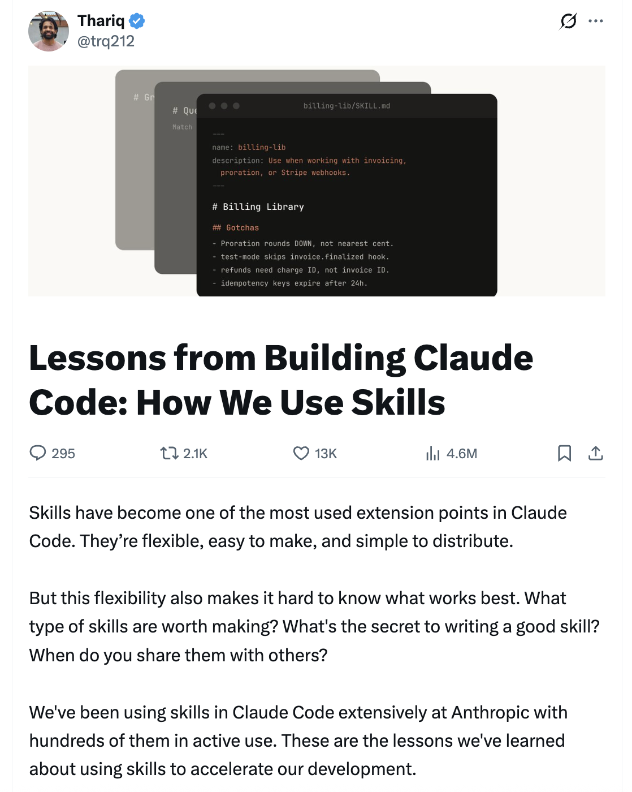</a>

---

## 什么是技能？

一个常见的误解是技能"只是 markdown 文件"，但最有趣的部分在于它们是**文件夹**——可以包含脚本、资产、数据等——代理可以发现、探索和操作的东西。技能还有多种配置选项，包括注册动态钩子。

<a href="https://x.com/trq212/status/2033949937936085378">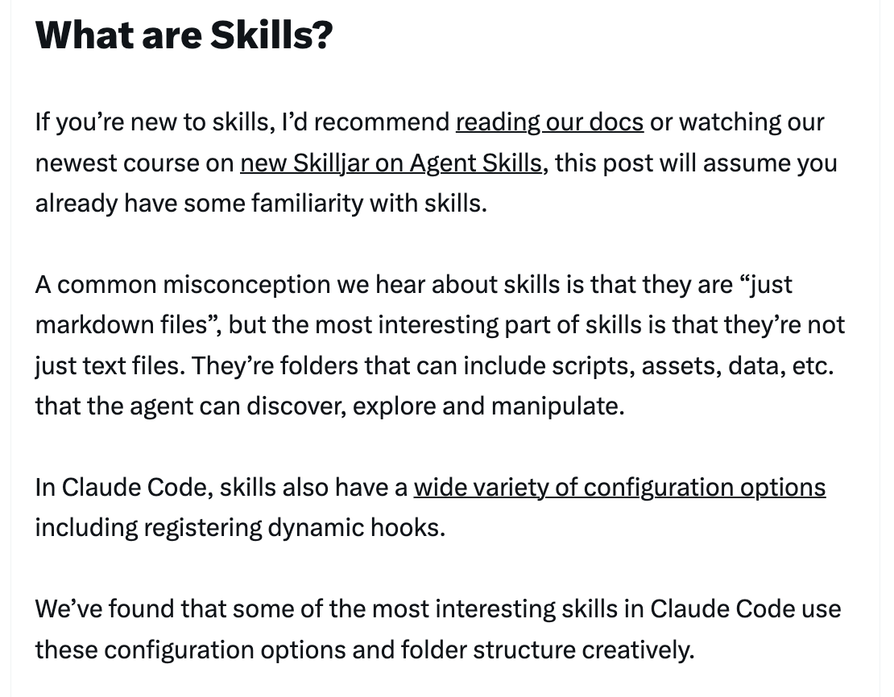</a>

---

## 技能的类型

在对所有技能进行分类后，团队注意到它们聚集为 9 个常见类别。最好的技能清楚地属于一个类别；而令人困惑的那些则跨越多个类别。

<a href="https://x.com/trq212/status/2033949937936085378">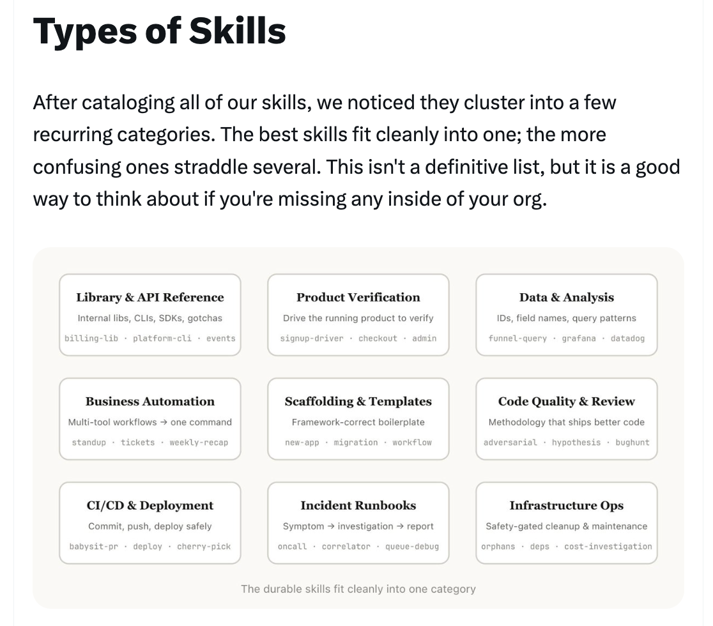</a>

---

### 1/ 库与 API 参考

解释如何正确使用库、CLI 或 SDK 的技能。这些可以是内部库或 Claude Code 有时处理不好的常见库。它们通常包含一个参考代码片段文件夹和一个避免在编写脚本时出错的注意事项列表。

**示例：** billing-lib、internal-platform-cli、frontend-design

<a href="https://x.com/trq212/status/2033949937936085378">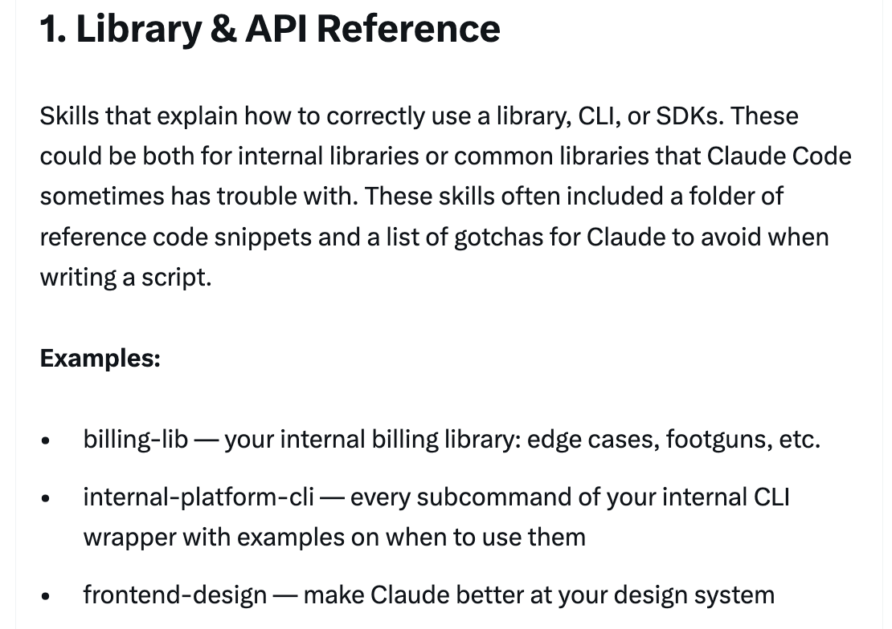</a>

---

### 2/ 产品验证

描述如何测试或验证代码是否正常工作的技能。这些通常与 Playwright、tmux 等外部工具配对使用。验证技能对于确保 Claude 输出正确非常有用。让一名工程师花一周时间来完善你的验证技能可能是值得的。

**示例：** signup-flow-driver、checkout-verifier、tmux-cli-driver

<a href="https://x.com/trq212/status/2033949937936085378">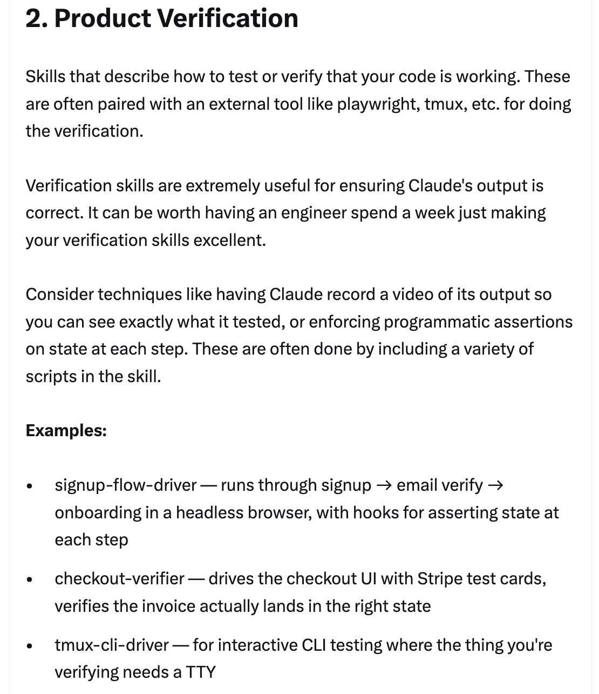</a>

---

### 3/ 数据获取与分析

连接到你的数据和监控堆栈的技能。这些可能包括带有凭据的数据获取库、特定的仪表板 ID 等，以及常见工作流或数据获取方式的说明。

**示例：** funnel-query、cohort-compare、grafana

<a href="https://x.com/trq212/status/2033949937936085378">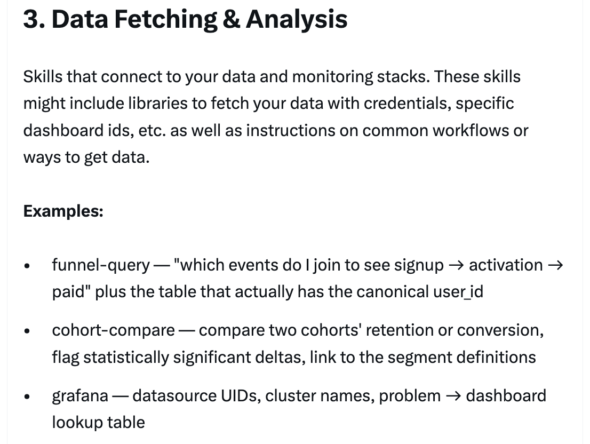</a>

---

### 4/ 业务流程与团队自动化

将重复性工作流自动化成一个命令的技能。这些通常是指令相当简单的，但可能依赖其他技能或 MCP 的更复杂依赖关系。将之前的结果保存在日志文件中可以帮助模型保持一致并反思之前的工作流执行情况。

**示例：** standup-post、create-\<ticket-system\>-ticket、weekly-recap

<a href="https://x.com/trq212/status/2033949937936085378">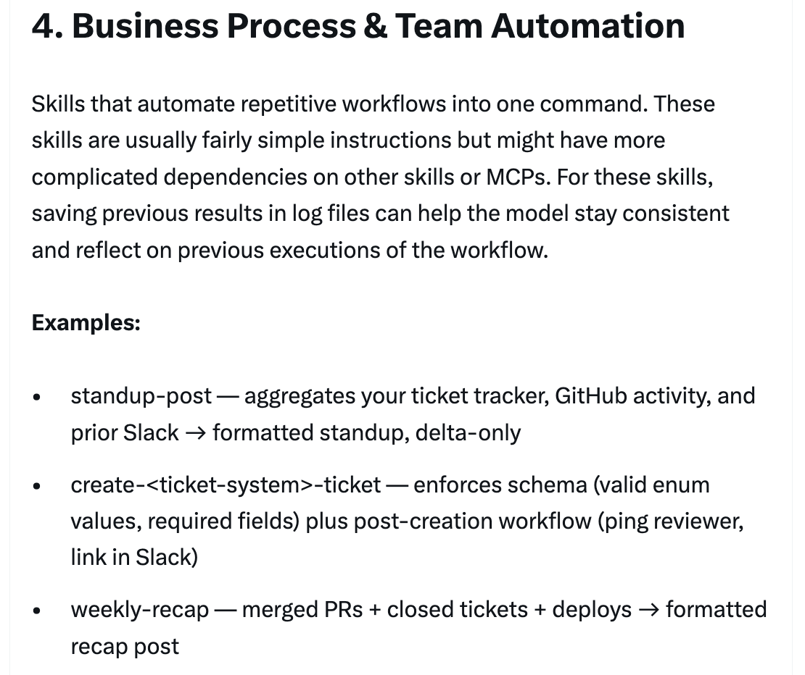</a>

---

### 5/ 代码脚手架与模板

为代码库中的特定功能生成框架样板代码的技能。你可以将这些技能与可组合的脚本结合使用。当你的脚手架有自然语言需求（不能纯粹由代码覆盖）时，它们特别有用。

**示例：** new-\<framework\>-workflow、new-migration、create-app

<a href="https://x.com/trq212/status/2033949937936085378">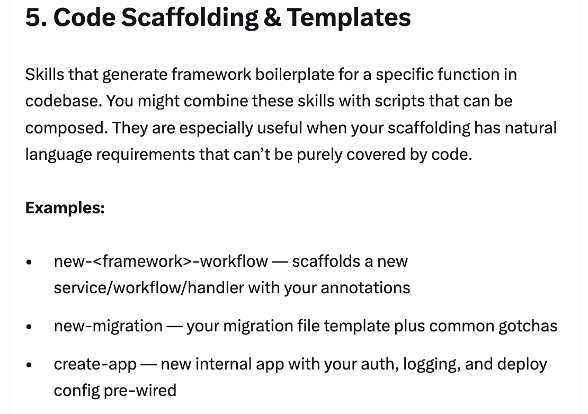</a>

---

### 6/ 代码质量与审查

在你的组织内强制执行代码质量并帮助审查代码的技能。这些可以包括确定性的脚本或工具以最大化稳健性。你可能希望将这些技能作为钩子的一部分或在 GitHub Action 中自动运行。

**示例：** adversarial-review、code-style、testing-practices

<a href="https://x.com/trq212/status/2033949937936085378">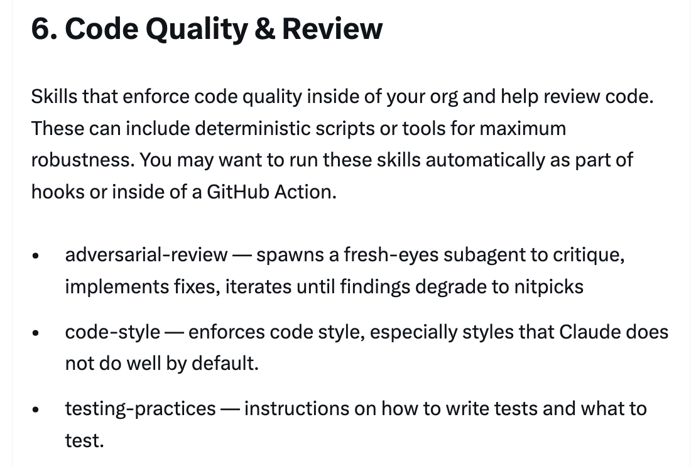</a>

---

### 7/ CI/CD 与部署

帮助你在代码库中获取、推送和部署代码的技能。这些技能可能引用其他技能来收集数据。

**示例：** babysit-pr、deploy-\<service\>、cherry-pick-prod

<a href="https://x.com/trq212/status/2033949937936085378">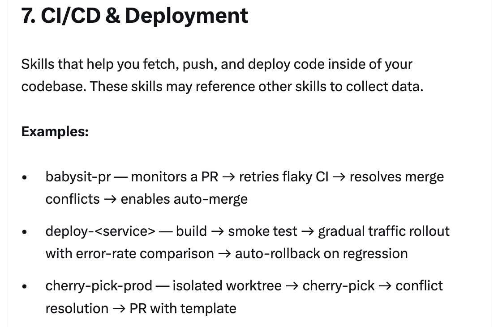</a>

---

### 8/ 运行手册

接收症状（如 Slack 讨论线程、警报或错误特征），进行多工具调查，并生成结构化报告的技能。

**示例：** \<service\>-debugging、oncall-runner、log-correlator

<a href="https://x.com/trq212/status/2033949937936085378">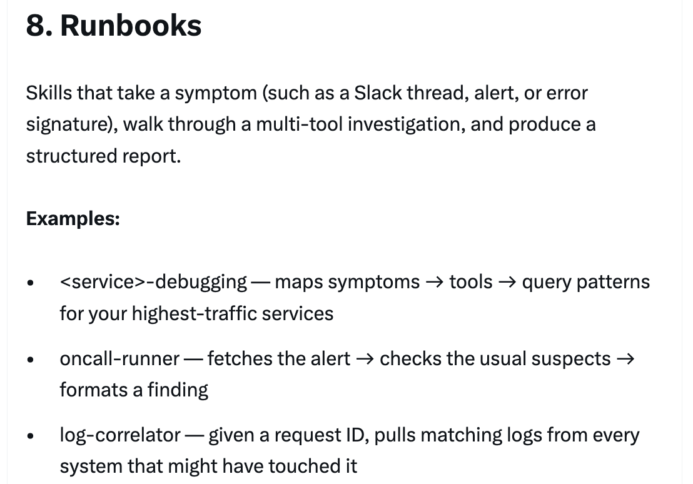</a>

---

### 9/ 基础设施运维

执行日常维护和运维流程的技能——其中一些涉及破坏性操作，受益于安全护栏。让工程师在关键操作中更容易遵循最佳实践。

**示例：** \<resource\>-orphans、dependency-management、cost-investigation

<a href="https://x.com/trq212/status/2033949937936085378">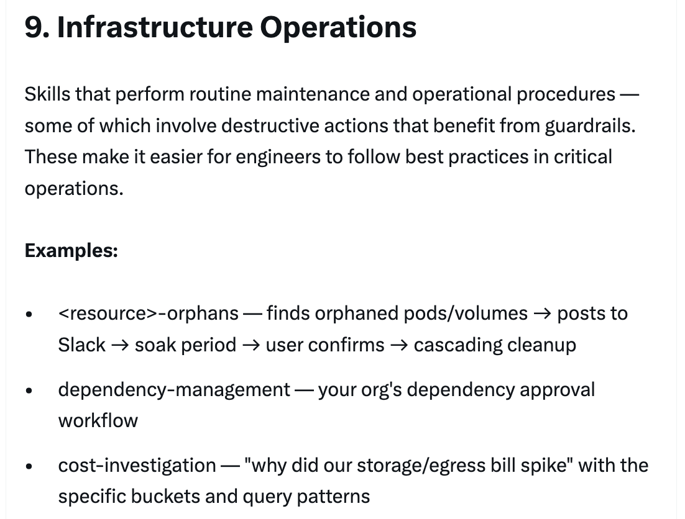</a>

---

## 制作技能的技巧

编写有效技能的 9 个最佳实践，以及分发和衡量的指导。

<a href="https://x.com/trq212/status/2033949937936085378">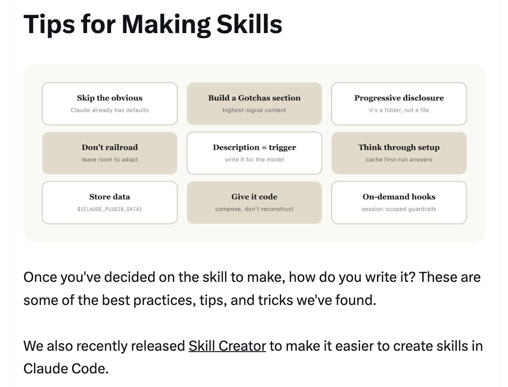</a>

---

### 技巧 1：不要陈述显而易见的内容

Claude Code 对你的代码库了解很多，Claude 也了解很多编码知识，包括许多默认意见。如果你发布的技能主要关乎知识，试着专注于推动 Claude 跳出其常规思维模式的信息。前端设计技能就是一个很好的例子——它是通过与客户迭代改进 Claude 的设计品味而构建的，避免了像 Inter 字体和紫色渐变这样的经典模式。

<a href="https://x.com/trq212/status/2033949937936085378">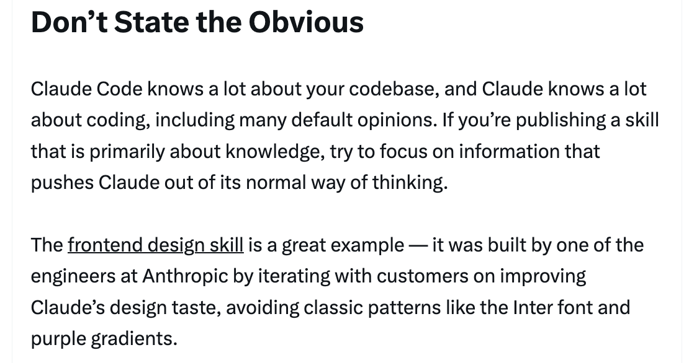</a>

---

### 技巧 2：构建注意事项部分

任何技能中信号最强的部分是注意事项部分。这些部分应该从 Claude 在使用你的技能时遇到的常见失败点中积累。理想情况下，你会不断更新技能以捕获这些注意事项。

<a href="https://x.com/trq212/status/2033949937936085378">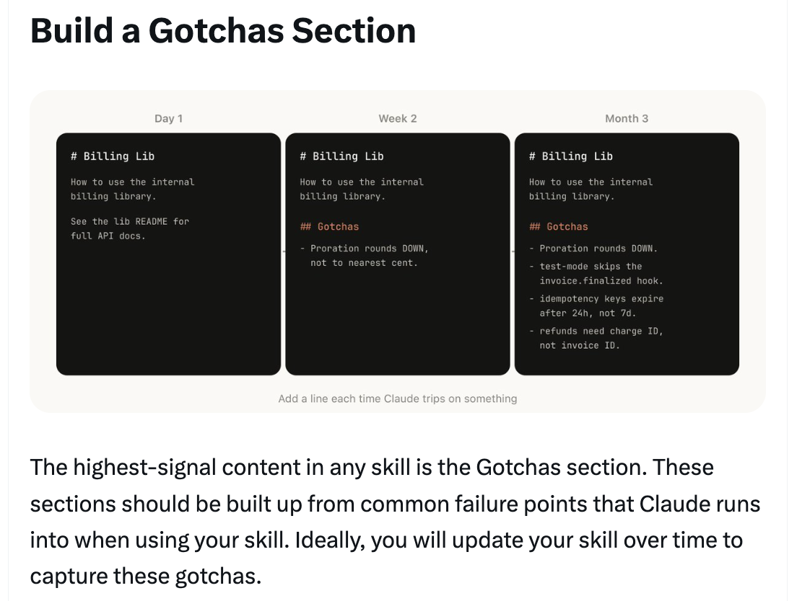</a>

---

### 技巧 3：利用文件系统与渐进式披露

技能是一个文件夹，而不仅仅是一个 markdown 文件。你应该将整个文件系统视为上下文工程和渐进式披露的一种形式。告诉 Claude 你的技能中有哪些文件，它会在适当的时候读取它们。最简单的形式是指向其他 markdown 文件——例如，将详细的函数签名和使用示例拆分到 `references/api.md` 中。你可以有参考文件夹、脚本、示例等。

<a href="https://x.com/trq212/status/2033949937936085378">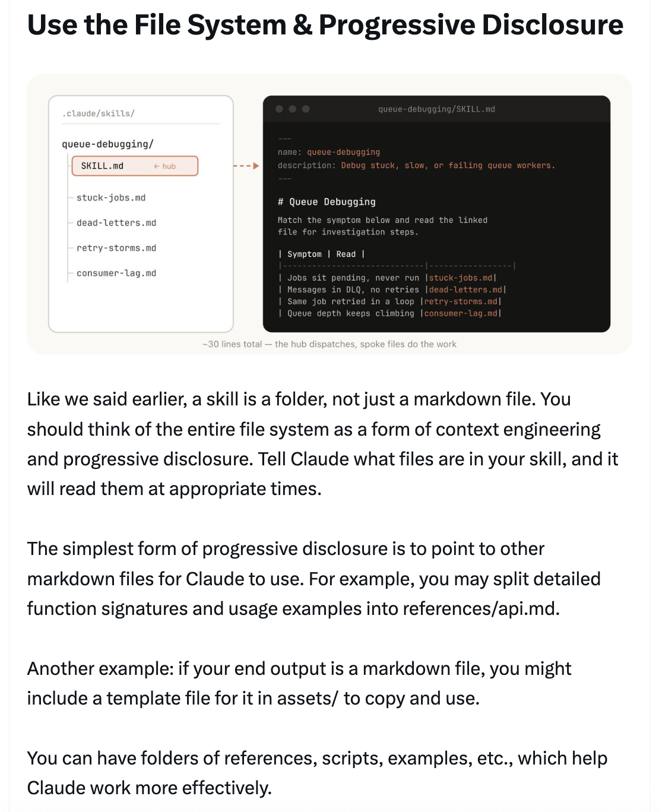</a>

---

### 技巧 4：避免过度限制 Claude

Claude 通常会尽力遵循你的指令，而且由于技能的可重用性很强，你需要小心不要过于具体。给 Claude 所需的信息，但给它适应情况的灵活性。与其给出规定性的逐步指令，不如给出目标和约束条件。

<a href="https://x.com/trq212/status/2033949937936085378">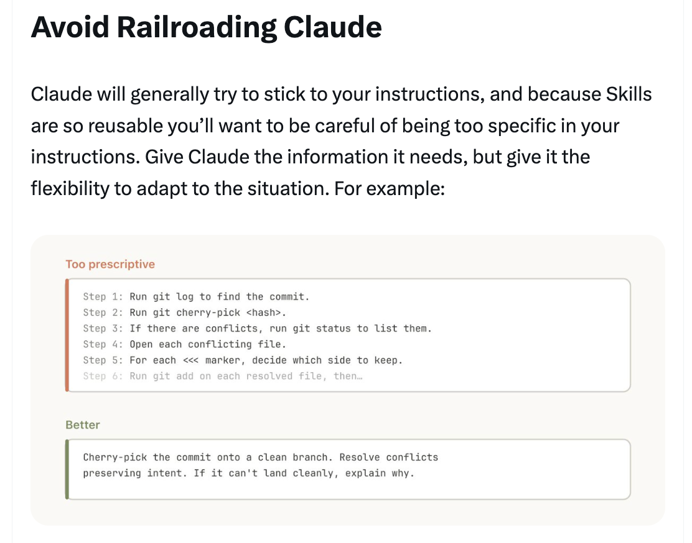</a>

---

### 技巧 5：仔细考虑设置

一些技能可能需要用户提供上下文来进行设置。一个好的模式是将这些设置信息存储在技能目录的 `config.json` 文件中。如果配置未设置，代理可以询问用户获取信息。你可以指示 Claude 使用 AskUserQuestion 工具进行结构化的多项选择提问。

<a href="https://x.com/trq212/status/2033949937936085378">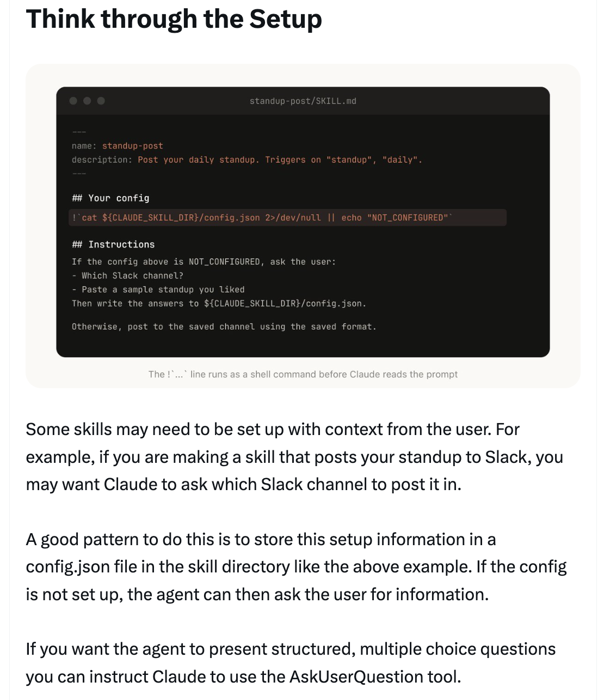</a>

---

### 技巧 6：描述字段是为模型准备的

当 Claude Code 启动一个会话时，它会构建每个可用技能及其描述的列表。这个列表是 Claude 扫描以决定"有没有适合这个请求的技能？"的依据。这意味着描述字段不是一个摘要——它是一个**何时触发**这个技能的说明。为模型而写。

<a href="https://x.com/trq212/status/2033949937936085378">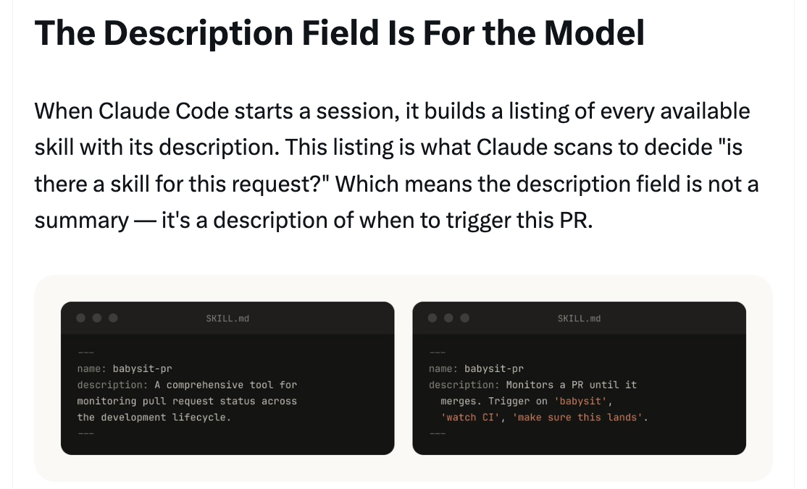</a>

---

### 技巧 7：内存与数据存储

一些技能可以通过在技能内存储数据来实现某种形式的内存。你可以将数据存储在简单的仅追加文本日志文件或 JSON 文件中，或者像 SQLite 数据库那样复杂的结构中。技能目录中存储的数据可能在升级技能时被删除，因此请使用 `${CLAUDE_PLUGIN_DATA}` 作为每个插件的稳定文件夹来存储数据。

<a href="https://x.com/trq212/status/2033949937936085378">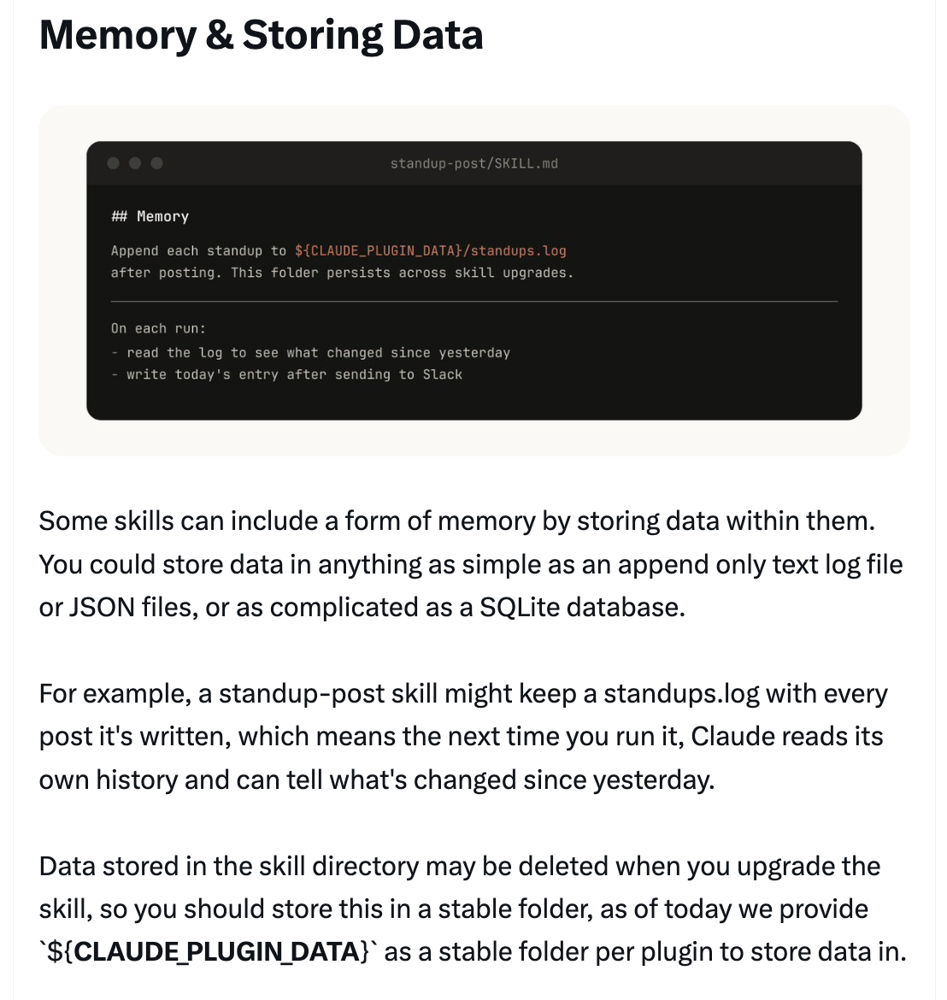</a>

---

### 技巧 8：存储脚本与生成代码

你能给 Claude 的最强大的工具之一是代码。给 Claude 脚本和库，可以让 Claude 将其精力花在组合上——决定下一步做什么，而不是重建样板代码。Claude 可以实时生成脚本，组合这些功能以实现更高级的分析。

<a href="https://x.com/trq212/status/2033949937936085378">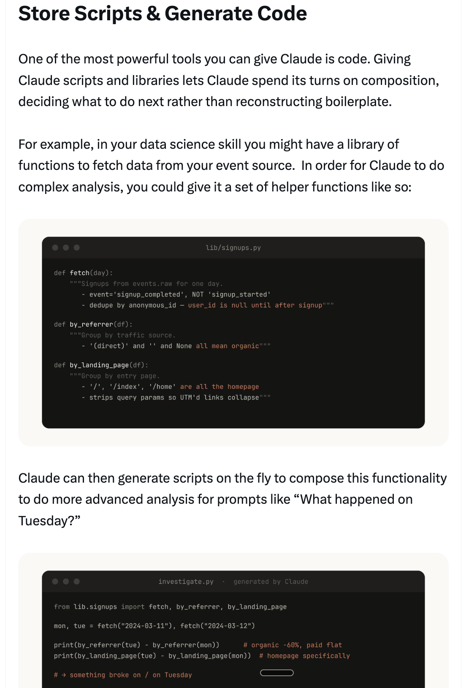</a>

---

### 技巧 9：按需钩子

技能可以包含仅在技能被调用时激活的钩子，并在会话期间持续存在。用于那些你不想一直运行但有时非常有用、更具仪式感的钩子。

**示例：**
- `/careful` — 通过 PreToolUse 对 Bash 的匹配器阻止 rm -rf、DROP TABLE、force-push、kubectl delete
- `/freeze` — 阻止任何不在特定目录中的 Edit/Write 操作

<a href="https://x.com/trq212/status/2033949937936085378">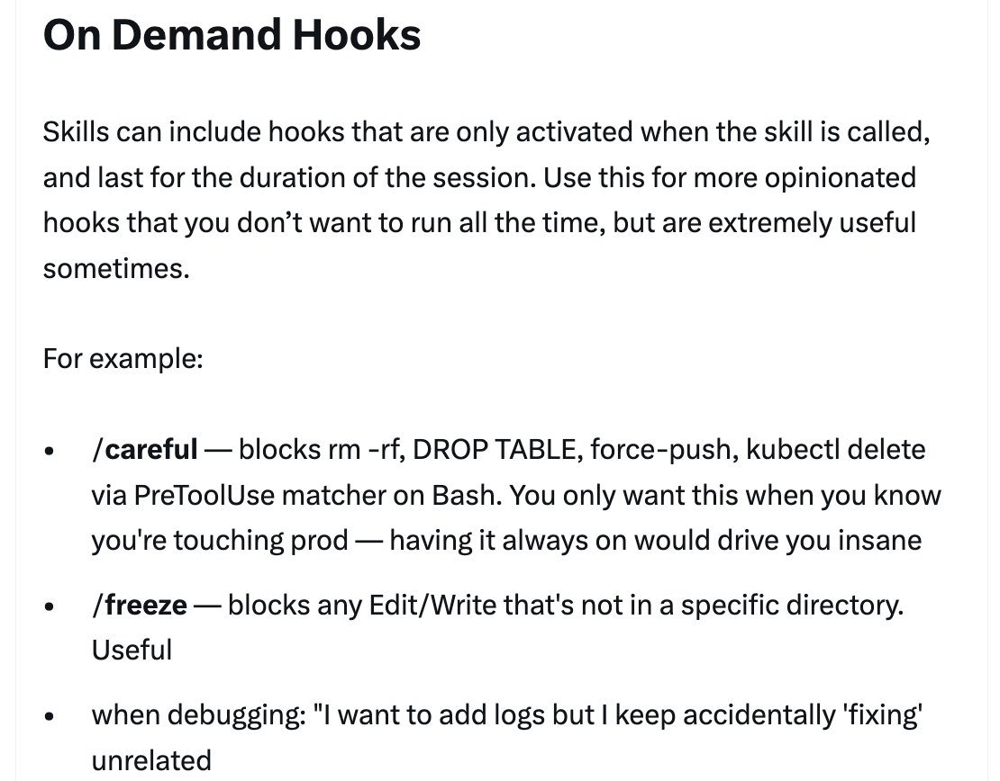</a>

---

## 分发技能

与你的团队分享技能的两种方式：
- **检入你的仓库**（放在 `.claude/skills` 下）——最适合在相对较少仓库上工作的小团队
- **制作一个插件**并拥有一个 Claude Code 插件市场，用户可以在其中上传和安装插件

每个检入的技能也会为模型的上下文增加一点负担。随着规模扩大，内部插件市场允许你分发技能，并让你的团队决定安装哪些。

<a href="https://x.com/trq212/status/2033949937936085378">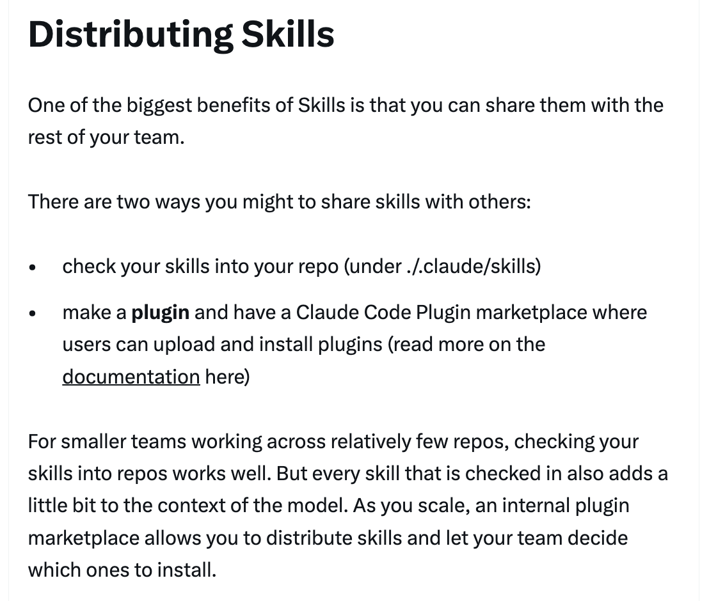</a>

---

## 管理市场

没有一个中央团队来决定哪些技能进入市场。相反，尝试有机地找到最有用的技能。上传到 GitHub 中的沙箱文件夹，并在 Slack 或其他论坛中引导人们查看。一旦一个技能获得了关注（由技能所有者自行决定），他们可以提交 PR 将其移入市场。发布前的策划很重要，以避免冗余技能。

<a href="https://x.com/trq212/status/2033949937936085378">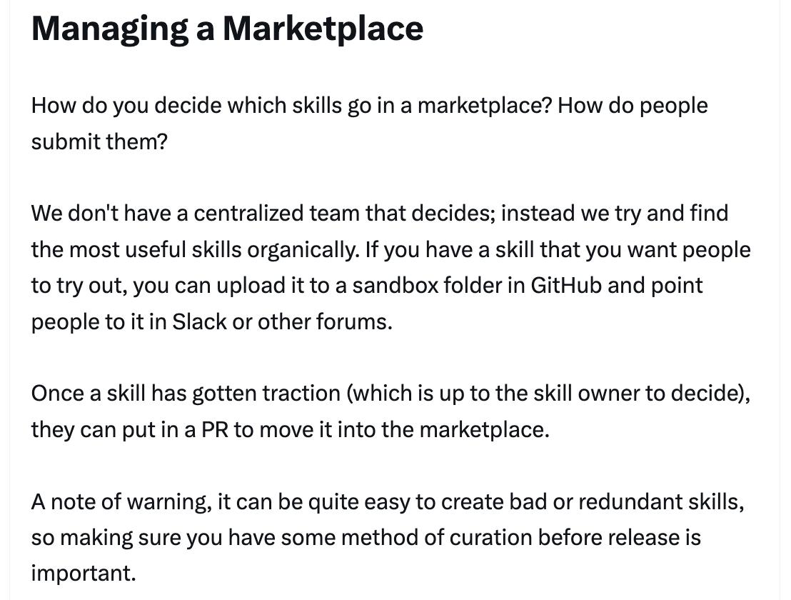</a>

---

## 组合技能

你可能希望拥有相互依赖的技能。例如，一个上传文件的文件上传技能，和一个生成 CSV 并上传的 CSV 生成技能。这种依赖管理尚未原生内置于市场或技能中，但你只需按名称引用其他技能，如果它们已安装，模型就会调用它们。

<a href="https://x.com/trq212/status/2033949937936085378">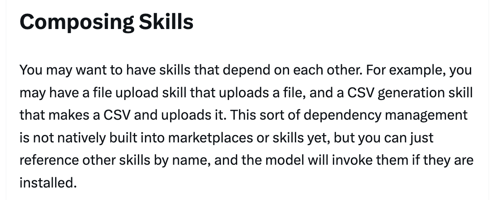</a>

---

## 衡量技能

要了解技能的表现，使用一个 PreToolUse 钩子来记录公司内部的技能使用情况。这可以让你找到受欢迎的技能或与预期相比触发不足的技能。

<a href="https://x.com/trq212/status/2033949937936085378">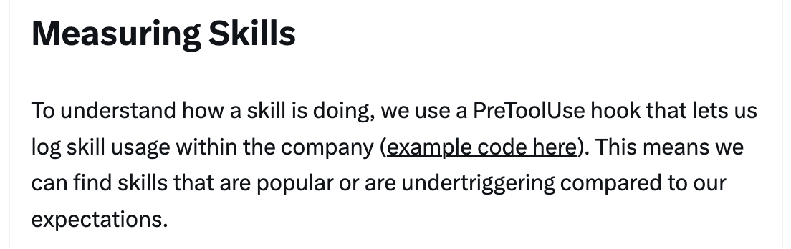</a>

---

## 结论

技能是用于代理的极其强大和灵活的工具，但这仍处于早期阶段，我们都在摸索如何最好地使用它们。把这更多地看作是一个我们见过的有效技巧的百宝袋，而非权威指南。了解技能的最佳方式是开始使用、实验，然后找出适合你的方法。我们的大多数技能都是从几行描述和一个注意事项开始的，并随着人们不断在 Claude 遇到新边缘情况时添加内容而变得更好。

<a href="https://x.com/trq212/status/2033949937936085378">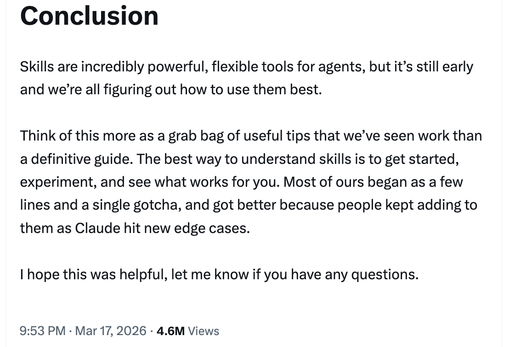</a>

---

## 来源

- [Thariq (@trq212) 在 X — 2026 年 3 月 17 日](https://x.com/trq212/status/2033949937936085378)
- [Skilljar — 代理技能课程](https://code.claude.com/docs/en/skills)
- [技能创建器](https://code.claude.com/docs/en/skills)
